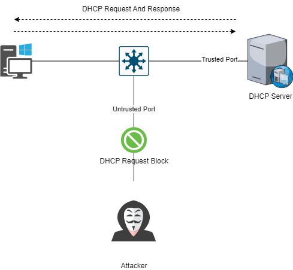
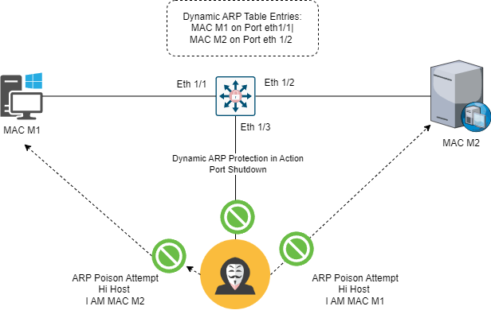

# 10. L2 SECURITY

## <mark style="color:purple;">DHCP SNOOPING</mark>


> **Purpose**: Protects the networks from Fake DHCP servers and prevents DHCP Based attacks like Stravation and Spoofing.

#### <mark style="color:blue;">How its works:</mark>

* Switches act as firewalls between untrusted ports and DHCP servers.
* Maintains a DHCP BINDING table to Tracks assigned IP Addressess and MAC addressess.
* Drops DHCP Packets if the sources MAC address doesn't match the binding tables.

<mark style="color:blue;">KEY Threats</mark>

* **DHCP Stravation**: Tools like YERSINIA Create fake MAC addresses to exhaust the DHCP pool disrupting legitmate Clients.
* **DHCP spoofing:** Fake DHCP servers provide incorrect configurations, leading to man-in-the-middle attacks.


<mark style="color:blue;">**Details Summary:**</mark>

* Its provide network protection from the fake (rogue) DHCP server. its create a (logical firewall ) between the untrusted hosts(PCs) and the DHCP server.
* The switchs create and maintain a DHCP snooping tables (also called as DHCP blinding database). The switchs uses this table to find the untrusted messages from the network, where a dhcp binding datases keeps track of dhcp address that are assigned to untrusted ports. As well as filtering DHCP message from untrusted ports.
* Incoming packets received on untrusted ports are been dropped if the source MAC address doesn't match the MAC blinding Table.
* Hackers uses tools like YERSINIA or ETTERCAP to create custom DORA packets, which strave the original DHCP and obstructing legitimate users from accessing the LANs and internet, Leading to Network Downtime.
* YERSINIA Creates custome  MAC address and takes all the free IP address from the DHCP server. To mitigate this its used the L2 Security on switch ports. including the MAC flooding.

<figure><figcaption><p>DHCP SNOOPING</p></figcaption></figure>

#### <mark style="color:blue;">CONFIGURATION</mark>

* Enable DHCP Snooping

```
Switch(config)# ip dhcp snooping
Switch(config)# ip dhcp snooping vlan [VLAN_ID]
```

* Mark trusted interfaces (Where DHCP servers are connted):

```
Switch(config-if)# ip dhcp snooping trust
```

* Limit traffic rate for trusted interfaces:

```
Switch(config-if)# ip dhcp snooping limit rate 100
Switch(config-if)# ip dhcp snooping vlan 5
Switch(config-if)# ip dhcp snooping information option
```

#### <mark style="color:blue;">VERIFICATION</mark>

* Show DHCP Snooping settings:

```
show ip dhcp snooping
```


* Show DHCP binding table:

```
show ip dhcp snooping binding
```


#### <mark style="color:blue;">**Best practices:**</mark>

* Ensure all DHCP servers are connected to trusted ports.
* Use rate-limiting on trusted ports to prevent flooding attacks.


## <mark style="color:purple;">PORT SECURITY</mark>

> **Purpose:** Restricts access to switch ports by limiting the MAC addresses allowed.

#### <mark style="color:blue;">**How it works:**</mark>

* Allows only specific MAC addresses on a port.
* Blocks additional devices or attacks using invalid MAC addresses.

#### <mark style="color:blue;">**CONFIGURATION**</mark>

* Enable port security and sticky MAC learning:

```
Switch(config-if)# switchport port-security
Switch(config-if)# switchport port-security mac-address sticky
```

* Set the maximum number of allowed MAC addresses:

```
Switch(config-if)# switchport port-security maximum 1
```

* Configure violation action (e.g., shutdown the port):

```
Switch(config-if)# switchport port-security violation shutdown
```

```
interface ethernet 0/0
    switch port-security #enables port-security
    switch port-security mac-address sticky #prevent MAC Address Attacks.
    switch port-security sticky #pervent MAC Address Attacks,
    switch port-security maximum (number) 1 #prevent dhcp stravation 1 mac address gets 1 ip address.
    switch port-security vilolation #means attack happends counter attack by doing port in shudown state.
```


#### <mark style="color:blue;">VERIFICATION</mark>

* Check port security status:

```
show port-security
```

* Recovery from Violations:
  * Manully restart the port:

```
Switch(config-if)# shutdown
Switch(config-if)# no shutdown
```


## <mark style="color:purple;">**IP Source Guard**</mark>

> **Purpose:** Prevents IP spoofing attacks by filtering packets based on the DHCP snooping binding table.

#### <mark style="color:blue;">**How it works:**</mark>

* Only allows packets with valid IP-to-MAC bindings to pass through untrusted ports.
* Blocks traffic with spoofed IP addresses.


#### <mark style="color:blue;">Details Summary:</mark>

* The IP Source Guard feature is essential for enhancing security by effectively restricting IP traffic on untrusted Layer 2 ports. It achieves this by filtering traffic based on the DHCP snooping binding database or manually configured IP source bindings. This feature plays a crucial role in preventing IP spoofing attacks, where a host attempts to use the IP address of another host. Any IP traffic entering the interface with a source IP address not assigned via DHCP or static configuration will be filtered out on the untrusted Layer 2 ports.
* To enable the IP Source Guard feature, it must be used in conjunction with the DHCP snooping feature on untrusted Layer 2 interfaces. It establishes and maintains an IP source binding table, learned through DHCP snooping or manually configured static IP source bindings. Each entry in the IP source binding table includes the IP address, associated MAC, and VLAN numbers. IP Source Guard is supported on Layer 2 ports, including access and trunk ports, and it also enables dynamic source IP and MAC address filtering.

<mark style="color:blue;">**Configuration**</mark>

*   Enable IP Source Guard:

    ```plaintext
    Switch(config-if)# ip verify source port-security
    Switch(config)# ip source binding 0011.0011.0011 vlan 5 10.1.1.11 interface
    Ethernet0/0
    ```
* Use DHCP snooping to populate the binding table.
*   Verify configuration:

    ```plaintext
    show ip verify source
    ```


## <mark style="color:purple;">**Dynamic ARP Inspection (DAI)**</mark>

> **Purpose:** Protects against ARP spoofing by verifying ARP packets.

#### <mark style="color:blue;">**How it works:**</mark>

* Validates ARP packets using the DHCP snooping binding table or static ARP ACLs.
* Drops ARP packets with invalid IP-to-MAC bindings.


#### <mark style="color:blue;">Details Summary:</mark>

**Overview:** ARP spoofing, a potential security threat, involves sending false Address Resolution Protocol (ARP) messages within a network. Unlike hub-based networks, where all data is broadcasted to every device, switches selectively forward data based on MAC addresses, reducing unnecessary broadcast traffic. Dynamic ARP Inspection (DAI) is a security feature designed to validate ARP packets and prevent ARP spoofing attacks.

**ARP Spoofing Scenario:** In ARP spoofing, attackers flood the switch's ARP table with fake ARP requests, potentially causing increased CPU and RAM utilization and network downtime. Manipulating the ARP table allows attackers to associate their MAC address with critical devices, posing a risk of unauthorized file transfers.

**Execution of ARP Spoofing:** Attackers execute ARP spoofing by sending a fake Gratuitous ARP (GARP) packet. For instance, an attacker can use a packet with IP address 10.0.0.2 and MAC address M2. This broadcast prompts devices to update their ARP tables. With manipulated ARP tables, the attacker intercepts important files when devices attempt to send them to an admin PC.

**Mitigation Measures:** To mitigate ARP spoofing, implement the following measures:

<figure><figcaption><p>SPOOFING</p></figcaption></figure>


#### <mark style="color:blue;">**Configuration in a DHCP environment:**</mark>

*   Enable DAI on VLANs:

    ```plaintext
    Switch(config)# interface GigabitEthernet1/0/1
    Switch(config-if)# ip arp inspection trust
    Switch(config)# ip arp inspection vlan [vlan-id]
    ```
*   Mark trusted interfaces:

    ```plaintext
    Switch(config-if)# ip arp inspection trust
    ```

#### <mark style="color:blue;">**Configuration in a non-DHCP environment:**</mark>

*   Create and apply ARP ACLs:

    ```plaintext
    Switch(config)# arp access-list arpacl
    Switch(config-arp-acl)# permit ip host [IP] mac host [MAC]
    Switch(config-arp-acl)# permit ip host 10.1.1.11 mac host 0011.0011.0011
    Switch(config-arp-acl)# exit
    Switch(config)# ip arp inspection filter arpacl vlan [vlan-id]
    Switch(config)# interface GigabitEthernet1/0/2
    Switch(config-if)# no ip arp inspection trust
    ```

#### <mark style="color:blue;">**Verification:**</mark>

*   Check ARP inspection configuration:

    ```plaintext
    show ip arp inspection vlan [vlan-id]
    ```

**Rate Limiting ARP Packets:**

* Prevent ARP flooding DoS attacks with `ip arp inspection limit` to limit incoming ARP requests and responses.
* Default limit: 15 pps on untrusted interfaces; no limit on trusted interfaces.

**ARP Validation Checks:**

* Perform additional checks using `ip arp inspection validate {[src-mac] [dst-mac] [ip]}` to validate destination MAC, sender and target IP addresses.

**Monitoring:**

* Use `show ip arp inspection interfaces` to display trust state, rate limit, and burst interval.
* Check DAI configuration and VLAN operation state with `show ip arp inspection vlan [vlan# or range]`.

**Packet Statistics:**

* Use `show ip arp inspection statistics` to display packet statistics on DAI-configured VLANs.


## **MAC and IP Spoofing**

**Threats:**

* **MAC spoofing:** Attackers use tools like `macchanger` to spoof MAC addresses.
* **IP spoofing:** Attackers falsify IP addresses to bypass security checks.

**Mitigation:**

* Use **port security** to lock down MAC addresses.
* Enable **IP Source Guard** to validate IP-to-MAC bindings.


#### **Layer 2 Security Best Practices**

1. Use **SSH** for secure switch management.
2. Restrict management access with ACLs and strong authentication.
3. Disable unused services (e.g., CDP, DTP) and ports.
4. Use dedicated VLANs for trunk ports; avoid VLAN 1.
5. Deploy Layer 2 security features:
   * DHCP Snooping
   * Port Security
   * IP Source Guard
   * Dynamic ARP Inspection
6. Enable **Spanning Tree Protocol (STP)** features like BPDU Guard and Root Guard.
7.  Regularly monitor and audit configurations:

    ```plaintext
    show ip dhcp snooping
    show ip arp inspection statistics
    ```
