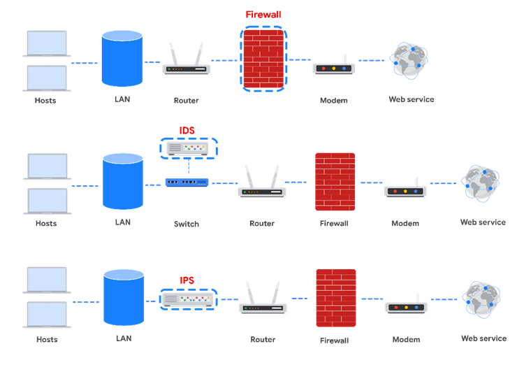
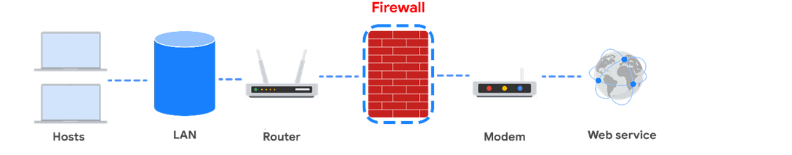
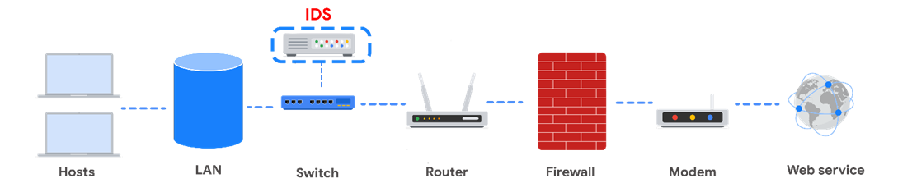
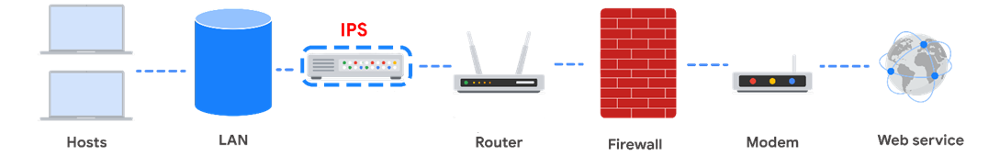
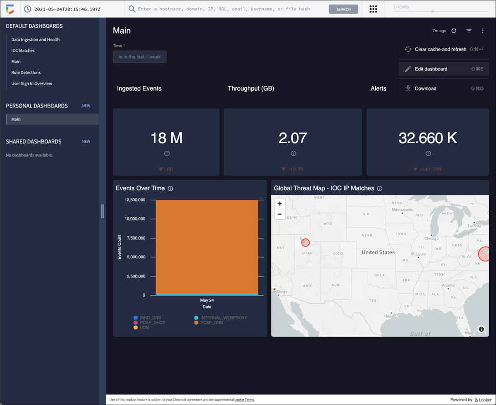
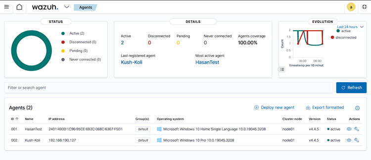

# 13. Network Security Application

## <mark style="color:purple;">**Network Security Applications**</mark>

Network security protects your network and data from breaches, intrusions, and other threats. It involves adding layers of defense, known as **defense in depth**, to strengthen a network's security.

<figure><figcaption>
NSA
</figcaption></figure>

#### <mark style="color:blue;">**1. Firewalls**</mark>

**Function:**

* Firewalls are the first line of defense, filtering network traffic based on pre-defined rules.
* They inspect the headers of data packets entering the network and allow or block traffic based on:
  * **Port Numbers**
  * **IP Addresses**
* Modern **Next-Generation Firewalls (NGFWs)** can also inspect **packet payloads** for threats.

<figure><figcaption>
FIREWALL
</figcaption></figure>

**Key Points:**

* Every device on the network should have its own firewall in addition to the network firewall.
* Firewalls provide foundational security, but they cannot detect or respond to sophisticated threats on their own.

#### <mark style="color:blue;">**2. Intrusion Detection Systems (IDS)**</mark>

**Function:**

* IDS monitors network activity and detects potential intrusions by identifying:
  * **Signatures of Known Attacks**
  * **Anomalies in Network Behavior**

<figure><figcaption>
IDS
</figcaption></figure>

**Key Points:**

* **Alert System:** When IDS detects malicious activity, it sends alerts to administrators for further investigation.
* **Packet Sniffing:** IDS analyzes data packets for known attack patterns.
* **Anomaly Detection:** It can identify suspicious activity, even if it doesn't match known attack signatures.

**Limitations:**

* IDS can only detect **known attacks** or **obvious anomalies**.
* It does not prevent attacks; it alerts administrators to take action.
* New and sophisticated attacks may bypass detection.

#### <mark style="color:blue;">**3. Intrusion Prevention Systems (IPS)**</mark>

**Function:**

* IPS is an advanced form of IDS that not only detects but also **blocks malicious traffic** in real time.
* It inspects and takes preventive actions, such as dropping malicious packets or blocking IP addresses.

<figure><figcaption>
IPS
</figcaption></figure>

**Key Points:**

* IPS works inline with the network traffic, actively analyzing and mitigating threats.
* It provides faster response compared to IDS, but it requires careful configuration to avoid blocking legitimate traffic.

#### **4. Security Information and Event Management (SIEM) Tools**

**Function:**

* SIEM tools aggregate, analyze, and monitor security logs and events across the network.
* They help identify patterns or correlations that indicate ongoing or potential attacks.

<figure><figcaption></figcaption></figure>

**Key Points:**

* SIEM tools provide **real-time alerts** and **post-event analysis** for a holistic view of network security.
* They integrate with firewalls, IDS/IPS, and other systems to centralize security management.

## <mark style="color:blue;">WAZUH</mark>

> WAZUH is open source and Cortex XRD By Palo Alto Is also One of the best open sources SIEM

<figure><figcaption>
WAZUH DASHBOARD
</figcaption></figure>

#### **Layered Security Approach**

Each tool adds a layer of defense:

1. **Firewalls:** Basic traffic filtering.
2. **IDS:** Alerts for malicious activity.
3. **IPS:** Real-time threat prevention.
4. **SIEM Tools:** Comprehensive monitoring and analysis.

**Example:** A network protected with all four layers ensures:

* Unauthorized traffic is blocked (Firewall).
* Suspicious activity is identified (IDS).
* Threats are mitigated immediately (IPS).
* Comprehensive monitoring of all security events (SIEM).

