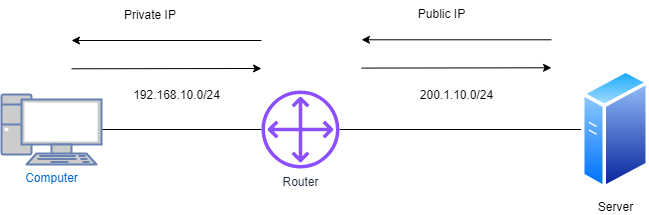

# 9. SYSTEM TRADE (ACL, NAT,NTP,SNMP,LINE VTY,BANNER)

## <mark style="color:purple;">Access Control List (ACL)</mark>

> A security feature that acts as a security guard for a network by allowing or denying access based on IP addresses. It operates at the OSI Layer 3 network level and is used to permit or deny network traffic.
>
> ACLs are typically applied to Layer 3 devices, but they can also be applied to Layer 2 devices such as switches, especially on VLAN interfaces

<table data-header-hidden><thead><tr><th></th><th width="149"></th><th></th><th></th></tr></thead><tbody><tr><td>IP Address</td><td>Protocols</td><td>Port</td><td>Data</td></tr><tr><td>10.0.0.1</td><td>TCP</td><td>Source address Random</td><td>FILE</td></tr><tr><td>200.1.30.10</td><td>TCP</td><td>Destination Address : 443</td><td>FILE</td></tr></tbody></table>

> Access lists can filter IP traffic based on IP, protocol, and port numbers. They primarily operate at OSI Layer 3 and Layer 4, providing fine control over IP traffic

### <mark style="color:blue;">ACL configuration guidelines</mark>&#x20;

> Only one ACL per interface, per protocol, per direction is allowed.
>
> ACLs are processed top-down, meaning the first matching rule is applied, and further rules are not evaluated.
>
> &#x20;the most specific statements must go at the top of the list. Once a packet meets the ACL criteria, the ACL processing stops and the packet is either permitted or denied.
>
> ACLs are created globally and then applied to interfaces.
>
> An ACL in network configuration can filter traffic going through the router, or traffic to and from the router.

### <mark style="color:blue;">Types of Access List</mark>

#### <mark style="color:blue;">Standard access list</mark>

> A standard access list verifies only the source IP address.
>
> Standard access lists use numeric identifiers (1-99, 1300-1999)


```bash
ip access-list standard (1-99)
    deny host (single network)
    permit any

interface ethernet 0/0
    ip access-group (number) in or out

```



```bash
ip access-list standard Shadow
    1 deny host 10.0.0.1
    2 permit host 10.0.0.2
    3 permit any

interface ethernet 0/0
    ip access-group Shadow in
```


> **Verification**


```
show running-config | section OR include access-list
```


#### <mark style="color:blue;">Disadvantage</mark>&#x20;

> If DHCP is applied, the IP address will change, rendering standard ACI ineffective. After applying it to the interface devices, packets are denied by default, which is referred to as an implicit rule.

#### <mark style="color:blue;">**Extended Access List**</mark>

> Extended access lists verify source and destination IP addresses and ports. They use numeric identifiers (100-199, 2000-2699) or named ACLs for configuration.


```bash
ip access-list extended (100-199/NAME)
    (action) deny or permit (Source IP) (Source port) (Destination IP) (Destination port)

interface ethernet 0/0
    ip access-group (list name) in

```



```bash
ip access-list extended Shadow
    deny tcp host 10.0.0.1 host 200.1.30.10 eq www
    deny tcp host 10.0.0.2 host 200.1.30.10 eq 443
    permit ip any any

interface ethernet 0/0
    ip access-group Shadow in
```


## <mark style="color:purple;">Network Address Translation (NAT)</mark>

> NAT allows L3 devices to convert private IP addresses to public ones. Types include Static NAT, which is one-to-one mapping.
>
> A process of changing the source and destination IP addresses and ports. Address translation reduces the need for IPv4 public addresses and hides private network address ranges. The process is usually done by routers or firewalls.Comment

<figure><figcaption><p>NAT</p></figcaption></figure>

> L3 devices can apply Network Address Translation (NAT) to facilitate network access translation.
>
> NAT converts private IP addresses to public ones, helping conserve public IP addresses and improving network security by hiding internal addresses.

### <mark style="color:blue;">How does it work?</mark>

> In many-to-one NAT, a single device (such as a router) translates many private IP addresses into one public IP address for communication with external networks. This helps conserve public IP addresses and improve efficiency

### <mark style="color:blue;">Types of NAT</mark>

> Static NAT allows both inbound and outbound connections, meaning devices on the public network can initiate communication with private network devices using their mapped public IP.
>
> Static NAT, also referred to as **One-to-One NAT,** entails transforming a single private IP address into a corresponding public IP address. While this method requires manual configuration and consumes a significant number of public IP addresses, it is well-suited for server environments. It is commonly utilized in servers, VPNs, and various applications, and operates bidirectionally.

> Static NAT is useful for servers but is less practical in dynamic environments because it requires manual configuration and consumes more public IP addresses.

### <mark style="color:blue;">Configuring static NAT on Cisco devices</mark>

> With static NAT, routers or firewalls translate one private IP address to a single public IP address. Each private IP address is mapped to a single public IP address.&#x20;
>
> Static NAT maps one private IP address to one public IP address, requiring a unique public IP for each private IP. This method is typically used when a server or device must always be accessible from the public network

Static NAT

```
Steps to configure static NAT on Cisco devices through CLI
Login to the device using SSH / TELNET and go to enable mode.
Go into the config mode.
Router#configure terminal

Enter configuration commands, one per line. End with CNTL/Z.

Router(config)#

Use below command to configure static NAT
Router(config)#ip nat inside source static 10.0.0.2 59.40.40.1
```

> This command translates the internal IP `10.0.0.2` to the external public IP `59.40.40.1` for all outgoing traffic.

#### **Interface Configuration:**

The instructions for configuring inside and outside interfaces are correct but can be streamlined for better readability:

**Inside Interface:**

```bash
Router(config)#interface fa0/0
Router(config-if)#ip nat inside
```

> The `ip nat inside` command tells the router that the interface is on the private (internal) network.

**Outside Interface:**

```bash
bashCopy codeRouter(config)#interface fa0/1
Router(config-if)#ip nat outside
```

> The `ip nat outside` command sets the interface as the public-facing (external) side.


```bash
show ip nat translation
```


| **Configlet Name**    | Configure Static NAT - Cisco                                                                                                                                                                     |
| --------------------- | ------------------------------------------------------------------------------------------------------------------------------------------------------------------------------------------------ |
| **Description**       | This configlet is used to configure static NAT in Cisco devices.                                                                                                                                 |
| **Execution Mode**    | Script Execution Mode                                                                                                                                                                            |
| **Configlet Content** | configure terminalip nat inside source static $PRIVATE\_IP $PUBLIC\_IPinterface $INSIDE\_INTFip nat insideexitinterface $OUTSIDE\_INTFip nat outsideexitexitshow ip nat translationswrite memory |

### <mark style="color:blue;">Dynamic NAT</mark>

> Dynamic NAT allows multiple private IP addresses to be dynamically mapped to a pool of public IP addresses, meaning the router chooses an available public IP from the pool for translation when inside traffic flows to the outside

<figure><figcaption><p>Dynamic NAT</p></figcaption></figure>

> Unlike with static NAT, where you had to manually define a static mapping between a private and a public address, with dynamic NAT the mapping of a local address to a global address happens dynamically. This means that the router dynamically picks an address from the global address pool that is not currently assigned. It can be any address from the pool of global addresses. The dynamic entry stays in the NAT translations table as long as the traffic is exchanged. The entry times out after a period of inactivity and the global IP address can be used for new translations.

> Unlike Static NAT, which has a permanent one-to-one mapping, Dynamic NAT assigns public addresses from a pool to private addresses temporarily while traffic is active, and the mapping is removed after the connection ends
>
> In PAT, FTP can present challenges due to its dynamic port usage, but most modern routers and firewalls use Application Layer Gateways (ALG) or NAT inspection to ensure proper functionality for FTP over PAT.
>
> Ensure appropriate routing (such as Default, RIP, EIGRP) is configured so that the router knows the best path to forward traffic after performing NAT

#### Configuring Dynamic NAT on Cisco Devices

**Dynamic NAT** allows multiple private IP addresses to be dynamically mapped to a pool of public IP addresses. This type of NAT assigns public addresses to internal devices as needed, from a pre-configured pool.

**To configure dynamic NAT**, the following steps are required:

1. **Configure the router’s inside interface** (where private IP addresses exist).
2. **Configure the router’s outside interface** (where public IP addresses exist).
3. **Configure an ACL** that matches the inside source addresses to be translated.
4. **Configure the pool of global IP addresses** that the router will use for translations.
5. **Enable dynamic NAT** by associating the access list with the address pool.

#### Steps to Configure Dynamic NAT Using CLI

1. **Login to the device** using SSH/Telnet and go to enable mode.
2.  **Go into config mode**:

    ```arduino
    Router# configure terminal
    ```
3.  **Configure the inside interface**:

    ```scss
    Router(config)# interface fa0/0
    Router(config-if)# ip nat inside
    Router(config-if)# exit
    ```
4.  **Configure the outside interface**:

    ```scss
    Router(config)# interface eth0/0/0
    Router(config-if)# ip nat outside
    Router(config-if)# exit
    ```
5.  **Configure an ACL** that specifies the inside source addresses to be translated:

    ```arduino
    Router(config)# access-list 1 permit 192.168.10.0 0.0.0.255
    ```

    > **Note:** This ACL matches all hosts in the `192.168.10.0/24` subnet.
6.  **Configure the pool of global IP addresses**:

    ```arduino
    Router(config)# ip nat pool MY_POOL 200.1.10.1 200.1.10.254 netmask 255.255.255.0
    ```

    **Note:** The pool consists of 254 addresses, from `200.1.10.1` to `200.1.10.254`.
7.  **Enable dynamic NAT**:

    ```scss
    Router(config)# ip nat inside source list 1 pool MY_POOL
    ```

    **Note:** This command instructs the router to translate the inside addresses matched by access list 1 to the pool of global addresses called `MY_POOL`.
8.  **Exit config mode**:

    ```shell
    Router(config)# exit
    ```
9.  **View the NAT translations**:

    ```arduino
    Router# show ip nat translations
    ```
10. **Save the configuration**:

    ```arduino
    Router# write memory
    Building configuration... [OK]
    ```

### PAT (Port Address Translation)

> This technology is widely utilized for its ability to convert private IP addresses into the same public IP address, utilizing a random port number in the public IP. When NAT is active, the router can identify PCs and devices based on the source port. A NAT table is created by the router to store the source port of NAT devices, and a single public user PC can have up to 65,535 ports. With numerous users, idle connections are subject to a 30-second timer, except for FTP. Access lists can also be established to manage which local IP addresses are being NATed

<details>

<summary>What if the router ports of the PC are the same as those used by the other PC?</summary>

The router automatically generates its own Port Address Translation (PAT) and Network Address Translation (NAT) tables, which are commonly known as connection tables and the NAT Table. These tables are essential for mapping internal IP addresses to external IP addresses and managing the flow of network traffic.

</details>

### Configuring Port Address Translation (PAT) on Cisco devices

> With Port Address Translation (PAT), a single public IP address is used for all internal private IP addresses,&#x20;
>
> but a different port is assigned for each session from the private IP addresses. This type of NAT is also known as NAT Overload and is the typical form of NAT used in today’s networks. It is even supported by most consumer-grade routers.

> PAT allows you to support many internal hosts using a single or a few public IP addresses.
>
> &#x20;It works by creating dynamic NAT mapping, in which a global (public) IP address and a unique port number are selected. The router keeps a NAT table entry for every unique combination of the private IP address and port, with translation to the global address and a unique port number.

<figure><figcaption><p>PAT</p></figcaption></figure>


### Configure PAT on Cisco Device:

* Configure the router’s inside interface using the ip nat inside command.
* Configure the router’s outside interface using the ip nat outside command.
* Configure an access list that includes a list of the inside source addresses that should be translated.
* Enable PAT with the ip nat inside source list ACL\_NUMBER interface TYPE overload global configuration command.

#### Steps to Configure PAT Using CLI

1.  **Login to the device using SSH/Telnet and go to enable mode.**

    ```bash
    Router> enable
    ```
2.  **Go into config mode:**

    ```bash
    Router# configure terminal
    ```
3.  **Configure the inside interface (where private IP addresses exist):**

    ```bash
    Router(config)# interface fa0/0
    Router(config-if)# ip nat inside
    Router(config-if)# exit
    ```
4.  **Configure the outside interface (where public IP addresses exist):**

    ```bash
    Router(config)# interface fa0/1
    Router(config-if)# ip nat outside
    Router(config-if)# exit
    ```
5.  **Configure an Access Control List (ACL) that specifies the inside source addresses to be translated:**

    ```bash
    Router(config)# access-list 1 permit 192.168.10.0 0.0.0.255
    ```

    **Note:** This ACL matches all hosts in the **192.168.10.0/24** subnet.
6.  **Enable PAT with a single public IP address using the "overload" option:**

    ```bash
    Router(config)# ip nat inside source list 1 interface fa0/1 overload
    ```

    **Note:** This command instructs the router to translate all the inside addresses matched by ACL 1, using the public IP address assigned to the outside interface (fa0/1) and different ports for each session.
7.  **Exit config mode:**

    ```bash
    Router(config)# exit
    ```
8.  **View the NAT translations:**

    ```bash
    Router# show ip nat translations
    ```
9.  **Save the configuration:**

    ```bash
    Router# write memory
    Building configuration... [OK]
    ```

#### Key Difference with Dynamic NAT:

* In **PAT**, multiple private IP addresses share a single public IP address by using different port numbers for each translation (hence the term "overload").
* In **Dynamic NAT**, a pool of public IPs is used for translation, but each private IP is mapped to a unique public IP from the pool.

## NTP (Network Time Protocol)

* NTP works on **UDP port 123**,.
* Its purpose is to synchronize the real-time clock across network devices to maintain accurate system time.

**Basic Configuration:**

1.  **Set the local time on a device:**

    ```bash
    Router# clock set 17:05:10 Aug 15 2023
    ```
2.  **Set the time zone (for example, UTC +5:30 for India Standard Time):**

    ```bash
    Router(config)# clock timezone IST 5 30
    ```

**Configuring an NTP Server:**

You can set up a Cisco device as an NTP server:

```bash
Router(config)# ntp master 1
```

The **"1"** represents the stratum level of the server (lower values indicate higher priority servers).

**Configuring an NTP Client:**

To configure a device as an NTP client and sync with an external or local NTP server:

```bash
Router(config)# ntp server 10.0.0.1
```

This command sets **10.0.0.1** as the NTP server the client will sync with.

**Verification:**

To verify the NTP associations, use the following command:

```bash
Router# show ntp associations
```

**NTP Authentication:**

To secure NTP communication using MD5 authentication:

1.  **Set an NTP authentication key:**

    ```bash
    Router(config)# ntp authentication-key 1 md5 ntp@123
    ```
2.  **Enable NTP authentication:**

    ```bash
    Router(config)# ntp authenticate
    ```
3.  **Associate the authentication key with the NTP server:**

    ```bash
    Router(config)# ntp trusted-key 1
    ```
4.  **Specify the key to use with a particular NTP server:**

    ```bash
    Router(config)# ntp server 10.0.0.1 key 1
    ```

**Timestamp Logging:**

To log time with date and time for events in the system logs:

```bash
Router(config)# service timestamps log datetime
```

## SYSLOG

> Syslog helps to monitor, log, and analyze all device activities by sending log messages to a centralized Syslog server. It provides detailed information about network events to assist in network troubleshooting and monitoring.

#### Configuration

* **`logging on`**: Enables the logging feature on the device.
* **`logging <IP Address>`**: Sends log messages to the specified Syslog server.
* **`logging traps debugging`**: Sends debug-level traps to the Syslog server.
* **`logging buffered debugging`**: Stores all debug messages locally in the device's buffer.
* **`show logging`**: Displays the current logs stored in the buffer.
* **`clear logging`**: Clears the buffer to reset stored log data.

## SNMP (Simple Network Management Protocol)

> SNMP is used to manage the communication between network devices, allowing network administrators to monitor and control them remotely.

### Three Key Components of SNMP:

1. **NMS (Network Management Station):**
   * The central management system that monitors and manages SNMP-enabled devices (clients).
2. **SNMP Client:**
   * Network devices (e.g., routers, switches) managed by the NMS.
3. **MIB (Management Information Base):**
   * A database that stores information about device parameters, presented in the form of variables.

### OID (Object Identifier):

* OID represents specific values in the MIB and is used for retrieving information from SNMP clients.

#### SNMP operates on UDP ports:

* **Port 161**: For general SNMP communication.
* **Port 162**: For TRAP messages.

### SNMP Versions:

1. **SNMP v1:**
   * Works on UDP Port 161.
   * Commands include:
     * **GET**: Retrieves information (e.g., interface status, MTU, free space).
     * **SET**: Configures the device (e.g., changing the hostname).
     * **INFORM**: Acts like an "if-then" statement (e.g., sends a message if CPU exceeds 80% usage).
     * **GET NEXT**: Retrieves additional information (e.g., packet statistics on an interface).
   * Communication between NMS and SNMP clients in v1 is unencrypted (in plain text), making it insecure.
2. **SNMP v2 (v2c):**
   * Introduced the concept of **community strings**, which act as plaintext passwords.
   * Commands:
     * **GET BULK**: Retrieves detailed information in bulk.
     * **TRAP**: Similar to **INFORM** but adds acknowledgment (ACK) to ensure message delivery (uses port 162).
   * Still lacks proper encryption and security.
3. **SNMP v3:**
   * Works on UDP ports 161 and 162.
   * Includes commands from v1 and v2 but improves security.
   * **SNMPv3 Modes:**
     1. **NoAuth**: No authentication between NMS and SNMP client.
     2. **Auth**: Authentication is required, using secure methods like pre-shared keys (encrypted via hashing).
     3. **Priv**: Provides both authentication and encryption, ensuring complete privacy and security.

#### Why Enable SNMP on Cisco Devices?

SNMP allows network administrators to efficiently manage thousands of network devices, helping them monitor device health and performance in real-time. For large enterprises, enabling SNMP on all devices ensures proactive network management, reducing downtime.

#### Basic SNMP Configuration (SNMP v2):

1. Login to the device via SSH/Telnet and go to enable mode.
2.  Enter config mode:

    ```bash
    configure terminal
    ```
3.  Configure the **read-only** community string:

    ```bash
    snmp-server community public RO
    ```

    * "public" is the read community string.
4.  Configure the **read-write** community string:

    ```bash
    snmp-server community private RW
    ```

    * "private" is the read-write community string.
5.  Exit configuration mode:

    ```bash
    exit
    ```
6.  Save the configuration:

    ```bash
    write memory
    ```

#### SNMP v3 Configuration:

SNMPv3 improves security with encryption and authentication mechanisms.

1.  Define a group and specify the mode:

    ```bash
    snmp-server group operatorauth v3 priv
    ```
2.  Define NMS location (optional):

    ```bash
    snmp-server location "Data Center"
    ```
3.  Create a user account on the SNMP client:

    ```bash
    snmp-server user TEST operatorauth v3 auth sha <PASSWORD> priv aes <PASSWORD>
    ```

#### SNMPv3 Advantages over SNMPv2:

1. **Authenticity**: Ensures the messages come from an authentic source, not just a notification of delivery.
2. **Integrity**: Guarantees that the data has not been altered during transmission.
3. **Encryption**: Encrypts data, preventing it from being readable by unauthorized parties.

## Line VTY (Virtual Teletype)

The **Line VTY** is a virtual line that provides remote console access to devices through protocols like SSH or Telnet. It allows network administrators to manage devices remotely via a shell interface.

* **Input**: Refers to where the connection is initiated from, typically the administrator's device to the network device.
* **Output**: Refers to where the connection goes out from one device to another (though VTY usually concerns inbound connections).

#### Configuration Steps:

1.  **User Configuration**:

    ```bash
    username cisco privilege 15 password cisco
    ```

    * This sets up a user "cisco" with **privilege level 15** (full access). The default privilege level is 1.
2.  **Enable Password**:

    ```bash
    enable password cisco123
    ```

    * This sets an enable password to secure privileged EXEC mode. By default, it is hashed using **MD5**.
3.  **Encrypt Passwords**:

    ```bash
    service password-encryption
    ```

    * This command ensures that passwords in the configuration are encrypted, rather than stored as plain text.
4.  **Password Hashing**: By default, **`enable password`** uses weak encryption (not true hashing). To secure it, you should use:

    ```bash
    enable secret <password>
    ```

    * This command uses MD5 hashing.
5.  **Show Running Configuration**:

    ```bash
    show running-config | include line
    ```

    * This command filters the running configuration to show only the lines related to console and VTY.
6.  **Console Line (Local Console Access)**:

    ```bash
    line con 0
    ```

    * Refers to the physical console access configuration.
7.  **VTY Line Configuration**:

    ```bash
    line vty 0 4
    transport input telnet
    login local
    ```

    * **VTY lines 0-4** are configured for **Telnet** access, and the device uses local authentication via the username/password set earlier.
8.  **VTY Line for SSH**:

    ```bash
    line vty 1 4
    transport input ssh
    login local
    ```

    * This configures VTY lines **1-4** to accept **SSH** connections only, and it uses local authentication.
9.  **SSH Key Generation**:

    ```bash
    crypto key generate rsa modulus 2048 label MYKEY
    ```

    * Generates a **2048-bit RSA** key pair for SSH.
10. **Enable SSH Version 2**:

    ```bash
    ip ssh version 2
    ```

    * Configures the device to use **SSH Version 2** for secure remote access.
11. **View Generated SSH Keys**:

```bash
show crypto key mypubkey rsa
```

* Displays the public RSA keys generated for SSH access.

#### HTTP Server for Remote Management:

*   To enable HTTPS (secure web access to the device), use:

    ```bash
    ip http secure-server
    ```

    * This will enable secure web access via **port 443**.

    ```bash
    ip http authentication local
    ```

    * Sets local authentication for the HTTP/HTTPS server.

#### Client-Side Access:

*   To SSH into the device from a client machine, use the following command:

    ```bash
    ssh -l username IP-address
    ```

    * This initiates an SSH connection using the specified username and IP address.

## Banner in Cisco Devices

A **banner** is a message presented to a user accessing a Cisco switch or router. Depending on the type of banner configured, the message will be displayed at different stages of user interaction. Cisco IOS devices support several types of banners, including:

1.  **MOTD (Message of the Day) Banner**:

    * Displayed when users first connect to the device.
    * This banner is commonly used to display legal warnings or general system information.

    Example:

    ```bash
    banner motd ^C

    ******************************Warning***************************************
    *  This system is for the use of authorized users only. Individuals using  *
    *  this computer system without authority, or in excess of their authority,*
    *  are subject to having all of their activities on this system monitored  *
    *  and recorded by system personnel.                                       *
    ****************************************************************************

    ^C

    ```
2.  **Login Banner**:

    * Displayed just before the login prompt.
    * Typically used for security warnings or to notify users about the system.

    Example:

    ```bash
    banner login ^C

    ******************************Warning****************************************
    * "UNAUTHORIZED ACCESS TO THIS DEVICE IS PROHIBITED. YOU MUST HAVE EXPLICIT *
    * PERMISSION TO ACCESS THIS DEVICE. ALL ACTIVITIES PERFORMED ON THIS DEVICE *
    * MAY BE LOGGED & VIOLATION MAY RESULT IS DISCIPLINARY ACTION & MAY BE      *
    *               REPORTED TO LAW ENFORCEMENT"                                *
    *****************************************************************************

    ^C

    ```
3.  **Exec Banner**:

    * Displayed before the user enters exec mode, after successful login.
    * Used to display important information about the device or network.

    Example:

    ```bash
    banner exec ^C

    ******************************Warning****************************************
    * "UNAUTHORIZED ACCESS TO THIS DEVICE IS PROHIBITED. YOU MUST HAVE EXPLICIT *
    * PERMISSION TO ACCESS THIS DEVICE. ALL ACTIVITIES PERFORMED ON THIS DEVICE *
    * MAY BE LOGGED & VIOLATION MAY RESULT IS DISCIPLINARY ACTION & MAY BE      *
    *               REPORTED TO LAW ENFORCEMENT"                                *
    *****************************************************************************

    ^C
    ```

