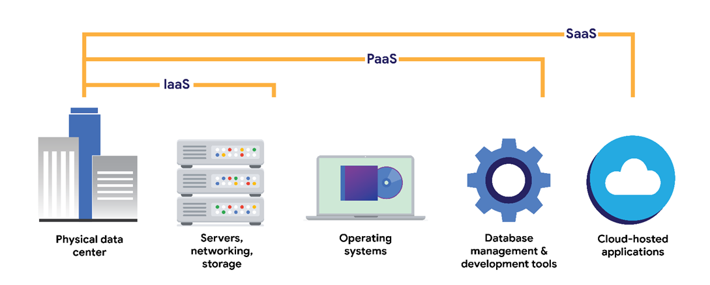

# CLOUD

## <mark style="color:purple;">**Cloud Computing**</mark>

Cloud computing gets its name because the information and services are accessed remotely, in a "cloud" or virtual space, rather than being physically present on your company's devices.

#### <mark style="color:blue;">**Cloud Computing Basics**</mark>

1. **Traditional Networks (On-Premise):**
   * All devices, servers, and data are physically located and maintained in the company’s premises (e.g., office buildings or data centers).
2. **Cloud Computing:**
   * Uses remote servers, applications, and services hosted on the internet.
   * Eliminates the need for physical infrastructure owned by the company.
   * Managed and maintained by a **Cloud Service Provider (CSP)**.

#### **What is a Cloud Service Provider (CSP)?**

* A **CSP** is a company that provides cloud computing services.
* CSPs own massive **data centers** worldwide that house millions of servers.
* These data centers allow companies to:
  * Rent storage and services.
  * Access resources through APIs (Application Programming Interfaces) or web consoles.
* Examples of CSPs: AWS (Amazon Web Services), Microsoft Azure, Google Cloud Platform (GCP).

#### <mark style="color:blue;">**Types of Cloud Services**</mark>

CSPs provide three main categories of cloud services:

1. **Software as a Service (SaaS):**
   * Ready-to-use software hosted by the CSP.
   * Accessed remotely without needing to install or manage it.
   * Examples: Google Workspace (Docs, Sheets), Salesforce, Zoom.
2. **Infrastructure as a Service (IaaS):**
   * Virtual computing resources like servers, storage, and networks.
   * Configured remotely using APIs or web interfaces.
   * Allows businesses to host existing applications or run workloads without maintaining physical hardware.
   * Examples: Amazon EC2 (Elastic Compute Cloud), Microsoft Azure VMs.
3. **Platform as a Service (PaaS):**
   * Tools and frameworks for developers to create and deploy custom applications.
   * Designed to meet specific business needs.
   * Examples: Google App Engine, Microsoft Azure App Service.'

<figure><figcaption>
Cloud Service
</figcaption></figure>

#### <mark style="color:blue;">**Cloud Deployment Models**</mark>

1. **Hybrid Cloud:**
   * Combines cloud services with on-premise resources.
   * Commonly used to reduce costs while keeping sensitive data under company control.
2. **Multi-Cloud:**
   * Uses services from multiple CSPs simultaneously.
   * Allows organizations to avoid vendor lock-in and use the best tools from different providers.

#### <mark style="color:blue;">**Benefits of Cloud Computing**</mark>

1. **Cost Efficiency:**
   * Pay only for what you use.
   * No need to invest in expensive hardware or maintenance.
2. **Scalability:**
   * Resources can be scaled up or down based on demand.
3. **Flexibility:**
   * Access services and data from anywhere with an internet connection.
4. **Reliability:**
   * CSPs offer high availability, backup, and disaster recovery options.
5. **Security:**
   * Advanced security measures are provided by CSPs, including encryption and access controls.

####
