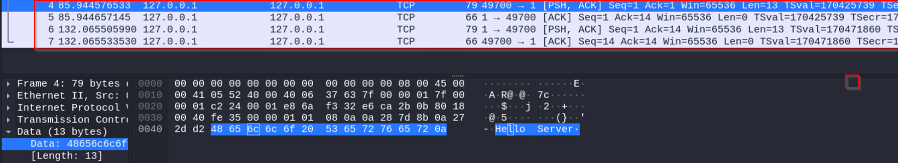
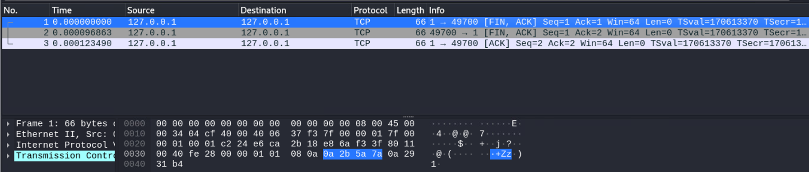
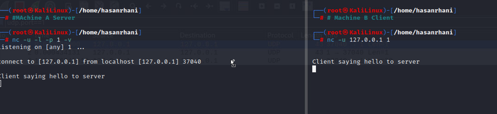
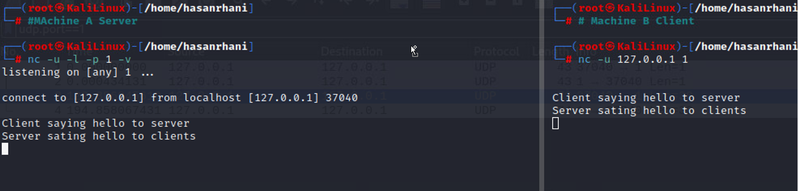
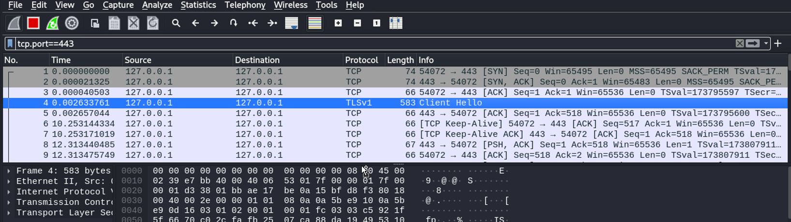

# Network Protocol And Service

## <mark style="color:purple;">Protocol</mark>

> Network Protocol is like **Rules** and **Regulation** for communication between **Endpoints** (Computer and devies) on network.
>
> When mulitpy **Endpoint** (Machine) are connected in a **NETWORK** there needs to be **RULES** in places to determine which Endpoint can provide **SERVICES** And which ones can access those **SERVICE**.

> Think of NETWORK SERVICE as the functionalities or feature that a NETWORK can offer. To make  using these service eaiser and organized.
>
> Rules and Protocols are created similar how RAILWAY provide service tio the public but the rules of ticketing to use those SERVICE.
>
> In the context of a **network**, services might include things like **file sharing, web browsing, email, or video conferencing**, and there are **protocols** in place to ensure these services work smoothly and securely

### <mark style="color:purple;">Communication Protocol</mark>

#### <mark style="color:blue;">Transmission Control Protocol (TCP)</mark>

> TCP Protocol is conversation manager of internet, its help devices connect and sent data reliably. also know as **STATEFULL PROTOCOL.**

### <mark style="color:purple;">Sockets</mark>

> A socket is a low-level network interface for programming, which uses Python to communicate with TCP/UDP protocols.

```python
import requests
import socket

def tcplistener():
    server_socket = socket.socket(socket.AF_INET, socket.SOCK_STREAM)
    server_socket.bind(("127.0.0.1", 8080))
    server_socket.listen()
    print("Listening on 8080")
    
    while True:
        client_socket, addr = server_socket.accept()
        print("Got connection from", addr)
        client_socket.send(b"Welcome\n")
        data = client_socket.recv(1024)
        print(f"User input: {data.decode('utf-8')}")
        client_socket.close()
        break

    server_socket.close()

tcplistener()
```

### <mark style="color:purple;">TCP Half Connection</mark>

> It help devices connect and send data reliably, ituses a **Three-Way Handshake**\
> In TCP communication, a <mark style="color:blue;">**"half connection**</mark>" refers to the initial phase of establishing a connection between a **client and a server**.&#x20;

<mark style="color:blue;">**Packet Level Analysis:**</mark>

<mark style="color:blue;">**TCP Half Connection:**</mark>

| Packet Level            | Description                      |
| ----------------------- | -------------------------------- |
| Wireshark Filter        | tcp.port==1                      |
| Source Address          | 127.0.0.1 (Client IP)            |
| Source MAC Address      | MAC1 (Client's MAC)              |
| Source Port             | \[Client's Dynamic Port]         |
| Destination Address     | 127.0.0.1 (Server IP - Loopback) |
| Destination MAC Address | MAC2 (Server's MAC)              |
| Destination Port        | \[Server's Service Port]         |
| Request/Response        | SYN Packet / Hello Packet        |
|                         | SYN-ACK Packet                   |
|                         | ACK Packet                       |

<mark style="color:blue;">**Half Connection Sequence**</mark>

|                                                                                                                                                                                                                      |
| -------------------------------------------------------------------------------------------------------------------------------------------------------------------------------------------------------------------- |
| **SYN Packet / Hello Packet:** The client initiates the connection by sending a SYN packet, often referred to as a "Hello Packet." This packet is used to request the server's attention and establish a connection. |
| **SYN-ACK Packet:** The server responds with a SYN-ACK packet, acknowledging the client's request and indicating its readiness to establish the connection.                                                          |
| **ACK Packet:** The client sends an ACK packet to confirm that it has received the server's response. This completes the initial handshake phase.                                                                    |
| **Timeout:** If the server does not respond within a certain timeout period (e.g., 75 seconds), the request/response packets may be discarded, and the connection attempt may be considered unsuccessful.            |

1. <mark style="color:blue;">**`A sends a SYN (Synchronize) request to B.`**</mark>
2. <mark style="color:blue;">**`B replies with a FIN/ACK packet.`**</mark>
3. <mark style="color:blue;">**`A acknowledges with an ACK packet.`**</mark>

#### <mark style="color:blue;">TCP Half Connection</mark>

<figure><figcaption><p>TCP SYN Packet</p></figcaption></figure>

#### <mark style="color:blue;">TCP Client Saying Hi To Server</mark>

<figure><figcaption><p>Client Saying HI To Server</p></figcaption></figure>

#### <mark style="color:blue;">TCP Server Saying Hi To Clinet</mark>

<figure><figcaption><p>Server Saying HI to Client</p></figcaption></figure>

> This process represents the "**TCP Half Connection**" phase.

#### <mark style="color:blue;">TCP Full Connection or Five-Way Handshake</mark>

|                                                                                                                                                               |
| ------------------------------------------------------------------------------------------------------------------------------------------------------------- |
| In a complete TCP connection, there's also a "<mark style="color:blue;">**Five-Way Handshake**</mark>" that includes the termination of the connection:       |
| **FIN Packet:** To close the connection, either the client or the server sends a **FIN (Finish) packet** to signal the intention to terminate the connection. |

<figure><figcaption><p>TCP FIN Packet</p></figcaption></figure>

#### <mark style="color:blue;">TCP RESET Packet</mark>

> If the TCP port is not open: If the specified port on the server is not open or not listening, the server may respond with a RST (Reset) packet, indicating that the connection request is rejected.

<figure><figcaption><p>TCP Reset Packet</p></figcaption></figure>

### <mark style="color:purple;">User Datagram Protocol</mark>

> * **UDP** is like <mark style="color:blue;">sending postcards in the mail.</mark>
> * It's quick but doesn't guarantee delivery.
> * Protocol number: **17**.
> * Uses an <mark style="color:blue;">**8-byte header/flag**</mark><mark style="color:blue;">.</mark>
> * Known as a **'Stateless Protocol'** because it doesn't receive confirmation of receipt.
> * Ideal for applications where speed is crucial, such as streaming media.
> * UDP operates at the transport layer in the TCP/IP model.
> * Perfect for applications like online gaming.


In summary, **TCP** ensures reliable and ordered data delivery, **UDP** prioritizes speed,


> * To use **UDP**, you can use the `-u` option.
> * When monitoring UDP traffic with Wireshark, you can use the filter **`udp.port==1`.**
> * The application layer will be visible when you enter the conversation

<figure><figcaption><p>NetCat Listing on UDP Protocols</p></figcaption></figure>

#### <mark style="color:blue;">UDP Request And Response</mark>

<figure><figcaption><p>UDP Request And Response</p></figcaption></figure>

#### <mark style="color:blue;">UDP Clinet to Server</mark>

<figure><figcaption><p>Client Saying Hello To Server</p></figcaption></figure>

#### <mark style="color:blue;">Wireshark of UDP Client to Server</mark>

<figure><figcaption><p>Client Saying Hello to Server Wireshark</p></figcaption></figure>

#### <mark style="color:blue;">UDP Server To Client</mark>

<figure><figcaption><p>UDP Server Saying Hello To Client</p></figcaption></figure>

#### <mark style="color:blue;">UDP Server To Client Wireshark</mark>

<figure><figcaption><p>UDP Server Saying Hello to Clinet Wireshark</p></figcaption></figure>

> * If both the client and server close the **UDP** connection, packets will not be generated.
> * **UDP communication is based on request and response.**


<mark style="color:blue;">**Port number 0 is used when there's no specific port assigned. In such cases, the operating system or application dynamically assigns an available port. This is particularly useful when connecting with multiple tabs in a browser or handling multiple simultaneous communications.**</mark>



### <mark style="color:purple;">File Transfer Protocol (FTP)</mark>

> Used for Sharing Files on LAN and WAN.
>
> Port 20 is used for DATA CONNECTION
>
> Port 21 is used for CONTROL CONNECTION.

<figure><figcaption><p>FTP Connection</p></figcaption></figure>

### <mark style="color:purple;">Internet Control Message Protocol (ICMP)</mark>

> ICMP is a **network** layer protocol primarily used for diagnosing **network**-related issues and checking connectivity between devices on a **network**. It provides two main services

### <mark style="color:purple;">Address Resolution Protocol (ARP)</mark>

> Hub boardcast all the Data to find MAC Address, where Switch doesn't boardcast its Data it used ARP Requests.
>
> Each device on the **network** performs **ARP** (Address Resolution Protocol) and maintains an **ARP cache**, which keeps track of matching **IP and MAC addresses.** ARP does not have a specific port number

<figure><figcaption><p>ARP Request</p></figcaption></figure>


```bash
show ip arp
show ip arp interface ethernet 0/0
```


#### <mark style="color:blue;">Reverse Address Resolution Protocol (RARP)</mark>

* it's the opposite of ARP, ARP is to find MAC butin RARP is to find IP Address thorugh MAC Address.
* RARP is introducted by IEEE and its has been replaced by DHCP .

#### <mark style="color:blue;">Generic Attribute Registration Protocol (GARP)</mark>

> In ARP if the old MAC is replaced by the New MAC, Switch and ARP both don't update the table that where GARP comes in.
>
> GARP means were the New MAC is added and its request to boardcast that "its new here" and all the activate devices will now the NEW MAC.

<details>

<summary>Why ARP use When GARP is feaure that Updates everyone there MAC ?</summary>

Because when GARP is updateing to everyone some Devices which are inactive will not get the NEW MAC so that why ARP is used.

</details>

> GARP also Detech duplicate IP
>
> When to config the IP that has already asign to everyone then PC use GARP to Know everyone that THE NEW MAC then the packet goes to the 'already asign PC ' then it say to the devices that i have already using the IP Address please change it to the NEW MAC devices.

### <mark style="color:purple;">HTTP (Hypertext Transfer Protocol)</mark>

> * **HTTP** is like a language for web browsers and servers.
> * It facilitates communication between your **browser** and **websites**.
> * Uses **port 80**.
> * **HTTP** is considered <mark style="color:red;">insecure</mark>, so it's being replaced by  [#http-s](network-protocol-and-service.md#http-s "mention")for security.
> * However, **HTTP** is still used by some websites.
> * **HTTP** operates at the application layer in the TCP/IP model.

### <mark style="color:purple;">**Management Protocols**</mark>

> **Management protocols** are like **network** supervisors, helping monitor and optimize **network** activity.&#x20;

#### <mark style="color:blue;">**SNMP (Simple Network Management Protocol):**</mark>

> * Manages and monitors devices on a **network**.
> * Can change device configurations and check **bandwidth usage.**
> * Occurs at the application layer in the [#tcp-ip-protocol](osi-model-layer.md#tcp-ip-protocol "mention").
> * <mark style="color:blue;">**ICMP (Internet Control Message Protocol):**</mark>
>   * Used to report data transmission errors between devices.
>   * Often used for troubleshooting with the "**ping**" command.

### <mark style="color:purple;">**Security Protocols**</mark>

> **Security protocols** are like <mark style="color:blue;">**digital bodyguards for your data.**</mark> They ensure secure communication:

#### <mark style="color:blue;">**HTTPS (Hypertext Transfer Protocol Secure):**</mark>

> * Provides secure communication between clients and websites.
> * Uses **SSL/TLS encryption** to protect data.
> * Operates at the application layer and uses port 443 in the TCP/IP model.

#### <mark style="color:blue;">**SFTP (Secure File Transfer Protocol):**</mark>

> * Securely transfers files over a **network**.
> * Uses SSH with encryption to prevent interception.
> * Occurs at the application layer and commonly used with cloud storage.

### <mark style="color:purple;">Email Protocols</mark>

#### <mark style="color:blue;">Post Office Protocol (POP)</mark>

* **POP (Post Office Protocol)** is an **application layer protocol** (Layer 4 of the TCP/IP model) used to manage and retrieve email from a mail server.
* Many organizations have dedicated mail servers that handle incoming and outgoing mail for users on the **network**.
* User devices send requests to the remote mail server to download email messages locally.
* POP operates over **TCP/UDP port 110** for unencrypted, plaintext authentication, and **TCP/UDP port 995** over **Secure Sockets Layer/Transport Layer Security (SSL/TLS)** for encrypted emails.
* With POP, mail must finish downloading on a local device before it can be read, and it doesn't allow users to sync emails.

#### <mark style="color:blue;">Internet Message Access Protocol (IMAP)</mark>

* **IMAP (Internet Message Access Protocol)** is used for incoming email. It downloads email headers but not the content.
* Email content remains on the email server, allowing users to access their email from multiple devices.
* IMAP uses **TCP port 143** for unencrypted email and **TCP port 993** over **TLS** for encrypted email.
* IMAP allows users to partially read email before it finishes downloading and supports email synchronization. However, it is typically slower than POP3.

#### <mark style="color:blue;">Simple Mail Transfer Protocol (SMTP)</mark>

* **SMTP (Simple Mail Transfer Protocol)** is used to transmit and route email from the sender to the recipient's address.
* SMTP works with **Message Transfer Agent (MTA)** software, which resolves email addresses to IP addresses using DNS servers to ensure emails reach their intended destination.
* SMTP uses **TCP/UDP port 25** for unencrypted emails and **TCP/UDP port 587** using **TLS** for encrypted emails.
* TCP port 25 is often associated with high-volume spam, but SMTP helps filter out spam by regulating how many emails a source can send at a time.

## <mark style="color:purple;">**Ports**</mark>

**Ports** are like the <mark style="color:purple;">**doors and windows Or Gates of the digital world.**</mark> They allow communication between devices and services on a **network**.

### <mark style="color:purple;">**Types of Ports:**</mark>

* **Physical Ports:** These are like the physical connectors on your devices, such as Ethernet, USB, or AUX ports.
* **Virtual Ports:** These are logical channels for data to flow through software. There are 65535 of them, and 1024 are commonly reserved for specific services.

<mark style="color:blue;">TCP and UDP:</mark>

* Both virtual and physical ports have two roads: TCP and UDP, Then Both ways have 65535 roads.
* **TCP (Transmission Control Protocol):** It's like a reliable, guaranteed delivery service. It ensures data won't be lost during transmission.
* **UDP (User Datagram Protocol):** This is more like a speedy courier. It's fast but doesn't guarantee delivery; some data may be lost.

#### <mark style="color:blue;">**Rules and Regulations:**</mark>

* **TCP:** Promises not to drop your data, ensuring it gets to the destination intact.
* **UDP:** Can't guarantee data won't be dropped, but it's faster for things like real-time streaming.

#### <mark style="color:blue;">**Server and Client:**</mark>

* **Server:** Software that provides services, like **HTTP, MySQL, FTP, or SSH.**
* **Client:** Software that uses those services, like **web browsers, database clients, FTP clients, or SSH clients.**
* Servers and clients communicate through **ports** to access and exchange data and services.


In the digital world, ports are like **doors**, and **TCP/UDP** are the **rules for delivery,** <mark style="color:blue;">**allowing servers and clients to talk and share data.**</mark>


### <mark style="color:purple;">Services and Protocols</mark>

> **Protocols have their own&#x20;**<mark style="color:blue;">**rules and regulations**</mark>**, and the&#x20;**<mark style="color:blue;">**same applies to services**</mark>**&#x20;as well. Services depend on&#x20;**<mark style="color:purple;">**protocols**</mark>**, meaning that to use software applications or deploy services, they must adhere to the&#x20;**<mark style="color:blue;">**rules and regulations**</mark>**&#x20;of both the protocol and the service**

#### <mark style="color:blue;">PING</mark>

* **Purpose**: **Ping** is used to check the connectivity of a **network** or a specific device on the **network**.
* **Protocol Rules**: Ping follows specific protocol rules to measure various aspects of **network** connectivity, such as determining whether messages are delivered, counting the timing of message delivery, and identifying packet loss or **network** downtime.
* **Methods**: Ping uses two primary methods - ECHO and Echo Reply.

<mark style="color:blue;">**ICMP Echo (Request)**</mark>

| Field                   | Description                           |
| ----------------------- | ------------------------------------- |
| Source Address          | IP address of the source device       |
| Source MAC Address      | MAC address of the source device      |
| Source Port             | Source port (N/A for ICMP)            |
| Destination Address     | IP address of the destination device  |
| Destination MAC Address | MAC address of the destination device |
| Destination Port        | Destination port (N/A for ICMP)       |
| ICMP Code               | Specific code for ICMP Echo (Request) |
| Data                    | Data payload                          |

<mark style="color:blue;">**ICMP Echo Reply (Response)**</mark>

| Field                   | Description                                  |
| ----------------------- | -------------------------------------------- |
| Source Address          | IP address of the responding device          |
| Source MAC Address      | MAC address of the responding device         |
| Source Port             | Source port (N/A for ICMP)                   |
| Destination Address     | IP address of the original sender            |
| Destination MAC Address | MAC address of the original sender           |
| Destination Port        | Destination port (N/A for ICMP)              |
| ICMP Code               | Specific code for ICMP Echo Reply (Response) |
| Data                    | Data payload                                 |


```
(config)# ping 8.8.8.8 
```


#### <mark style="color:blue;">Traceroute</mark>

> **Purpose**: Traceroute is used to identify the path that **network** packets take from the source device to the destination address. It helps in understanding the route taken by packets and can be useful in diagnosing **network** routing issues.

> **How it Works**: Traceroute sends a series of packets with increasing **Time-to-Live (TTL) values**. Each router along the path decrements the TTL value. When the TTL reaches zero, the router sends an ICMP Time Exceeded message back to the source device. By analyzing these messages, Traceroute can determine the route and delays involved in reaching the destination.

> **ICMP**, particularly **Ping** and **Traceroute**, is valuable for **network** troubleshooting and monitoring **network** performance. These tools provide essential insights into **network** connectivity and routing.


```bash
(config) traceroute 8.8.8.8 
```



```bash
tracert 8.8.8.8
```


#### <mark style="color:blue;">**DNS**</mark>



* **Domain Name System** uses port **53 works on UDP protocol mostly but also works on TCP.**
* **Domain Name System (DNS)** is a protocol that translates internet domain names into IP addresses. When a client computer wishes to access a website domain using their internet browser, a query is sent to a dedicated DNS server. The **DNS** **server** then looks up the IP address that corresponds to the website domain. DNS normally uses **UDP on port 53**. However, if the DNS reply to a request is large, it will switch to using the TCP protocol. In the [Broken link](broken-reference "mention"), DNS occurs at the application layer.



* Because all the device /router/ any machine understand binary, and we humans are not good in remembering numbers/IP Address. That why DNS comes and helps, It requery Numbers / IP Address into Names



#### <mark style="color:blue;">**DNS Types**</mark>

> DNS has Multiply types of Records

> A record: Is requery for IPv4
>
> AAAA record : is requery for IPv6
>
> MX record \[mail server record ]: it specifies the mail server responsible for accepting incoming emails.
>
> Name server Record: It provides information about authoritative name servers for a domain.
>
> CNAME Record: Redirector \[One server domain redirect to Different Server domain], It acts as a redirector, redirecting one server domain to a different server domain.


**The latest and best which is used in Current Network environment is QUIC Protocol !!.**


| **DNS Request Packet**       |                    | **DNS Response Packet**      |                    |
| ---------------------------- | ------------------ | ---------------------------- | ------------------ |
| **Source Address:**          | 127.0.0.1          | **Source Address:**          | 127.0.0.1          |
| **Source MAC Address:**      | MAC1               | **Source MAC Address:**      | MAC1               |
| **Source Port:**             | 53                 | **Source Port:**             | 53                 |
| **Destination Address:**     | 8.8.8.8            | **Destination Address:**     | 127.0.0.1          |
| **Destination MAC Address:** | MAC2               | **Destination MAC Address:** | MAC1               |
| **Destination Port:**        | 53                 | **Destination Port:**        | 53                 |
| **Request:**                 | Nasa.com           | **Response:**                | 200.1.1.10         |
| **DATA:**                    | \[Additional data] | **DATA:**                    | \[Additional data] |

#### <mark style="color:blue;">**Configuration**</mark>


**The configuration/CMD may very as per OEMs.**


1. <mark style="color:orange;">**`ip dns server`**</mark>**&#x20;\[enable to act as a DNS server]**: This command typically enables the device to act as a DNS server. It allows the device to respond to DNS queries from clients on the **network**. Enabling this feature allows the device to perform DNS resolution.
2. <mark style="color:orange;">**`ip dns server gateway`**</mark>: This command might specify the gateway or route for DNS traffic. It could indicate the path that DNS requests should take when leaving the local **network**.
3. <mark style="color:orange;">**`ip host www.google.com`**</mark> **\[Name of Site] 192.168.10.50 \[IP address of that host]**: This command configures a static DNS mapping. It associates the hostname "www.google.com" with the IP address "192.168.10.50." This is useful for cases where you want to manually specify DNS mappings for specific hosts on your **network**.
4. <mark style="color:orange;">**`show running-configure | s ip host | ip dns`**</mark>: This command displays the running configuration of the device and filters the output to show lines containing "ip host" or "ip dns." It allows you to view the current DNS-related configuration settings.

#### <mark style="color:blue;">Dynamic Host Configuration Protocol (DHCP)</mark>

> **Dynamic Host Configuration Protocol (DHCP)** is in the management family of **network** protocols. DHCP is an application layer protocol used on a **network** to configure devices. It assigns a unique IP address and provides the addresses of the appropriate DNS server and default gateway for each device. DHCP servers operate on UDP port 67 while DHCP clients operate on UDP port 68.

> **Bootstrap Protocol** is Designs to get client IPs and it has services 68 and 67 ports And the different is DHCP Work Under UDP and Bootstrap Protocol doesn’t

* DHCP is a **network** protocol used to automatically assign IP addresses and other **network** configuration parameters to devices on a **network**.
* **It operates over UDP (User Datagram Protocol) and uses port numbers 68 (DHCP Server or BOOTP) and 67 (DHCP Client or BOOTPC).**

<table data-full-width="true"><thead><tr><th width="141">DHCP Stage</th><th width="130">Packet Type</th><th width="143">Source Address</th><th width="165">Source MAC Address</th><th>Source Port</th><th>Destination Address</th><th>Destination MAC Address</th><th>Destination Port</th><th>Requested Information</th></tr></thead><tbody><tr><td>DHCP Discover Packet</td><td>DHCP Discover Packet</td><td>0.0.0.0</td><td>MAC1</td><td>68 (Client)</td><td>255.255.255.255</td><td>MAC2 (Broadcast)</td><td>67 (Server)</td><td>UDP Request (Discover)</td></tr><tr><td>DHCP Offer Packet</td><td>DHCP Offer Packet</td><td>0.0.0.0</td><td>MAC1</td><td>67 (Server)</td><td>255.255.255.255</td><td>MAC2 (Broadcast)</td><td>68 (Client)</td><td>UDP Offered IP Address (192.168.10.3)</td></tr><tr><td>DHCP Request Packet</td><td>DHCP Request Packet</td><td>0.0.0.0</td><td>MAC1</td><td>68 (Client)</td><td>255.255.255.255</td><td>MAC2 (Broadcast)</td><td>67 (Server)</td><td>UDP Requested IP Address (192.168.10.3)</td></tr><tr><td>DHCP Acknowledge Packet</td><td>DHCP Acknowledge Packet</td><td>0.0.0.0</td><td>MAC1</td><td>67 (Server)</td><td>255.255.255.255</td><td>MAC2 (Broadcast)</td><td>68 (Client)</td><td>UDP Given IP Address (192.168.10.3)</td></tr></tbody></table>

<figure><figcaption><p>LOGS Of DHCP Packets</p></figcaption></figure>

#### <mark style="color:blue;">Configuration</mark>.


**The configuration/CMD may very as per OEMs.**


| DHCP Server                                                                                                                                                                                                                                                                                |
| ------------------------------------------------------------------------------------------------------------------------------------------------------------------------------------------------------------------------------------------------------------------------------------------ |
| <mark style="color:orange;">**`ip dhcp pool`**</mark> `[Name]`: This command is used to create a DHCP pool with a specified name. A DHCP pool defines the range of IP addresses that the DHCP server can assign to clients.                                                                |
| <mark style="color:orange;">**`network`**</mark>` ``[192.168.10.0 255.255.255.0]`: This command specifies the network address and subnet mask for the DHCP pool. It defines the range of IP addresses that can be allocated to clients within this pool.                                   |
| <mark style="color:orange;">**`default-gateway`**</mark>` ``[IP-Address of Default Gateway]`: Here, you specify the default gateway's IP address that will be provided to DHCP clients. The default gateway is used for routing traffic outside the local **network**.                     |
| <mark style="color:orange;">**`dns-server`**</mark>` ``[IP-Address in DNS Server]`: This command configures the DNS (Domain Name System) server's IP address that DHCP clients should use for domain name resolution.                                                                      |
| <mark style="color:orange;">**`domain-name`**</mark>` ``[Name of Domain]`: You set the domain name that DHCP clients should use. This domain name is often used for local **network** naming conventions.                                                                                  |
| <mark style="color:orange;">**`option`**</mark>` ``[Number of Option]`: DHCP options are used to provide additional configuration information to clients. The number corresponds to a specific DHCP option, and you can assign values to these options based on your network requirements. |
| <mark style="color:orange;">**`debug ip dhcp server packet`**</mark> \[to check/see the packet of client to server]                                                                                                                                                                        |
| <mark style="color:orange;">**`show ip dhcp binding`**</mark> \[to check/see the ip address given to Client data]                                                                                                                                                                          |
| <mark style="color:orange;">**`show ip dhcp pool lease`**</mark> \[to check the duration timing / it can be increased to days or infinite.]                                                                                                                                                |

```

Steps to configure DHCP server through CLI.
Login to the device using SSH / TELNET and go to enable mode.

Go into the config mode.
Router#configure terminal
Enter configuration commands, one per line. End with CNTL/Z. 
Router(config)#

Exclude IP addresses from being assigned by DHCP by using the ip dhcp excluded-address FIRST_IP LAST_IP
Router(config)#ip dhcp excluded-address 192.168.0.1 192.168.0.50
Router(config)#

Create a new DHCP pool with the ip dhcp pool NAME command
Router(config)#ip dhcp pool Floor1DHCP
Router(dhcp-config)#

Define a subnet that will be used to assign IP addresses to hosts with the network SUBNET SUBNET_MASK command.
Router(dhcp-config)#network 192.168.0.0 255.255.255.0
Router(dhcp-config)#

Define the default gateway with the default-router IP command
Router(dhcp-config)#default-router 192.168.0.1
Router(dhcp-config)#

Define the DNS server with the dns-server IP address command.
Router(dhcp-config)#dns-server 192.168.0.1
Router(dhcp-config)#

Return to privilege config mode
Router(dhcp-config)#exit
Router(config)#

Enable DHCP server on the interface using service dhcp interface-type number command
Router(config)#service dhcp vlan1
Router(config)#

Exit config mode
Router(config)#exit
Router#

To view information about the currently leased addresses, you can use the show ip dhcp binding command
Router#show ip dhcp binding
IP address Client-ID/ Lease expiration Type
Hardware address
192.168.0.51 0060.5C2B.3DCC -- Automatic
In the output above you can see that there is a single DHCP client that was assigned the IP address of 192.168.0.51. Since we’ve excluded the IP addresses from the 192.168.0.1 – 192.168.0.50 range, the device got the first address available – 192.168.0.51.


To display information about the configured DHCP pools, you can use the show ip dhcp pool command
Router#show ip dhcp pool
Pool Floor1DHCP :
Utilization mark (high/low) : 100 / 0
Subnet size (first/next) : 0 / 0
Total addresses : 254
Leased addresses : 1
Excluded addresses : 1
Pending event : none

1 subnet is currently in the pool
Current index IP address range Leased/Excluded/Total
192.168.0.1 192.168.0.1 - 192.168.0.254 1 / 1 / 254
This command displays some important information about the DHCP pool(s) configured on the device – the pool name, total number of IP addresses, the number of leased and excluded addresses, subnet’s IP range, etc.


Copy the running configuration into startup configuration using below command
Router#write memory
Building configuration... [OK]
Router#
```


| **Configlet Name**    | Configure DHCP Server Cisco                                                                                                                                                                                                                                                                                                                  |
| --------------------- | -------------------------------------------------------------------------------------------------------------------------------------------------------------------------------------------------------------------------------------------------------------------------------------------------------------------------------------------- |
| **Description**       | Script execution mode                                                                                                                                                                                                                                                                                                                        |
| **Execution Mode**    | This article is about how to configure Cisco Router as DHCP server using CLI and how to update on multiple devices simultaneously in NCM application using configlets.                                                                                                                                                                       |
| **Configlet Content** | <p>configure terminal<br>ip dhcp excluded-address $EXCLUDE_FIRST_IP $EXCLUDE_LAST_IP<br>ip dhcp pool $MY_POOL_NAME<br>network $SUBNET $SUBNET_MASK<br>default-router $DEFAULT_ROUTER_IP<br>dns-server $DNS_SERVER_IP<br>exit<br>service dhcp $INTERFACE_TYPE_NUMBER<br>exit<br>show ip dhcp binding<br>show ip dhcp pool<br>write memory</p> |

### <mark style="color:purple;">HTTP\S</mark>

> It's a **Service which uses protocols.**
>
> Sources want to communicate with HTTP OR HTTPS it will use this protocol or the structure of this protocol \[TCP/UDP] Latest is QUIC

#### <mark style="color:blue;">URL Structured</mark>

<figure><figcaption><p>URL Structure</p></figcaption></figure>

| How is the URL structured?                                                                                                                                                                                                                                                                            |
| ----------------------------------------------------------------------------------------------------------------------------------------------------------------------------------------------------------------------------------------------------------------------------------------------------- |
| The first is `[`<mark style="color:blue;">**`which/what is protocol`**</mark>`]` <mark style="color:green;">**`http/https`**</mark>                                                                                                                                                                   |
| The second is ip-addr or name `[`<mark style="color:blue;">**`which and what is the destination`**</mark>`]` <mark style="color:green;">**`http://192.168.1.1`**</mark>                                                                                                                               |
| The third is Path or folder `[`<mark style="color:blue;">**`wherever the services have in the backend file and Directory`**</mark>`]` <mark style="color:green;">**`http://192.168.1.1/unresticeted-file-upload.php`**</mark>                                                                         |
| The fourth is Whatever the file you want to access after this `[`<mark style="color:blue;">**`cmd is a parameter here and whoami is the value here for the that particular Shell`**</mark>` ``]` <mark style="color:orange;">**`http://192.168.1.1/unresticeted-file-upload.php?/cmd/whoami`**</mark> |
|                                                                                                                                                                                                                                                                                                       |

#### <mark style="color:blue;">Hypertext Transfer Protocol (HTTP)</mark>&#x20;

> Works on Port 80

| `nc lvp 80 [server]`                                |
| --------------------------------------------------- |
| `nc 127.0.0.1 80 [client or use browser]`           |
| First **TCP** connection made because http uses TCP |
| Then **http** connection made:                      |

#### <mark style="color:blue;">HTTP PACKET</mark>

<figure><figcaption><p>HTTP Packet</p></figcaption></figure>

> First **TCP** connection made because http uses TCP
>
> Then **http** connection made:

#### <mark style="color:blue;">HTTP PACKET Wireshark</mark>

<figure><figcaption><p>HTTP Packet Wireshark</p></figcaption></figure>

#### <mark style="color:blue;">HTTP FIN Packet</mark>

<figure><figcaption><p>HTTP FIN Packet</p></figcaption></figure>

#### <mark style="color:blue;">HTTP RST Packet Wireshark</mark>

> **When the port is not open and client request in TCP this is the RSK packet:**

<figure><figcaption><p>HTTP RST Packets Wireshark</p></figcaption></figure>

### <mark style="color:purple;">HTTPS</mark>

> **HTTPS Port 443**
>
> **HTTPS** is the upgradation version on HTTP.
>
> **HTTPS** is secure as in HTTP the message and packet are in readable format. But in HTTPS the packets are not in readable format.

#### <mark style="color:blue;">HTTPS Packet</mark>

<figure><figcaption><p>HTTPS Packet</p></figcaption></figure>

#### <mark style="color:blue;">HTTPS Packet Wireshark</mark>

<figure><figcaption><p>HTTPS Hello Packet Wireshark</p></figcaption></figure>


```bash
(config) ip http secure-server
```


#### <mark style="color:blue;">**SSL is Included in HTTPS**</mark>

> Hello client Is including in https service rule.
>
> Because of SSL it used to encrypted the packets

<figure><figcaption><p>HTTPS SSL Wireshark</p></figcaption></figure>

#### <mark style="color:blue;">FIN Packet</mark>

<figure><figcaption><p>FIN Packets</p></figcaption></figure>


```
(config)#ip http service
```


### <mark style="color:purple;">HTTP/S Methods</mark>

> In HTTP it has some methods which is

GET change the URL, GET / \[file size XXXXXXXXXXXXXXXX] /HTTP 1.1 And GET has some limitation that URL can be big enough but when you upload something, it has size limitations. that where POST comes.

**The basis search functionality can be use through GET**

#### **GET**:-

* The GET method is used to retrieve information from the given server using a given URL. Requests using GET should only retrieve data and should have no other effect on the data

**GET Method Request:**

| Request Line              | Headers                                |
| ------------------------- | -------------------------------------- |
| \`GET /hello.htm HTTP/1.1 | User-Agent: Mozilla/4.0 (Windows NT)\` |
|                           | Host: \[IP, Name]                      |
|                           | Accept-Language: en-us                 |
|                           | Accept-Encoding: gzip, deflate         |
|                           | Connection: Keep-Alive                 |

**GET Method Response:**

| Status Line     | Headers                                | Body                                    |
| --------------- | -------------------------------------- | --------------------------------------- |
| HTTP/1.1 200 OK | Date: Mon, DD-MM-YYYY HH:MM:SS IST     | `\<html>...\<h1>Hello, World!\</h1>...` |
|                 | Server: Apache/2.2.14 (Win32)          |                                         |
|                 | Last-Modified: DD-MM-YYYY HH:MM:SS IST |                                         |
|                 | Content-Type: text/html                |                                         |
|                 | Connection: Closed/open                |                                         |

#### POST

* When Uploading file HTTP/HTTPS use POST, and Submit sensitivity information because the URL don’t change it stick to the **`[title]`** The POST data will not be going to be visible in Brower history, it can be used for multi-purpose file Uploading, sensitive information, cookies ETC
* **Content Typ**e ==> can be different type like ==> multipart/form data is the most common content type, boundary is the beginning and ending part.
* **USER-Agent** ==> will going to have your browser information , at server end they can access-list the browser they what the client to interreact with
* **ACCEPT** ==> It is telling to server I can accept which type of data value
* **ACCEPTY** ==> Encoding ==> client browser accept there are different encoding value that your browser allowed and the server will send whenever its required
* **COOKIE** ==> whenever login in to particular website your authentication data will gonna be saved in a cookie format

| Request Line                       | Headers                                                    |
| ---------------------------------- | ---------------------------------------------------------- |
| POST /cgi-bin/process.cgi HTTP/1.1 | User-Agent: Mozilla/4.0 (compatible; MSIE5.01; Windows NT) |
|                                    | Host: 192.168.1.1/ane-pte                                  |
|                                    | Content-Type: text/xml; charset=utf-8                      |
|                                    | Accept-Language: en-us                                     |
|                                    | Accept-Encoding: gzip, deflate                             |
|                                    | Connection: Keep-Alive                                     |

**POST Method Response:**

| Status Line                                         | Headers                                |
| --------------------------------------------------- | -------------------------------------- |
| <mark style="color:green;">`HTTP/1.1 200 OK`</mark> | Date: DD-MM-YYYY HH:MM:SS IST          |
|                                                     | Server: Apache/2.2.14 (Win32)          |
|                                                     | Last-Modified: DD-MM-YYYY HH:MM:SS IST |
|                                                     | Vary: Authorization, Accept            |
|                                                     | Content-Type: text/html                |
|                                                     | Connection: Closed/open                |

<mark style="background-color:purple;">#http://192.168.1.1/Files/unrestricted\_file.php/?username=xyz/?password=xyz</mark>

#### Options

* its say what are the other methods that are allowed. The OPTIONS method is used by the client to find out the HTTP methods and other options supported by a web server. The client can specify a URL for the OPTIONS method, or an asterisk (\*) to refer to the entire server. The following example requests a list of methods supported by a web server running.

**OPTIONS Method Request:**

| Request Line        | Headers                                          |
| ------------------- | ------------------------------------------------ |
| OPTIONS \* HTTP/1.1 | User-Agent: Mozilla/4.0 (compatible; Windows NT) |

**OPTIONS Method Response:**

| Status Line                                         | Headers                                |
| --------------------------------------------------- | -------------------------------------- |
| <mark style="color:green;">`HTTP/1.1 200 OK`</mark> | Date: Mon, DD-MM-YYYY HH:MM:SS IST     |
|                                                     | Server: Apache/2.2.14 (Win32)          |
|                                                     | Allow: GET, HEAD, POST, OPTIONS, TRACE |
|                                                     | Content-Type: httpd/unix-director      |

#### Put

* **Something** to be **uploaded**.
* Example: register on website this will happened through POST methods let say change the password that can be done by PUT method, it can depend on developer if want to use PUT

**PUT Method Request:**

| Request Line            | Headers                                          |
| ----------------------- | ------------------------------------------------ |
| PUT /hello.htm HTTP/1.1 | User-Agent: Mozilla/4.0 (compatible; Windows NT) |
|                         | Host: \[IP, Name]                                |
|                         | Accept-Language: en-us                           |
|                         | Connection: Keep-Alive                           |
|                         | Content-type: text/html                          |

**PUT Method Response:**

| Status Line          | Headers                            |
| -------------------- | ---------------------------------- |
| HTTP/1.1 201 Created | Date: Mon, DD-MM-YYYY HH:MM:SS IST |
|                      | Server: Apache/2.2.14 (Win32)      |
|                      | Content-type: text/html            |
|                      | Content-length: 30                 |
|                      | Connection: Closed                 |

#### Delete Method

* Mostly used in APIs , this help deleting a data form XYZ, this DELETE method is used to request the server to delete a file at a location specified by the given URL.

**DELETE Method Request:**

| Request Line               | Headers                                          |
| -------------------------- | ------------------------------------------------ |
| DELETE /hello.htm HTTP/1.1 | User-Agent: Mozilla/4.0 (compatible; Windows NT) |
|                            | Host: \[IP, Name]                                |
|                            | Accept-Language: en-us                           |
|                            | Connection: Keep-Alive                           |

**DELETE Method Response:**

| Status Line     | Headers                       |
| --------------- | ----------------------------- |
| HTTP/1.1 200 OK | Date: DD-MM-YYYY HH:MM:SS IST |
|                 | Server: Apache/2.2.14 (Win32) |
|                 | Content-type: text/html       |

#### Connect Method

* The CONNECT method is used by the client to establish a **network** connection to a web server over HTTP.

**CONNECT Method Request:**

| Request Line                 | Headers                                          |
| ---------------------------- | ------------------------------------------------ |
| CONNECT \[IP, Name] HTTP/1.1 | User-Agent: Mozilla/4.0 (compatible; Windows NT) |

**CONNECT Method Response:**

| Status Line                         | Headers                            |
| ----------------------------------- | ---------------------------------- |
| HTTP/1.1 200 Connection established | Date: Mon, DD-MM-YYYY HH:MM:SS IST |
|                                     | Server: Apache                     |

### HTTP Status Code

**`1XX` - Informational / Hold On:**

* 100 Continue: Continue with the request.
* 101 Switching Protocols: Switch to a new protocol.
* 102 Processing: Request is being processed, but there's no response yet.

<mark style="color:green;">**`2XX`**</mark>**&#x20;- Success / Here you go:**

* 200 OK: Request successful; data returned.
* 201 Created: Request successful; a new resource has been created.
* 202 No Content: Request successful; no data to return (typically used for updates).
* 205 Reset Content: Request successful; client should reset the document view.

<mark style="color:blue;">**`3XX`**</mark>**&#x20;- Redirection / Go Away :**

* 300 Multiple Choices: Multiple options available; client should choose one.
* 302 Found: Resource temporarily moved; use the new URL (commonly used for redirects).
* 303 See Other: Similar to 302, but explicitly indicating a GET request to the new URL.
* 305 Use Proxy: Resource must be accessed through a proxy.

<mark style="color:red;">**`4XX`**</mark>**&#x20;- Client Error / You Fucked Up:**

* 400 Bad Request: Server can't understand the request due to malformed syntax.
* 401 Unauthorized: Request lacks proper authentication credentials.
* 402 Payment Required: Not widely used, and meaning not well-defined.
* 404 Not Found: Requested resource was not found.

<mark style="color:yellow;">**`5XX`**</mark>**&#x20;- Server Error / I Fucked Up:**

* 501 Not Implemented: Server doesn't support needed functionality.
* 502 Bad Gateway: Server acting as a gateway received an invalid response from an upstream server.
* 503 Service Unavailable: Server currently unable to handle the request due to overloading or maintenance.
* 504 Gateway Timeout: Server acting as a gateway did not receive a timely response from an upstream server.
* 506 Variant Also Negotiates: Server has an internal configuration error.
* 507 Insufficient Storage: Server is unable to store the representation needed to complete the request.
