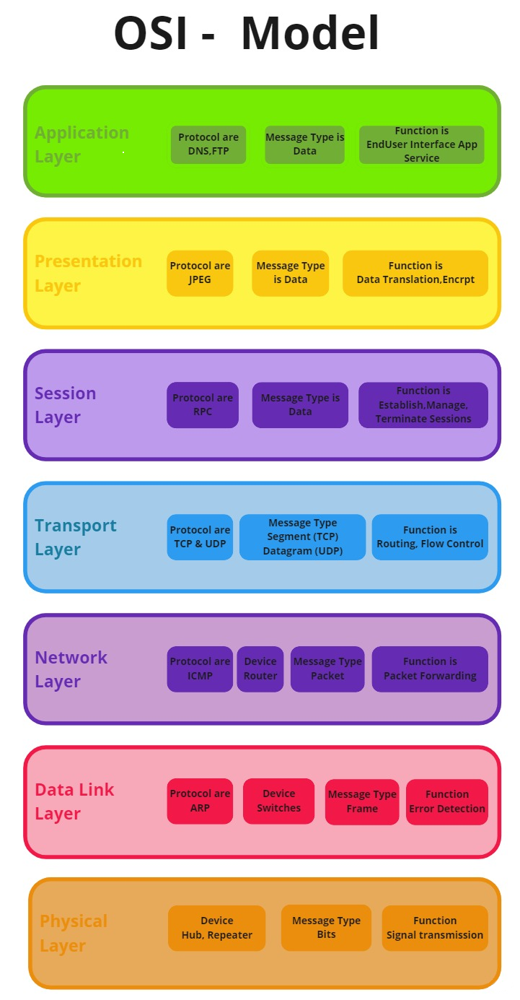
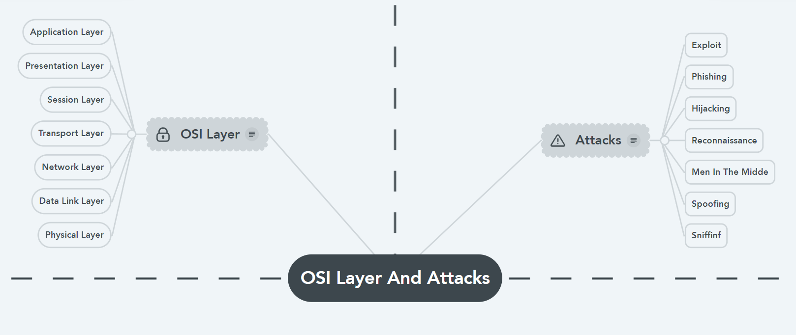
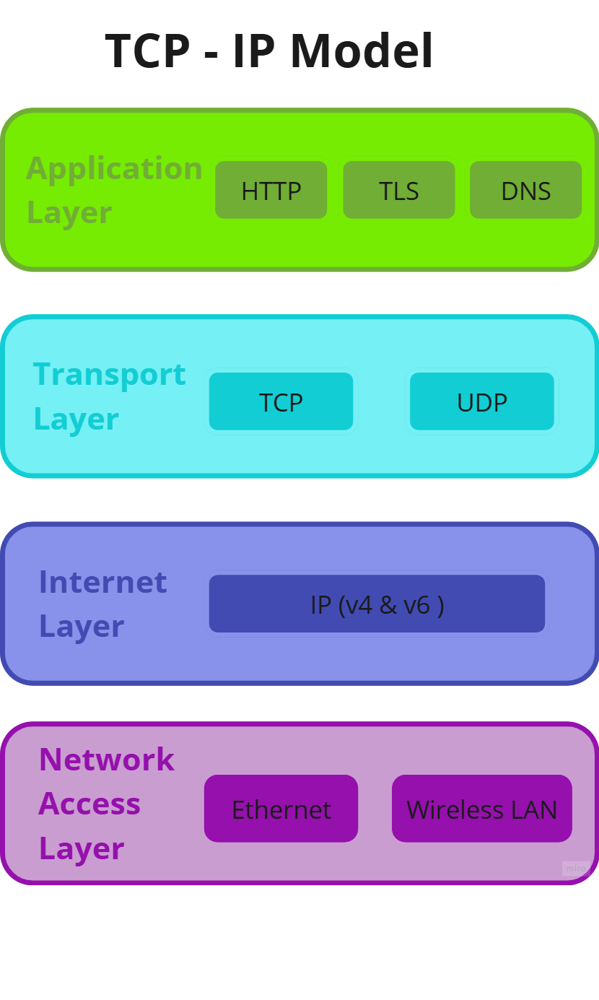

# OSI MODEL LAYER

### <mark style="color:purple;">Internaltional Standard Organization (ISO)</mark>

> Its an organization that sets international Standards for various measurements.

### <mark style="color:purple;">Open System InterConnection (OSI)</mark>

> The OSI model describes **Seven Layers** used by endpoint (Computer) system to communicate over a Network.
>
> Its depends in connecting different vendours and PCs thorugh Standardized protocol/Rules.&#x20;

<mark style="color:blue;">**How does data transfer through OSI?**</mark>

> Data transfer thorugh OSI layer.

### <mark style="color:purple;">**OSI Model Layers**</mark>

<table><thead><tr><th width="178">Layer Number</th><th width="191">Layer Name</th><th>Corresponding OSI Layer</th></tr></thead><tbody><tr><td>7</td><td>Application Layer</td><td>Application, Presentation, Session Layers</td></tr><tr><td>6</td><td>Presentation Layer</td><td>Presentation Layer</td></tr><tr><td>5</td><td>Session Layer</td><td>Session Layer</td></tr><tr><td>4</td><td>Transport Layer</td><td>Transport Layer</td></tr><tr><td>3</td><td>Network Layer</td><td>Network Layer</td></tr><tr><td>2</td><td>Data Link Layer</td><td>Data Link Layer</td></tr><tr><td>1</td><td>Physical Layer</td><td>Physical Layer</td></tr></tbody></table>

### <mark style="color:purple;">Application Layer</mark>

> Responsible for making connections and interface with other devices using **HTTP, HTTPS, FTP**, etc. More on [network-protocol-and-service.md](network-protocol-and-service.md "mention")

#### <mark style="color:blue;">Layer 7 Application Layer.</mark>

> **The Application layer** serves as the interface for users and applications that require network communication. It includes protocols like HTTP, HTTPS, and FTP.

> Communication at the application layer involves direct interaction with end-users. For instance, web browsers use HTTP or HTTPS to retrieve and display web content. Email applications use SMTP for sending and receiving emails. Additionally, the DNS protocol translates domain names into IP addresses.

### <mark style="color:purple;">Presentation Layer</mark>

> Handles the translation, encryption, and compression of data. It ensures that the data sent from the application layer of one system is readable by the application layer of another system.

#### <mark style="color:blue;">Layer 6 Presentation Layer</mark>

> The Presentation layer focuses on data translation, encryption, and data format representation. It ensures that data is properly formatted and encrypted for communication.
>
> * Transforms data formats for applications at both ends.
> * Involves encryption, compression, and character code interpretation.
> * Example: SSL encryption for HTTPS websites.
>
> Tasks at this layer include encryption, compression, and character set translation. For instance, SSL is used to encrypt data between web servers and browsers. The Presentation layer ensures that data is presented in a format that can be understood by the application layer.

### <mark style="color:purple;">Session Layer</mark>

What is Session ID or Token ?

A User cannot enter credentials every time certain action is performed therefore there server create SESSIONID in USERID database which generate a random string used as a user credentials

> Session layer is responsible for managing session, maintance and termination of sessions. while handles authentication and reconnection which ensures continous data flow in a session

> * Manages session, maintenance, and termination.
> * Handles authentication, reconnection, and checkpoints.
> * Ensures continuous data flow in a session.

#### <mark style="color:blue;">Layer 5 Session Layer</mark>

> **The Session layer** manages and maintains sessions between devices. It handles the establishment, management, and termination of connections.

> Sessions allow devices to communicate with each other. The session layer is responsible for tasks such as **authentication, reconnection, and maintaining checkpoints during data transfers.** If a session is interrupted, checkpoints ensure the resumption of transmission from the last checkpoint

### <mark style="color:purple;">Transport Layer</mark>

> Transport Layer is the heart of OSI Model Its responsible for Communcaition between NODES ( Endpoints to Servers) ensuring the data transfer , speeds and segmentations (Divide Larger data into manageable segments).
>
> Corrects error from DATA LINK LAYER
>
> This is where TCP and UDP Protocol Works more into on [network-protocol-and-service.md](network-protocol-and-service.md "mention")&#x20;

#### <mark style="color:blue;">**Layer 4 Transport Layer**</mark>

> The Transport layer is responsible for providing reliable host-to-host communication services for applications. It plays a crucial role in ensuring data transfer between source and destination devices. This layer decides the source and destination ports and selects the appropriate protocol for the service.

* **Assigns Random Ports**

> One of the main responsibilities of the Transport layer is to establish a reliable connection between nodes. It manages the speed of data transfer, flow control, and segmenting large data transmissions into smaller segments. These smaller segments are then reassembled at the receiving end to ensure proper processing by the Session layer. Transport layer protocols like TCP <mark style="color:blue;">**(Transmission Control Protocol) and UDP (User Datagram Protocol)**</mark> facilitate these functions

### <mark style="color:purple;">Network  Layer</mark>

> Network Layer is responsible for **ROUTING (Data between networks and handles packets forwarding).** Which means Manages IP Addressing Routing and Firewalling. and converts the data into **PACKETS**&#x20;

#### <mark style="color:blue;">**Layer 3 Network Layer**</mark>

> **The Network layer** is responsible for routing data between nodes on a network. It handles packet forwarding, including routing through intermediate routers. This layer operates by sending data in packet format, which includes information about source and destination IP addresses. Routers, which operate at the Network layer, use IP addresses to make routing decisions.

> **The Network layer** checks whether a particular packet is allowed to pass based on security and firewall rules. It also handles encryption for secure communication. Data packets are received from the Data Link layer and delivered to their intended destinations based on IP addresses

### <mark style="color:purple;">Data Link Layer</mark>

> Data Link layer ensures reliable data transfer between two directly connected devices over a network. also manages data frames and Error Detection and Error Correction. \
> Involes MAC Address and Network Interface Cards.\
> Lastly convert the **PACKETS** into **FRAMES**

#### **Layer 2 Data Link Layer**

#### **Data Link Layer**

> **The Data Link layer** focuses on the reliable transmission of data between nodes within a network segment. It operates across the physical layer and understands MAC addresses. Switches, which work at this layer, use MAC addresses to forward data to the appropriate destination.

* LLC Local Link Control
  * Error Detections

> Data is sent in frames from the Data Link layer to the next layer. The Data Link layer is responsible for error detection and correction, ensuring that the data being transmitted is accurate and reliable. Protocols such as High-Level Data Link Control (HDLC) and Ethernet are commonly used at this layer.

### <mark style="color:purple;">Physical Layer</mark>

> Physical Layer is all about physical Network Connectivility (speed and power supply)
>
> Responsble for the physocal transmission of data.&#x20;
>
> Involoes hardware likes cables, Wrining and moderns.
>
> Convertes the **FRAMES** into **BINARY**

#### Layer 1 Physical Layer

> **The Physical layer** deals with the actual physical transmission of data over the network medium. It includes the hardware components and physical infrastructure required for network communication. Devices like hubs, modems, and cables are part of this layer.

* Bandwidth, Voltage, Interface , Encapsulation & Decapsulation

> **The Physical layer**, data is represented as a stream of binary digits (0s and 1s) that travel across the physical wiring and cables. This layer ensures physical connectivity, checks transmission speed, and manages power supply to network devices.


**The OSI mode**l provides a structured approach to understanding and troubleshooting network communication


### <mark style="color:purple;">Summary</mark>

<figure><figcaption>
OSI Model
</figcaption></figure>

### OSI Layer And Attacker Layer

<figure><figcaption>
OSI Layer VS Attacks
</figcaption></figure>

## TCP / IP Protocol

> **TCP/IP** stands for **Transmission Control Protocol/Internet Protocol**, and it is used for communication protocols. It combines TCP and IP protocols&#x20;


Nowadays QUIC protocol is used which is a combination of TCP , UDP , HTTP.


> The **TCP/IP** model provides a framework for understanding how data is organized and transmitted across a network. This model assists network engineers and security analysts in conceptualizing network processes and identifying disruptions or security threats. The TCP/IP model comprises four layers: Network Access Layer, Internet Layer, Transport Layer, and Application Layer. When troubleshooting network issues, security professionals can analyze which layers were involved in an incident.

#### <mark style="color:blue;">How TCP/IP Functions</mark>

* TCP/IP follows the **client-server communication model** where clients (users or machines) receive services from servers (other computers) within the network, such as sending webpages.
* The TCP/IP protocol is **stateless**, treating each client request as new and independent, allowing continuous network path utilization.
* It differs from the seven-layer OSI networking model, which outlines application communication across networks

### <mark style="color:purple;">TCP / IP Layers</mark>

<table><thead><tr><th width="163">Layer Number</th><th width="164">Layer Name</th><th>Corresponding OSI Layer</th></tr></thead><tbody><tr><td>1</td><td>Application Layer</td><td>Application, Presentation, Session Layers</td></tr><tr><td>2</td><td>Transport Layer</td><td>Transport Layer</td></tr><tr><td>3</td><td>Network Layer</td><td>Network Layer</td></tr><tr><td>4</td><td>Network Interface Layer</td><td>Data Link, Physical Layers</td></tr></tbody></table>

### <mark style="color:blue;">**Layer 1 Application Layer**</mark>

> The **Application Layer** in the TCP/IP model is analogous to the combined functions of the OSI's Application, Presentation, and Session layers. This layer is responsible for making network requests and responding to them. It defines the services and applications accessible to users. Common protocols at this layer include:

* **Hypertext Transfer Protocol (HTTP)**
* **Simple Mail Transfer Protocol (SMTP)**
* **Secure Shell (SSH)**
* **File Transfer Protocol (FTP)**
* **Domain Name System (DNS)**

> **Application layer protocols** depend on lower layers for data transmission.

### <mark style="color:blue;">**Layer 2 Transport Layer**</mark>

* **Transmission Control Protocol (TCP)**: Ensures reliable and ordered data transmission.
* **User Datagram Protocol (UDP)**: Used for real-time, non-reliable applications like video streaming.

### <mark style="color:blue;">**Layer 3 Network Layer**</mark>

> The **Network Layer**, also known as the Internet Layer, focuses on delivering data to the destination host, potentially across different networks. It determines the protocol for data packet delivery. Common protocols include:

* **Internet Protocol (IP)**: Sends data packets to the correct destination and relies on TCP/UDP for service delivery.
* **Internet Control Message Protocol (ICMP)**: Shares error and status information for troubleshooting.

### <mark style="color:blue;">**Layer 4 Network Interface Layer**</mark>

> The **Network Interface Layer**, often referred to as the Data Link Layer, manages data frame transmission within a single network. It corresponds to the physical hardware involved in network transmission, such as hubs, modems, cables, and wiring. This layer also includes the Address Resolution Protocol (ARP), which maps IP addresses to MAC addresses on the same network.

## **Network Layer Operations**

> **The Network layer** plays a crucial role in organizing the addressing and delivery of data packets across networks and the internet. This layer ensures efficient transmission from the host device to the destination device. Let's delve into the key functions performed at the network layer:

* **Addressing and Routing:** The network layer directs data packets from one router to another across the internet, based on the destination network's Internet Protocol (IP) address. Each data packet's header contains the destination IP address, which guides its journey.
* **Routing Tables:** Along the packet's path to its destination, routing tables store the destination IP address for future routing. Routers refer to these tables to determine the best route for data packet transmission.
* **IP Packets:** Every data packet, known as an IP packet or datagram, contains an IP address. This address is pivotal for routing as routers utilize it to direct packets between networks. The IP header within the packet communicates vital information beyond the destination address, such as source IP, packet size, and the protocol to be used for the data.

> **The network layer** serves as the bridge between different networks, ensuring effective data transmission and routing. It empowers the internet to function as a seamless global network.

<figure><figcaption>
TCP IP MODEL
</figcaption></figure>

