# ROUTING

### <mark style="color:blue;">Router Functionality</mark>

> Router operater under OSI LAYER 3 (Network Layer). It connection between mulitpe network, enabling devices on different network to communicat.

### <mark style="color:blue;">Router Tables</mark>

> Routers matain an routing table that contain information aboute the routes or other networks&#x20;

### <mark style="color:blue;">Routing Concepts</mark>

> Fixed Routers are where the routers come with fixed interfaces.
>
> Modules Routers have interface modules expansion based on networks needs.

### <mark style="color:blue;">BOOT Sequence</mark>

* Routers go through the Power-On Self-Test (POST) to ensure hardware functionality.
* They locate the IOS image stored in flash memory, which is loaded into RAM.
* The configuration register determines how the router boots&#x20;
  * The **configuration register** is a 16-bit value that controls how the router boots and whether it loads the startup configuration stored in NVRAM.
  * The typical value is **0x2102**, which tells the router to load the IOS from flash memory and load the startup configuration from NVRAM.
  * A special value, like **0x2142**, tells the router to bypass the startup configuration, useful for password recovery.
* Whether it loads the startup configuration stored in NVRAM.

## <mark style="color:purple;">**Initial Configurations**</mark>

1. **Enabling Interfaces:**
   * Router interfaces are typically in a shutdown state. You must enable them using the `no shutdown` command.
2. **Basic Router Configuration Commands:**
   * `enable`: Access privileged EXEC mode.
   * `show ip interface brief`: Display a summary of interfaces and their statuses.
   * `show interfaces`: View detailed information for all interfaces.
   * `show ip route`: View the routing table to see known routes.
   * `configure terminal`: Enter global configuration mode for making changes.
   * `hostname <name>`: Set the router’s hostname.
   * `enable secret <password>`: Set an encrypted enable password.
   * `line vty 0 4`: Configure virtual terminal (telnet/SSH) lines for remote access.
   * `password <password>`: Set a password for the console or remote access.
   * `service password-encryption`: Encrypt all plain-text passwords on the router.
3. **Interface Configuration:**
   * `interface <interface>`: Enter interface configuration mode.
   * `ip address <IP> <subnet mask>`: Assign an IP address to the interface.
   * `no shutdown`: Activate the interface.
   * `interface range <range>`: Configure multiple interfaces at once.
4. **Routing Configuration:**
   * **Static Route:** `ip route <destination> <subnet mask> <next-hop>` – Manually define a static route.
   * **Dynamic Routing Protocols:**
     * **RIP:** `router rip`, `network <network>` – Enables RIP routing protocol.
     * **OSPF:** `router ospf <process-id>`, `network <network> area <area>` – Configures OSPF routing.
     * **EIGRP:** `router eigrp <ASN>`, `network <network>` – Enables EIGRP routing protocol.
5. **Web Server Configuration:**
   * `ip http server`: Enable the HTTP server for web-based management.
   * `ip http secure-server`: Enable HTTPS server.
   * `ip http authentication local` : Enable local Authentication
6. **Time and Timezone Settings:**
   * `show clock`: Check the router’s current time.
   * `clock set <time>`: Set the router’s time.
   * `clock timezone <timezone>`: Set the router’s timezone.

#### <mark style="color:blue;">**Distance Vector vs. Link State**</mark>

* **Distance Vector:** Routing decisions are made based on the number of hops.
* **Link State:** Routes are chosen based on factors like bandwidth and speed, as used by OSPF.

## <mark style="color:purple;">Static Routing & Default Routing</mark>

> **Static Routing** involves manually configuring routes on a router.

**Example Command**: `ip route <destination> <subnet mask> <next hop IP>`

> **Default Routing** is used when the destination IP is not explicitly known.

**Example Command**: `ip route 0.0.0.0 0.0.0.0 <next hop IP>`

### <mark style="color:blue;">Types of Routing</mark>

1. **Static Routing**:
   * Requires manual configuration of each route on all routers.
   * Used for small or specific network setups where routes rarely change.
2. **Default Routing**:
   * Used when there is no specific route for the destination.
   * It acts as a "catch-all" route when no other routes match.

#### <mark style="color:blue;">Disadvantages of Static Routing</mark>

* **Difficult to Monitor**: Changes in the network topology require manual updates.
* **No Backup**: Static routes do not automatically adjust if a link goes down.
* **Requires Configuration**: Every route must be manually configured, making it time-consuming and prone to errors in larger networks.

<mark style="color:blue;">Dynamic Routing</mark>

> Works on Algorithums.

## <mark style="color:purple;">Routing Information Protocol (RIP)</mark>

> **Metric**: Based solely on hop count; the route with the fewest hops is considered the best. The maximum hop count limit is 15, beyond which the network is considered unreachable.

> **Operation**: RIP operates as a service under UDP port **520**.

### <mark style="color:blue;">Timed Updates</mark>

* RIP sends updates every **30 seconds** to share routing information.
* When a new router is added, it broadcasts updates that contain both new and existing data.
* **Hold-down Timer**:
  * When a network goes down, RIP waits for **180 seconds** before assuming the network may recover.
  * After this, the **flush timer** activates, waiting for **60 seconds** to delete the network data.
  * Total time before a route is removed: **240 seconds**.

### <mark style="color:blue;">Administrative Distance (AD)</mark>

* RIP has an **AD value of 120**, indicating its trust level compared to other routing protocols (lower AD values are more trusted).

## <mark style="color:purple;">RIP Version 1</mark>

* **No Authentication**: Version 1 does not support authentication, which poses security risks and can lead to network instability.
* **No Support for VLSM or CIDR**: RIP v1 does not support customized subnet masks, limiting its ability to handle variable-length subnets.
* **Broadcast**: Sends routing updates via broadcasts to all hosts, which can result in inefficient use of bandwidth.

### <mark style="color:purple;">**Differences Between RIPv1 and RIPv2:**</mark>

| **Aspect**                 | **RIPv1**                  | **RIPv2**                                       |
| -------------------------- | -------------------------- | ----------------------------------------------- |
| Routing Type               | Distance vector            | Distance vector                                 |
| Subnet Mask Support        | Classful (No VLSM or CIDR) | Classful and Classless (Supports VLSM and CIDR) |
| Authentication             | No authentication support  | Supports authentication mode                    |
| Hop Limit                  | 15                         | 15                                              |
| Update Mechanism           | Broadcast updates          | Triggered updates                               |
| Manual Route Summarization | Not supported              | Supported                                       |


Authentication is important in RIP to prevent unauthorized routers from injecting incorrect routing information into the network, which could lead to network instability or attacks like DoS and DDoS. RIPv2, with its support for authentication and classless routing, offers enhanced security and flexibility compared to RIPv1.


### <mark style="color:blue;">**Default Configuration:**</mark>

```bash
router rip
version [number]
network [network-id]
```

## <mark style="color:purple;">**Interior Gateway Routing Protocol (IGRP)**</mark>[**​**](http://localhost:3000/journey/docs/CyberSecurity/CCNA/Routing#igrp-interior-gateway-routing-protocol)

* IGRP (Interior Gateway Routing Protocol) was developed by **Cisco**.
* It's used for routing within an autonomous system (AS).
* IGRP uses a dual algorithm to calculate the metric.
* The metric in IGRP is determined by two factors: bandwidth and delay.

#### <mark style="color:blue;">**Metric Components**</mark>[<mark style="color:blue;">**​**</mark>](http://localhost:3000/journey/docs/CyberSecurity/CCNA/Routing#metric-components)

* **Bandwidth:** It represents the speed of the interface. Higher bandwidth is preferred.
* **Delay:** IGRP calculates the delay based on how long it takes for a packet to travel from the source to the destination. Lower delay is preferred.

#### <mark style="color:blue;">**Timed Updates**</mark>[**​**](http://localhost:3000/journey/docs/CyberSecurity/CCNA/Routing#timed-updates-1)

* IGRP sends updates every 90 seconds.
* The maximum number of hops allowed in IGRP is 100.
* The administrative distance (AD) value for IGRP is 100, which indicates its trustworthiness in routing decisions.
* When IGRP sends updates, it broadcasts the data to all devices in the network.

#### <mark style="color:blue;">**Protocol**</mark>[**​**](http://localhost:3000/journey/docs/CyberSecurity/CCNA/Routing#protocol-characteristics)

* IGRP uses protocol number 9 in IP headers.
* IGRP operates in a classful manner, which means it does not support subnetting, Variable Length Subnet Masks (VLSM), or Classless Inter-Domain Routing (CIDR).


IGRP was an early proprietary routing protocol developed by **Cisco**. While it had some advantages, it's largely been replaced by more open and widely adopted routing protocols like **OSPF** and **EIGRP**. These modern protocols offer greater flexibility and are more suited to complex, modern networks.


## <mark style="color:purple;">Enchaned Interior Gateway Routing Protocol (EIGRP)</mark>

> A Routing protocol used by routers to decide the best path for sending data.
>
> Protocol Number is 88 and developed by Cisco (An Imporved Version of IGRP)
>
> **Metric Calculation**: EIGRP uses bandwidth and delay to determine the best path, but it can also consider reliability, load, and MTU.

#### <mark style="color:blue;">Key Features</mark>

* **Classless Routing**: It supports both Fixed-Length (FLSM) and Variable-Length Subnet Masks (VLSM), allowing for flexible subnetting.
* **Wildcard Masks**: Used for summarization, they help manage how subnets are defined.
* **Max Hops**: 256

#### <mark style="color:blue;">Load Balancing</mark>

* EIGRP performs load balancing when multiple routes have the same metric.
* It can dynamically change load balancing based on traffic history.

#### <mark style="color:blue;">Communication</mark>

* **Hello Packets**: Routers exchange hello packets every 5 seconds to check if neighbors (other routers) are reachable.
* **Hold-down Time**: If no response is received within 15 seconds, the neighbor is considered down.

#### <mark style="color:blue;">Tables</mark>

* **Neighbor Table**: Stores details about neighboring routers, like their address and interface.
* **Topology Table**: Stores all routes the router knows. It sends updates when new routes are learned or changes occur.
* **Routing Table**: Filters and displays only the best routes from the topology table.

#### <mark style="color:blue;">Multicast</mark>

* EIGRP uses multicast IP address `224.0.0.10` to send hello packets and updates.

<mark style="color:blue;">Maximum Tramission Unit</mark>

> The largest size of a data packet that can be transmitted over a network without being fragmented. Typically, the size is set to 1500 bytes for Ethernet networks.
>
> In EIGRP, **MTU** is not a primary factor for metric calculation anymore. Instead, EIGRP uses **bandwidth** and **delay** to calculate the best path for data transmission. This change was made to avoid the heavy impact on router resources like RAM and CPU that could happen due to load balancing and reliability calculations.

### <mark style="color:purple;">EIGRP Metric Calculation</mark>

1. <mark style="color:blue;">**Bandwidth Calculation**</mark><mark style="color:blue;">:</mark>
   * Formula: `107 / least bandwidth`
   * For a serial link with a bandwidth of 1544 Kbps:
     * `107 / 1544 = 6477`
2. <mark style="color:blue;">**Delay Calculation**</mark><mark style="color:blue;">:</mark>
   * Sum the delays of all the links.
   * Example: For three links with 20,000 microseconds each:
     * `20,000 + 20,000 + 20,000 = 60,000 microseconds`
     * Convert to tens of microseconds: `60,000 / 10 = 6000`
3. <mark style="color:blue;">**Metric Calculation**</mark><mark style="color:blue;">:</mark>
   * Formula: `Metric = (Bandwidth + Delay) * 256`
   * Using the values calculated above:
     * `Metric = (6477 + 6000) * 256 = 3194112`

> Thus, EIGRP selects the path with the lowest metric, primarily using bandwidth and delay.


## <mark style="color:purple;">Open Shortest Path First (OSPF)</mark>

> Open Standard routing protocol that operates on Dijkstra's Algorithum. Its protocol number is 89 and it ultilzes multicast to send updates.

#### <mark style="color:blue;">Key Features:</mark>

* **Classless**: OSPF supports both VLSM (Variable Length Subnet Masking) and FLSM (Fixed Length Subnet Masking), allowing for flexible subnetting.
* **Multicast ID**: OSPF uses **224.0.0.5** and **224.0.0.6** for sending updates to neighbors.
* **Unlimited Hops**: Unlike RIP, OSPF doesn’t have a limit on the number of hops.

#### <mark style="color:blue;">Update Timings:</mark>

* **Hello Packet**: Sent every **10 seconds** to maintain neighbor relationships.
* **Hold Down Timer**: After **40 seconds**, if no hello packet is received, the router assumes the neighbor is down.
* **Incremental Updates**: OSPF uses triggered updates, meaning it only sends updates when there is a change in the network.

#### <mark style="color:blue;">Tables in OSPF:</mark>

* **Neighbor Table**: Maintains information about directly connected OSPF neighbors by exchanging hello packets.
* **Topology Table**: Stores all possible routes learned from OSPF.
* **Routing Table**: Filters the best routes from the topology table and installs them for forwarding traffic.

#### <mark style="color:blue;">Security:</mark>

> OSPF supports **authentication** for secure communication between routers.

#### <mark style="color:blue;">Metric:</mark>

> OSPF's metric is based on **speed (link-state)**. The faster the link, the lower the cost, making it a preferred path.

#### <mark style="color:blue;">Disadvantages:</mark>

> OSPF's **area design** can be complex, and incorrect design can prevent OSPF from functioning correctly.

### <mark style="color:purple;">Area Concept</mark>

> **It help to reduce the data floodes.**

<figure>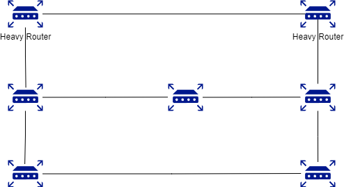<figcaption><p>OSPF Heavy Routers.</p></figcaption></figure>

> **There are only two heavy router and all are low storage devices. If RIP is applied it will share data every time to everyone so low storage device might get damage**

> **But OSPF Is applied.**

<figure>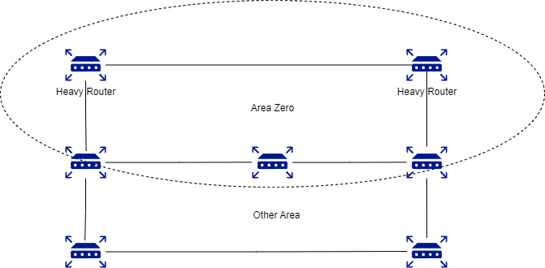<figcaption><p>OSPF Area</p></figcaption></figure>

* **Area 0 is the backbone of all routers.**
* **Protocols rule is somehow every router must connect to area 0.**
* **Its basically, area 0 is the head of a community and take problems to the superior (like network added or down etc.)**

### <mark style="color:blue;">**Universal configuration**</mark>

```
routing ospf <numbers>
#network <ip-address> <wildcards> area <0-255 number>
```

### <mark style="color:purple;">Link State Area (LSA)</mark>

> **OSPF single network is also called LSA 1**

<figure><figcaption></figcaption></figure>

> **OSFP multi Network**

<figure>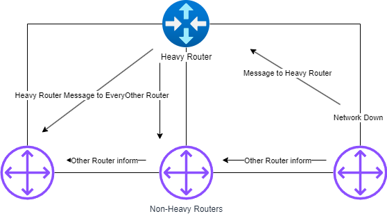<figcaption></figcaption></figure>

> **If router are connected to multi connection this might cause flooding.**
>
> **This is why DR and DBR comes in.**

### <mark style="color:blue;">**Database Description (DBD)**</mark>

> **Router ID**
>
> **It used for in router to another router,**
>
> **It used highest IP address.**
>
> **In case you will create loopback what will you used , used loopback that will different that the create in router.**

## <mark style="color:purple;">OSPF Neighbor STATE</mark>

#### 1. Down:

> The first of many OSPF neighbor states is "down." When a device is in the "down" state, it means that there is currently no hello package being received from that device. This could be due to a physical issue, such as a broken network cable, or a software issue, such as incorrect configuration parameters. In any case, it is important to troubleshoot and resolve this issue as quickly as possible, as it can greatly impact the network’s overall performance.

#### 2. Attempt:

> In a network, the "attempt" **OSPF state** is only applicable in a non-broadcast multi-access (NBMA) environment. In this type of network, routers use unicast hello packages to establish adjacencies with their neighbors. The "attempt" neighbor state indicates that a router has received a hello package and is attempting to become neighbors with the sending router.

#### 3. Init

> In OSPF networking, "init" refers to a neighbor state in which a hello package has been received, but no router ID has been received. This generally indicates that the exchange of information between routers has just begun, and the network is still in the process of establishing connections.

4. Initial State/Two Way State

> Two Ways state is also known as Down State. That means no comm to used.
>
> In OSPF, the exchange neighbor state is when two routers share information about their connections and distances. This helps them build a map of the network. It's an important step for routers to work together and communicate properly.

<figure><figcaption><p>Two Way State.</p></figcaption></figure>

5. Exstart State

> Routers decide and compare each other, is big IP Address one will recived Full Routes Tables First.

> The "Exstart" state in OSPF neighbor relationships means that both routers have agreed to exchange information about their connections and have established a leader-follower relationship. During this state, they start sharing information about their connections until they have nothing left to share. This helps routers find the best paths for sending data between networks.

&#x20;

<figure>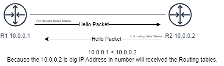<figcaption><p>ExStart State</p></figcaption></figure>


6. Exchange State

> In OSPF, the exchange neighbor state is when two routers share information about their connections and distances. This helps them build their maps of the network. This step is important for routers to communicate and route properly in a network.

7. Loading:&#x20;

> "Loading" means the router is exchanging link state information with its neighbors to build a complete database. Once done, the neighbor state changes to "Full," showing successful exchange of all link state information.

8. Full&#x20;

> "Full" is the normal and desired state for routers in an OSPF network, where they are fully synchronized and have efficient communication and routing. If a router is in "Init" or "Down" state, it may indicate a problem. Having routers in a "Full" state is important for smooth network operation.

## <mark style="color:purple;">DR And BDR</mark>

> In OSPF (Open Shortest Path First), **DR** (Designated Router) and **BDR** (Backup Designated Router) serve to optimize the exchange of routing information on a multi-access network segment, such as Ethernet.

#### <mark style="color:blue;">DR/BDR Election Process:</mark>

1. **Priority-Based Election**:
   * The router with the **highest priority** becomes the DR.
   * The router with the **second-highest priority** becomes the BDR.
   * By default, the priority value is **1**, but it can be manually changed. A priority of **0** means the router is not eligible for election.
2. **Router ID-Based Election** (in case of equal priorities):
   * If routers have the same priority, the **highest Router ID** becomes the DR, and the next highest becomes the BDR.
   * The **Router ID** is either manually set, or OSPF will select the highest IP address on a **loopback interface**. If no loopback interface exists, it selects the highest IP address on an active interface.
3. **Important Rules**:
   * **Non-preemptive**: OSPF doesn’t re-elect a new DR/BDR unless the current DR/BDR fails. To manually force a re-election, use the `clear ip ospf process` command.
   * **Per multi-access segment**: DR/BDR elections happen on each multi-access segment, not per area.
   * A router with a **priority of 0** cannot become DR or BDR.
4. **Checking DR/BDR Status**:
   * To view the DR/BDR status, use the commands `show ip ospf neighbor` or `show ip ospf database`.

#### <mark style="color:blue;">ABR (Area Border Router) and ASBR (Autonomous System Boundary Router):</mark>

> **ABR**
>
> Connects multiple OSPF areas and facilitates routing between them.
>
> Located at the border of different areas and advertises routes from one area to another.

<figure>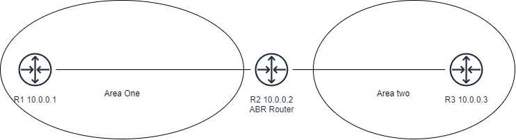<figcaption><p>ABR Router</p></figcaption></figure>

> **ASBR**
>
> Connects an OSPF network to external networks, often running different routing protocols.
>
> Redistributes routes from external networks into the OSPF network.
>
> ASBRs are critical for connecting different types of networks and perform redistribution.

<figure>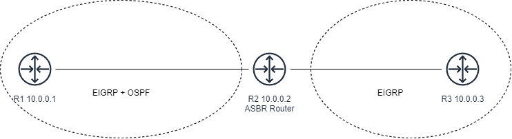<figcaption></figcaption></figure>

> ABRs and ASBRs can both reside on the same router, but their functions differ based on whether they are connecting internal OSPF areas (ABR) or injecting external routes (ASBR).

## <mark style="color:purple;">Link State Advertisement (LSA)</mark>

> The Autonomous System Boundary Router (ASBR) functions as the exit point in an OSPF (Open Shortest Path First) network, linking the OSPF network to external networks that use different routing protocols. ASBRs perform redistribution, incorporating routes from these external networks into the OSPF network. ASBRs utilize multiple algorithms and play a crucial role in connecting diverse network types.
>
> the message that route send to everyone when network is down, OR network is added is caled LSA
>
> So this message process is called LSA.

### <mark style="color:purple;">Types of LSA</mark>

<table data-header-hidden><thead><tr><th width="160"></th><th></th><th></th><th></th><th></th></tr></thead><tbody><tr><td>LSA TYPE </td><td>Description </td><td>Originator </td><td>Flooded To </td><td>Purpose </td></tr><tr><td>Type 1 </td><td>Router LSA </td><td>Router </td><td>Same Area </td><td>Describes router’s Link </td></tr><tr><td>Type 2 </td><td>Network LSA </td><td>DR </td><td>Same Network </td><td>Describes routers on a network segment </td></tr><tr><td>Type 3 </td><td>Summary LSA </td><td>ABR </td><td>Other Area </td><td>Advertise routes between areas </td></tr><tr><td>Type 4 </td><td>Summary ASBR LSA </td><td>ABR </td><td> </td><td>Informs about an ASBR </td></tr><tr><td>Type 5 </td><td>Autonomous System external LSA </td><td>ASBR </td><td>OSPF Domain </td><td>Advertises external routes </td></tr><tr><td>Type 6 </td><td>Multicast OSPF LSA </td><td>OSPFv3 router </td><td>Same Area </td><td>Used for multicast group memberships </td></tr><tr><td>Type 7 </td><td>NSSA External LSA </td><td>ASBR in NSSA </td><td>NSSA </td><td>Carries external routes in NSSA configuration </td></tr></tbody></table>


### <mark style="color:blue;">Link State Advertisement 1</mark>&#x20;

> If the update or message send within the areas is called LSA 1.

<figure>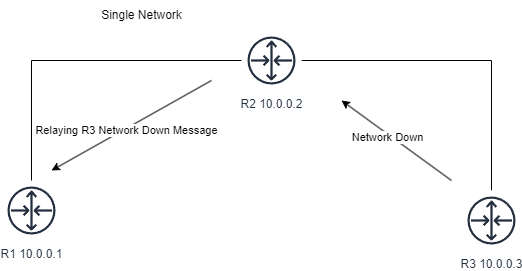<figcaption><p>Single Network LSA 1</p></figcaption></figure>

&#x20;\


<figure>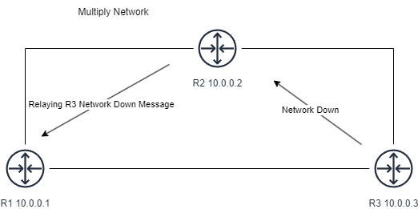<figcaption><p>Multiply Network LSA 1</p></figcaption></figure>

> When there is network down in an area and the router inform to DR (Router Leader ) by messaging is called LSA 1.

> Routers in an OSPF (Open Shortest Path First) network generate their own Router Link State Advertisement (LSA). This Type 1 LSA provides information about the router's links and interfaces, describing their states within an OSPF area. Importantly, Type 1 LSAs are confined to the area in which they originate and do not propagate beyond its boundaries. The Router LSA includes details such as the Router ID, the status of links, and IP information for each interface.

### <mark style="color:blue;">Link State Advertisement 2</mark>

> But when DR get the message and inform other router about the network which is down somewhere , this process called LSA 2

<figure>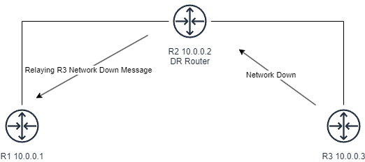<figcaption><p>Network LSA 2</p></figcaption></figure>

> In OSPF, Network Link State Advertisements (LSAs) are exclusively flooded by Designated Routers (DRs). These LSAs provide details about routers directly connected to multi-access network segments, including information about DRs, Backup Designated Routers (BDRs), and subnet information. Like Router LSAs, Network LSAs are confined to the OSPF area of origin and contribute to ensuring that all routers within the area maintain an accurate understanding of the network topology.

### <mark style="color:blue;">Link State Advertisement 3</mark>

> if area has to send information to different areas, first it's goes to ABR router through different area's , first it's goes to ABR router through different Area's ABR&#x20;

> ABR will inform to DR. and this process is called LSA 3

<figure>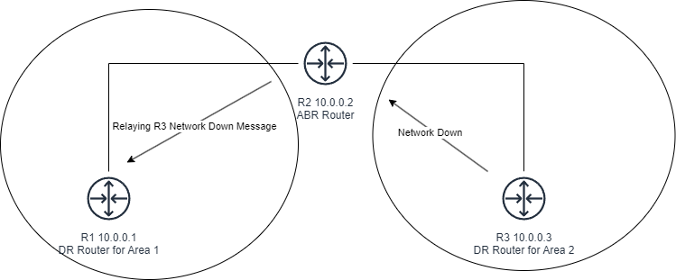<figcaption><p>LSA 3</p></figcaption></figure>

> In OSPF, when information about a specific area needs to be shared with another area, Summary Link State Advertisements (LSAs) or Inter-Area LSAs, known as Type 3 LSAs, are utilized. ABRs (Area Border Routers) generate these LSAs to advertise routes between OSPF areas. In the OSPF routing table, they are represented as "O IA," signifying routes learned through inter-area routing. Type 3 LSAs play a key role in facilitating communication and connectivity between different OSPF areas.

### <mark style="color:blue;">Link State Advertisement 4</mark>

> Multiply Algorithms are running including OSPF,
>
> ASBR Router will inform the update/down  add network other algo throught ASBR.
>
> ASBR will generate a message (about updates) is different algo,
>
> this process is called LSA 4

<figure>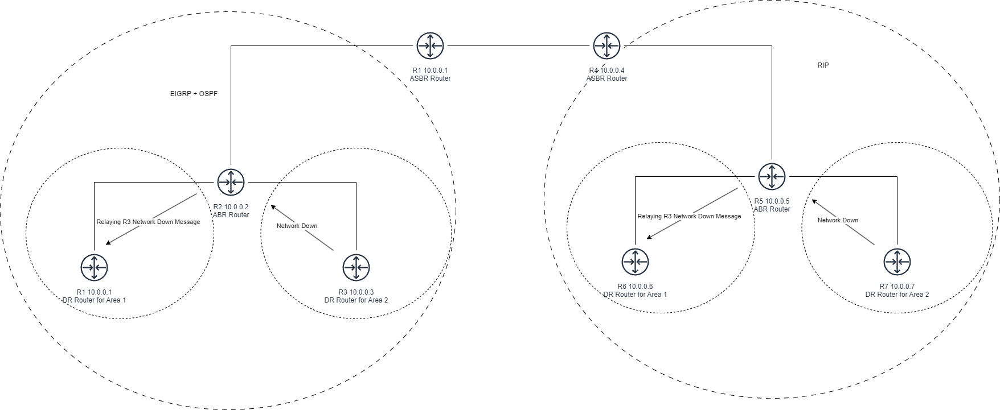<figcaption><p>LSA 4</p></figcaption></figure>


There are 11 LSA i haved coverd what is required.


