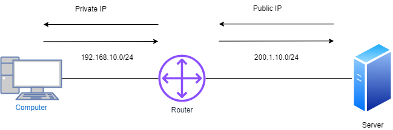

# SYSTEM TRADE (ACL, NAT)

## <mark style="color:purple;">Access Control List (ACL)</mark>

> A security feature that acts as a security guard for a network by allowing or denying access based on IP addresses. It operates at the OSI Layer 3 network level and is used to permit or deny network traffic.
>
> ACLs are typically applied to Layer 3 devices, but they can also be applied to Layer 2 devices such as switches, especially on VLAN interfaces

<table data-header-hidden><thead><tr><th></th><th width="149"></th><th></th><th></th></tr></thead><tbody><tr><td>IP Address</td><td>Protocols</td><td>Port</td><td>Data</td></tr><tr><td>10.0.0.1</td><td>TCP</td><td>Source address Random</td><td>FILE</td></tr><tr><td>200.1.30.10</td><td>TCP</td><td>Destination Address : 443</td><td>FILE</td></tr></tbody></table>

> Access lists can filter IP traffic based on IP, protocol, and port numbers. They primarily operate at OSI Layer 3 and Layer 4, providing fine control over IP traffic

### <mark style="color:blue;">ACL configuration guidelines</mark>&#x20;

> Only one ACL per interface, per protocol, per direction is allowed.
>
> ACLs are processed top-down, meaning the first matching rule is applied, and further rules are not evaluated.
>
> &#x20;the most specific statements must go at the top of the list. Once a packet meets the ACL criteria, the ACL processing stops and the packet is either permitted or denied.
>
> ACLs are created globally and then applied to interfaces.
>
> An ACL in network configuration can filter traffic going through the router, or traffic to and from the router.

### <mark style="color:blue;">Types of Access List</mark>

#### <mark style="color:blue;">Standard access list</mark>

> A standard access list verifies only the source IP address.
>
> Standard access lists use numeric identifiers (1-99, 1300-1999)


```bash
ip access-list standard (1-99)
    deny host (single network)
    permit any

interface ethernet 0/0
    ip access-group (number) in or out

```



```bash
ip access-list standard Shadow
    1 deny host 10.0.0.1
    2 permit host 10.0.0.2
    3 permit any

interface ethernet 0/0
    ip access-group Shadow in
```


> **Verification**


```
show running-config | section OR include access-list
```


#### <mark style="color:blue;">Disadvantage</mark>&#x20;

> If DHCP is applied, the IP address will change, rendering standard ACI ineffective. After applying it to the interface devices, packets are denied by default, which is referred to as an implicit rule.

#### <mark style="color:blue;">**Extended Access List**</mark>

> Extended access lists verify source and destination IP addresses and ports. They use numeric identifiers (100-199, 2000-2699) or named ACLs for configuration.


```bash
ip access-list extended (100-199/NAME)
    (action) deny or permit (Source IP) (Source port) (Destination IP) (Destination port)

interface ethernet 0/0
    ip access-group (list name) in

```



```bash
ip access-list extended Shadow
    deny tcp host 10.0.0.1 host 200.1.30.10 eq www
    deny tcp host 10.0.0.2 host 200.1.30.10 eq 443
    permit ip any any

interface ethernet 0/0
    ip access-group Shadow in
```


## <mark style="color:purple;">Network Address Translation (NAT)</mark>

> NAT allows L3 devices to convert private IP addresses to public ones. Types include Static NAT, which is one-to-one mapping.
>
> A process of changing the source and destination IP addresses and ports. Address translation reduces the need for IPv4 public addresses and hides private network address ranges. The process is usually done by routers or firewalls.Comment

<figure><figcaption><p>NAT</p></figcaption></figure>

> L3 devices can apply Network Address Translation (NAT) to facilitate network access translation.
>
> NAT converts private IP addresses to public ones, helping conserve public IP addresses and improving network security by hiding internal addresses.

### <mark style="color:blue;">How does it work?</mark>

> In many-to-one NAT, a single device (such as a router) translates many private IP addresses into one public IP address for communication with external networks. This helps conserve public IP addresses and improve efficiency

### <mark style="color:blue;">Types of NAT</mark>

> Static NAT allows both inbound and outbound connections, meaning devices on the public network can initiate communication with private network devices using their mapped public IP.
>
> Static NAT, also referred to as **One-to-One NAT,** entails transforming a single private IP address into a corresponding public IP address. While this method requires manual configuration and consumes a significant number of public IP addresses, it is well-suited for server environments. It is commonly utilized in servers, VPNs, and various applications, and operates bidirectionally.

> Static NAT is useful for servers but is less practical in dynamic environments because it requires manual configuration and consumes more public IP addresses.

### <mark style="color:blue;">Configuring static NAT on Cisco devices</mark>

> With static NAT, routers or firewalls translate one private IP address to a single public IP address. Each private IP address is mapped to a single public IP address.&#x20;
>
> Static NAT maps one private IP address to one public IP address, requiring a unique public IP for each private IP. This method is typically used when a server or device must always be accessible from the public network

Static NAT

```
Steps to configure static NAT on Cisco devices through CLI
Login to the device using SSH / TELNET and go to enable mode.
Go into the config mode.
Router#configure terminal

Enter configuration commands, one per line. End with CNTL/Z.

Router(config)#

Use below command to configure static NAT
Router(config)#ip nat inside source static 10.0.0.2 59.40.40.1
```

> This command translates the internal IP `10.0.0.2` to the external public IP `59.40.40.1` for all outgoing traffic.

#### **Interface Configuration:**

The instructions for configuring inside and outside interfaces are correct but can be streamlined for better readability:

**Inside Interface:**

```bash
Router(config)#interface fa0/0
Router(config-if)#ip nat inside
```

> The `ip nat inside` command tells the router that the interface is on the private (internal) network.

**Outside Interface:**

```bash
bashCopy codeRouter(config)#interface fa0/1
Router(config-if)#ip nat outside
```

> The `ip nat outside` command sets the interface as the public-facing (external) side.


```bash
show ip nat translation
```


| **Configlet Name**    | Configure Static NAT - Cisco                                                                                                                                                                     |
| --------------------- | ------------------------------------------------------------------------------------------------------------------------------------------------------------------------------------------------ |
| **Description**       | This configlet is used to configure static NAT in Cisco devices.                                                                                                                                 |
| **Execution Mode**    | Script Execution Mode                                                                                                                                                                            |
| **Configlet Content** | configure terminalip nat inside source static $PRIVATE\_IP $PUBLIC\_IPinterface $INSIDE\_INTFip nat insideexitinterface $OUTSIDE\_INTFip nat outsideexitexitshow ip nat translationswrite memory |

### <mark style="color:blue;">Dynamic NAT</mark>

> Dynamic NAT allows multiple private IP addresses to be dynamically mapped to a pool of public IP addresses, meaning the router chooses an available public IP from the pool for translation when inside traffic flows to the outside

<figure><figcaption><p>Dynamic NAT</p></figcaption></figure>

> Unlike with static NAT, where you had to manually define a static mapping between a private and a public address, with dynamic NAT the mapping of a local address to a global address happens dynamically. This means that the router dynamically picks an address from the global address pool that is not currently assigned. It can be any address from the pool of global addresses. The dynamic entry stays in the NAT translations table as long as the traffic is exchanged. The entry times out after a period of inactivity and the global IP address can be used for new translations.

> Unlike Static NAT, which has a permanent one-to-one mapping, Dynamic NAT assigns public addresses from a pool to private addresses temporarily while traffic is active, and the mapping is removed after the connection ends
>
> In PAT, FTP can present challenges due to its dynamic port usage, but most modern routers and firewalls use Application Layer Gateways (ALG) or NAT inspection to ensure proper functionality for FTP over PAT.
>
> Ensure appropriate routing (such as Default, RIP, EIGRP) is configured so that the router knows the best path to forward traffic after performing NAT

#### Configuring Dynamic NAT on Cisco Devices

**Dynamic NAT** allows multiple private IP addresses to be dynamically mapped to a pool of public IP addresses. This type of NAT assigns public addresses to internal devices as needed, from a pre-configured pool.

**To configure dynamic NAT**, the following steps are required:

1. **Configure the router’s inside interface** (where private IP addresses exist).
2. **Configure the router’s outside interface** (where public IP addresses exist).
3. **Configure an ACL** that matches the inside source addresses to be translated.
4. **Configure the pool of global IP addresses** that the router will use for translations.
5. **Enable dynamic NAT** by associating the access list with the address pool.

#### Steps to Configure Dynamic NAT Using CLI

1. **Login to the device** using SSH/Telnet and go to enable mode.
2.  **Go into config mode**:

    ```arduino
    arduinoCopy codeRouter# configure terminal
    ```
3.  **Configure the inside interface**:

    ```scss
    scssCopy codeRouter(config)# interface fa0/0
    Router(config-if)# ip nat inside
    Router(config-if)# exit
    ```
4.  **Configure the outside interface**:

    ```scss
    scssCopy codeRouter(config)# interface eth0/0/0
    Router(config-if)# ip nat outside
    Router(config-if)# exit
    ```
5.  **Configure an ACL** that specifies the inside source addresses to be translated:

    ```arduino
    arduinoCopy codeRouter(config)# access-list 1 permit 192.168.10.0 0.0.0.255
    ```

    > **Note:** This ACL matches all hosts in the `192.168.10.0/24` subnet.
6.  **Configure the pool of global IP addresses**:

    ```arduino
    arduinoCopy codeRouter(config)# ip nat pool MY_POOL 200.1.10.1 200.1.10.254 netmask 255.255.255.0
    ```

    **Note:** The pool consists of 254 addresses, from `200.1.10.1` to `200.1.10.254`.
7.  **Enable dynamic NAT**:

    ```scss
    scssCopy codeRouter(config)# ip nat inside source list 1 pool MY_POOL
    ```

    **Note:** This command instructs the router to translate the inside addresses matched by access list 1 to the pool of global addresses called `MY_POOL`.
8.  **Exit config mode**:

    ```shell
    shellCopy codeRouter(config)# exit
    Router#
    ```
9.  **View the NAT translations**:

    ```arduino
    arduinoCopy codeRouter# show ip nat translations
    ```
10. **Save the configuration**:

    ```arduino
    arduinoCopy codeRouter# write memory
    Building configuration... [OK]
    ```
