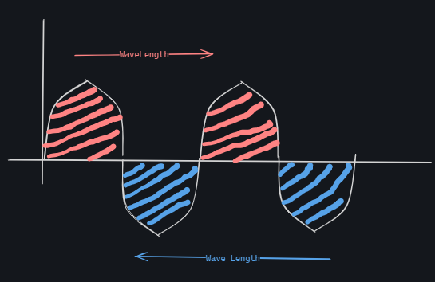
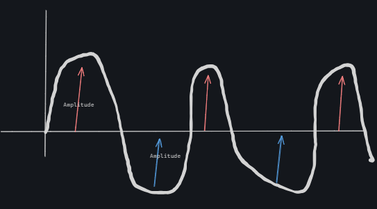

# Wireless 802.11

## <mark style="color:purple;">**Wireless Networks**</mark>

Wireless technology was discovered by James Maxwell, who theorized the presence of electromagnetic waves. These waves enable data transmission without physical cables, forming the basis of modern wireless communication.

#### <mark style="color:blue;">**Wired and Wireless Protocols**</mark>

1. **Wired Networks (802.3 - CSMA/CD):**
   * **CSMA/CD (Carrier Sense Multiple Access with Collision Detection):**
     * Used in wired networks, especially with hubs.
     * Prevents data collisions during transmission.
     * **How it works:**
       * Devices sense if the communication channel is free before sending data.
       * If the channel is busy, devices wait and retry.
       * If two devices transmit simultaneously, a collision occurs, and a **collision packet** is sent. Devices back off for a random time and retry.
2. **Wireless Networks (802.11 - CSMA/CA):**
   * **CSMA/CA (Carrier Sense Multiple Access with Collision Avoidance):**
     * Used in wireless networks, working proactively to avoid collisions.
     * **How it works:**
       * Devices sense the channel's status before sending data.
       * If the channel is busy, they wait and retry.
       * When the channel is free:
         * The device sends an **RTS (Request to Send)** to the access point (AP).
         * The AP responds with a **CTS (Clear to Send)** if the channel is clear.
         * Data is transmitted after receiving CTS.
           *   **InDetails**: Start sending packets to the --> frame  , frame sense and check the channel is idle or busy , its the channel is busy it will reset to start if not then goes/generate  an  --> RTS (request to send ) to AP,

               Ap will check the channel ‘ is there any user using the channel number’ if yes the channel is unutilised then the AP will send CTS ‘Clear to send’ after that the user will transmitted , go the data to AP using the given channel&#x20;
     * What if Two users sending data at the same time?
       * In that case after sending the data from both users the data will collied and its wait for acknowledge of data which will recivced because of collization so what it will do is its will send an collization packet which says that user is sending the packet and other user have to wait till the user send the packet.

### <mark style="color:blue;">**Electromagnetic Spectrum in Wireless Networks**</mark>

Wireless communication uses specific parts of the electromagnetic spectrum for different purposes:

1. **Radio Waves:** Broadcasting radio and TV.
2. **Microwaves:** Used in wireless computer networks (e.g., Wi-Fi).
3. **Infrared:** Heat from the sun.
4. **Visible Light:** The range humans can see.
5. **Ultraviolet:** Emitted from the human body and the sun.
6. **X-rays and Gamma Rays:** Medical and scientific applications.

#### <mark style="color:blue;">**Radio Frequency (RF) in Wireless Networks**</mark>

1. **Frequency in Wi-Fi:**
   * **2.4 GHz:**
     * Lower frequency with longer wavelengths.
     * Provides better coverage but slower throughput.
   * **5 GHz:**
     * Higher frequency with shorter wavelengths.
     * Offers faster throughput but less coverage.
2.  **Wave Properties:**

    * **Wavelength:** The distance between two crests or two troughs.

    <figure><figcaption></figcaption></figure>

    * **Amplitude:** The height of the wave (crest or trough).

    <figure><figcaption>
AMPLITUDE
</figcaption></figure>

    * **Frequency:** The number of wave cycles per second (measured in Hz).
      * 1 kHz = 1,000 cycles/second
      * 1 MHz = 1,000,000 cycles/second
      * 1 GHz = 1,000,000,000 cycles/second
3. **Impact of Frequency:**
   * Higher frequency = shorter wavelength, higher throughput.
   * Lower frequency = longer wavelength, better coverage.

#### **Frequency Hopping Spread Spectrum (FHSS)**

1. **What is FHSS?**
   * A technique used to improve wireless communication security.
   * Devices change frequencies periodically to prevent interference and eavesdropping.
2. **Purpose of FHSS:**
   * Prevents prolonged communication on a single frequency.
   * Reduces the risk of spying and interference.

#### <mark style="color:blue;">**Wireless Communication Process**</mark>

1. **How Data is Transmitted:**
   * Data is sent in **bits** from devices to an access point (AP).
   * The AP converts the bits into **analog signals** for wireless transmission.
   * The receiving device converts the analog signals back into bits.
2. **Role of APs:**
   * Serve as intermediaries between devices.
   * Ensure data is transmitted over appropriate frequencies.

#### <mark style="color:blue;">**Summary**</mark>

1. **2.4 GHz vs. 5 GHz:**
   * **2.4 GHz:** Better coverage, slower speed.
   * **5 GHz:** Better speed, limited coverage.
2. **CSMA/CD vs. CSMA/CA:**
   * **CSMA/CD:** Used in wired networks, detects collisions.
   * **CSMA/CA:** Used in wireless networks, avoids collisions.
3. **FHSS:** Enhances security by frequently changing communication frequencies.
4. **Wireless Communication:** Involves electromagnetic waves, radio frequencies, and APs for efficient data transmission.

#### **Evolution of Wireless Security Protocols**

1. **The Early Days:**
   * Initially, internet communication relied on physical cables.
   * In the 1980s, radio wave frequencies were designated for unlicensed use, allowing wireless internet to evolve.
2. **Modern Wireless Technology:**
   * Wireless communication became widely adopted in the late 1990s.
   * Today, wireless internet is used by a variety of devices, including smart thermostats, door locks, and security cameras.

#### <mark style="color:blue;">**Wi-Fi and the Wi-Fi Alliance**</mark>

1. **What is Wi-Fi?**
   * Wi-Fi is a marketing term for wireless internet standards based on IEEE 802.11.
   * It defines communication protocols for WLANs.
2. **Wi-Fi Alliance:**
   * Originally known as the Wireless Ethernet Compatibility Alliance (WECA), the organization renamed itself the Wi-Fi Alliance.
   * Wi-Fi protocols are secured by various wireless security standards, evolving over time to address vulnerabilities.

#### <mark style="color:blue;">**Wireless Security Protocols**</mark>

**1. Wired Equivalent Privacy (WEP)**

* **What is WEP?**
  * Introduced in 1999, WEP was the first wireless security protocol.
  * Designed to provide the same level of security as wired networks.
* **Issues with WEP:**
  * Easily breakable encryption, making it a high-risk protocol.
  * Rarely used today but still encountered in outdated devices.

**2. Wi-Fi Protected Access (WPA)**

* **What is WPA?**
  * Introduced in 2003 to replace WEP.
  * Aimed to be a transitional solution compatible with older hardware.
* **Improvements over WEP:**
  * Used **Temporal Key Integrity Protocol (TKIP)** for better encryption.
  * Included **message integrity checks** to prevent tampering.
* **Vulnerabilities:**
  * Susceptible to **KRACK attacks**, where attackers bypass encryption by interfering with the WPA handshake process.
  * Replaced by **WPA2** due to these vulnerabilities.

**3. WPA2**

* **Introduction:**
  * Released in 2004, it improved on WPA with stronger encryption and security mechanisms.
* **Key Features:**
  * Uses **Advanced Encryption Standard (AES)** for stronger encryption.
  * Implements **CCMP (Counter Mode Cipher Block Chain Message Authentication Code Protocol)** for authentication and integrity.
* **Vulnerabilities:**
  * Still vulnerable to **KRACK attacks**, leading to the development of WPA3 in 2018.
* **Personal Mode:**
  * Ideal for home networks due to its simplicity.
  * Requires applying a single passphrase to all devices, making it manageable for smaller setups.

**4. WPA3**

* **Introduction:**
  * Released in 2018 to address WPA2's vulnerabilities.
* **Key Features:**
  * Introduced **forward secrecy** to ensure past data remains protected even if a current session is compromised.
  * Improved protection against dictionary attacks with **Simultaneous Authentication of Equals (SAE)**.
* **Suitability:**
  * Recommended for modern networks due to enhanced security.

#### **Wireless Security Threats and Mitigation**

**1. Common Threats**

* **KRACK attacks:** Exploit vulnerabilities in WPA/WPA2 handshake.
* **Man-in-the-middle (MITM) attacks:** Intercept wireless communications.
* **WEP vulnerabilities:** Easy to crack using basic tools.

**2. Mitigation Strategies**

* Use WPA3 or WPA2 with AES encryption for secure communications.
* Regularly update firmware to patch vulnerabilities.
* Disable outdated protocols like WEP.

## <mark style="color:purple;">CWNA (Cisco Wireless Network Administrator)</mark>


Kindly find the below link to download the Book.

[https://www.mediafire.com/folder/fq457goncp58t/CWNA](https://www.mediafire.com/folder/fq457goncp58t/CWNA)

