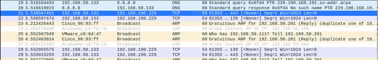
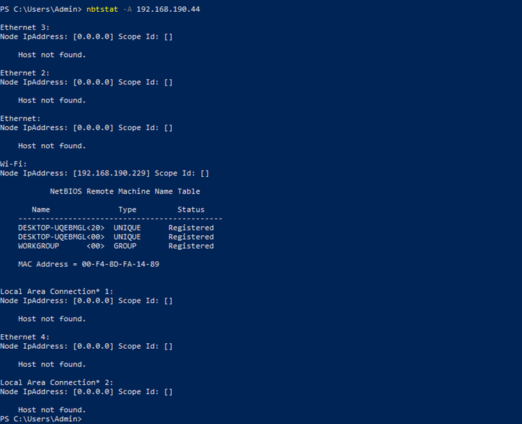

# SMB Enumertrix

## <mark style="color:green;">Enumeration</mark>

> Enumeration is also known as Service Scanning where its dig and validate the information.

### <mark style="color:purple;">Services</mark>

> To make the Jobs easyer are created Example : Railways are created for PUBLIC PURPOSE or SERVICE but if to use that SERVICES themust OBEY the RULE and REGULATION of RAILWAYS which is Buy the TICKET.

## <mark style="color:purple;">SMB Enumeration</mark>

> Service Message Block allows to share the Files/resources to other Endpoints over the Networks.
>
> The SMB service in Linux called SAMBA.
>
> SMB in modern terms also known as Common Internet File System.

The SMB service is Where the Computer/Endpoints (SMB Clinets) on a network that connect to SMB Server for File Sharing.&#x20;

The Inter- Process Commnucation (IPC) between application on a Network through a Clinet Server.

The SMB Service used protocol number 139 and 443.

#### <mark style="color:blue;">SMB Port 139</mark>

> Port 139 is used for NETBIOS (Network Basic Input Output System. NETBIOS allows to communicate between Computer on a Local Network. Which runs over ISO Model to locate and identify each other network via NETBIOS names.

#### <mark style="color:blue;">SMB Port 445</mark>

> While the Port 139 is Known for "NETBIOS over IP". The Port 445  is for "SMB over IP" where its run direclty over TCP/IP without the need for NETBIOS over TCP/IP.

#### <mark style="color:blue;">IPC$</mark>

> Its an anonymous Null Sessions where its accessable to interact with the services explosed.

This SMB Services its a Request-Response type.

The SMB Clinets used TCP/IP or QUIC Protocols to Connected to Servers.


By Enumerating the NETBIOS will get the information of Targert Workgroups, Domain, Networks Shares and Computer Names.


#### <mark style="color:blue;">Possible Credentails</mark>

| Username(s)           | Common passwords                         |
| --------------------- | ---------------------------------------- |
| (blank)               | (blank)                                  |
| guest                 | (blank)                                  |
| Administrator, admin  | (blank), password, administrator, admin  |


### <mark style="color:purple;">SMB Identification/Scanning</mark>

> SMB Communication in Wiresharks Packets.

<figure><figcaption><p>SMB Wiresharks</p></figcaption></figure>

> NSLOOKUP for DNS Resolving

```
nslookup -A #targetip
```

#### <mark style="color:blue;">NBSTATE</mark>

> Getting PC information of NetBIOS using NBSTATE.

```
nbstate -A #target-IP
```

<figure><figcaption><p>nbstate</p></figcaption></figure>

```
nbtscan -r -v #target-IP
```

<figure><figcaption><p>NBTSTAT RESULTS</p></figcaption></figure>

> NBTSCAN Using Kali Linux

```
nbtscan -r -v #Target-IP
```

<figure><figcaption><p>Linux NBTSCAN Results</p></figcaption></figure>

### How The Windows Computer Communicte Using SMB Service.

> The Communication is using 445 SMB port Number.&#x20;
>
> Where Machine 1 (192.168.190.229) initails the connection.and the Machine 2(192.168.190.44) which is being access

<figure><figcaption><p>Initails Wireshark Packets</p></figcaption></figure>

> Authentication Successfull Packet

<figure><figcaption><p>Login Successfull</p></figcaption></figure>

> Accessing One of the Files.

<figure><figcaption><p>Accessing the File</p></figcaption></figure>


In All this process the Data is ENCRYPTED



### SMB Authentication

```
smbmap -u "username" -p "password" -H #IPADDRESS -P #PORT
smbmap -u "username" -p "NT/LM HASH" -H #IPADDRESS -P #PORT
```

```
smbclinet -U 'username' 'password' -L NT/LM //#TARGET_IP 
```

### Network Mappers

> NMAP

```
nmap -sV -n -Pn -p 139,445 -sC smb-enum*.nse #TARGET_IP

nmap -sV -n -Pn -p 139,445 -sC smb2-enum*.nse #TARGET_IP
```


## GUEST SESSION

> The Login Successfull to SMB Server even the login Password is not correct/ not present in the database.
>
> COUNT SESSIOSN / GUEST SESSION >> ANY NAMES >> AUTHENTICATED >> SMB

### SMBMAP

```
smbmap -u 'anonymous' -p 'anouymous #TARGET_IP'
```

### ENUM4LINUX

```
enum4linux -a -u "username" -p "password" #TARGET_IP
```

### IMPACKET SMB CLINET

```
impacket-smbclinet //username@#IPADDRESS
```

### NETEXEC/ Crackmapexec


```
netexec smb #TARGET_IP -u username.txt -p password.txt --continue-on-success
netexec smb #TARGET_IP -u username.txt -H hash --continue-on-success --shares

crackmapexec smb #TARGET_IP -u username.txt -p password.txt --continue-on-success
netexec smb #TARGET_IP -u username -p password --continue-on-success
```



## NULL SESSION

> Able to Login without the password.
>
> NULL SESSION >> NO CREDENTAILS >> AUTHENTICATED >> SMB.

### SMBMAP

```
smbmap -u "" -p "" -H #TARGET_IP
```

### SMBCLIENT

> -N mean NULL SESSION.

```
smbclient -N -L #TARGET_IP
```

<figure><figcaption></figcaption></figure>

### ENUM4LINUX

```
enum4linux -a  -u "" -p "" #TARGETIP  
```

