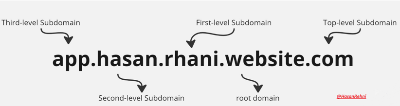

# INFORMATION GATHERING

## <mark style="color:green;">Information Gathering</mark>

* Information gathering means collecting the information from whatever means necessary.
* It helps the tester to know more about the target system or network and plan the exploit.
* It's the sensitive steps in hacking.

> The building tester collect the information how the building is built and secured paint the building and it test the build with multiply ways like from Hammer to chemicals.

## <mark style="color:purple;">API (Application Programming Interface)</mark>

> A software (it can be anything like any game, any application etc.)
>
> The software is hosted an feature of authetication is enable (if someone wants to use/connect to softare it need to be authenticated by some credentials like username and password. >> A similar concept use by API where instead of credentials API use server generated Tokens based value, with token the software is accessable using API.

### <mark style="color:purple;">Assests Discovery</mark>

> A person will gather information about the target by observing the people the target interacts with. The term "victim asset" refers to the assets owned by the victim. This increases the vulnerability to attacks.

### <mark style="color:purple;">RECON</mark>


<mark style="color:orange;">**RECON IS A CYCLE.**</mark>

<mark style="color:blue;">**A Good Recon Has Ups and Downs**</mark>

<mark style="color:blue;">**It not a Strate line,**</mark>


### <mark style="color:purple;">ENUMERATION</mark>


<mark style="color:blue;">Digging up the information.</mark>


## <mark style="color:orange;">InReality</mark>


<mark style="color:purple;">**Before dating a girl, a boy observes (Asset Discovery) the girl (the target) and her friends (the target people) to understand her daily interactions (Information Gathering). Through one of her friends (the target people), the boy knows the girl needs emotional support (information gathering). He then plans and creates a pickup/promises line (Exploit) to use it when the girl is in a bad time and emotional need (Vulnerability). If the girl is charmed/impressed (Initial Access), the boy aims to maintain the connection (Maintaining Access) with her (exploited connection) and seeks to identify emotional vulnerabilities (Privilege Escalation) to offer more support.**</mark>



Don't trust the Passive information becuase it available to other for some logical reasons.


### <mark style="color:purple;">Domain</mark>

> A domain name is a unique address for web application. >> .com, .in is the domain

### <mark style="color:blue;">Types of Domain Name</mark>

> Horizontal Domain Enumeration
>
> Vertical Domain Enumeration

<figure><figcaption>
Types of Domains
</figcaption></figure>

### <mark style="color:blue;">What are we After</mark>

<figure><figcaption>
Domains
</figcaption></figure>

> FQDN >> The full address of computer or server like <mark style="background-color:orange;">computer</mark>.subdmain.apexdomain.com  >> the full specific address.
>
>
>
> Apex Domain >> An apex domain is the root domain. & Aquatics Domain >> Horizontal Domain www.<mark style="background-color:orange;">website.com</mark>

> Subdomain >> RFC 1034 >> A Domain is a Subdomain of another domain if it's contained within that domain. >> Vertical Domain >> www.<mark style="background-color:orange;">rhani.</mark>website.com >> the main entrance without any extra details. >>  a department within the larger domain.

### <mark style="color:blue;">FQDN</mark>

> &#x20;The fully specific address of computer or server.

### <mark style="color:purple;">Apex/Horizontal Domain</mark>

> Find the list of all the main web application / website owned by the target system or networks.


More on [apex-domain-enumeration.md](recon-and-footprinting-survey-corps/apex-domain-enumeration.md "mention")


> Short points of Apex domain.
>
> * Finding Related Domain/Acquisitions
>   * WhoisXMLAPI
>   * Whoxy
>   * Whoxyrm
>   * Crunchbase
>   * MarketScreener
>   * Shodan and github Enumeration
> * Discovery IP space
>   * whois
>   * chatGTP
>   * ASNs
> * PTR Records (Reverse DNS)
>   * dnsx
> * Favicon Enumeration
>   * fav-up github
> * Cloud Recon
>   * Kaeferjager
> * Linked Discovery
>   * Gospider
>   * Katana
>   * hakrawler
>   * Rengine
> * AD & Analytics Relationships
>   * Google Analytics
>   * Builtwith
>   * Analyticsrelationships github
> * Trademarks

### <mark style="color:purple;">Subdomain/Vertical Enumeration</mark>

> finding related web application that belong to the same organization (Target system or networks)

<figure><figcaption>
Subdomain
</figcaption></figure>


More Info on  [subdomain-secrets](recon-and-footprinting-survey-corps/subdomain-secrets/ "mention")


> Short points on Subdomain Enumeration.
>
> * Certification Logs
>   * CTFR Tools
>   * Crt.sh
>   * Domain Collector
>   * TLS,CSP,CNAME Finding
> * Passive Source
>   * Whois
>   * Google dorks
>   * shodan
> * Other resouse on Passive Source
>   * Amass
>   * Sublist3r
>   * subfinder
>   * Assestfinder
>   * BBOT
>   * Subdomainer
> * Recursive Enumeration
> * Findomain
> * Gau (github all Url)
> * Crobat & Crobat API (using Rapid7 project)
> * rapiddns
> * IntelligenceX
> * Project Sonar by Rapid7
> * Exiftool
> * DNSbruteForcing

