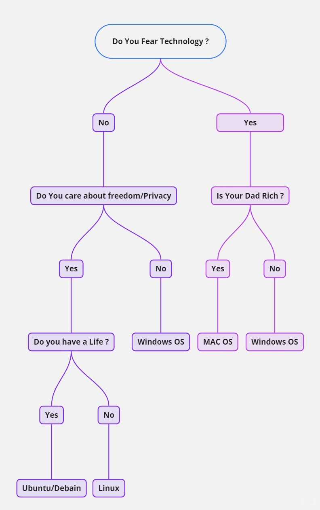

# INTRODUCTION INTO HACKING (THE BEGINING)

## <mark style="color:green;">Prerequisities</mark>&#x20;

### WHOAMI


A Typical day of me as a Engineer at Work

It would start with solving a problem. Maybe I trying to debug, why is this particular endpoint flooded with so much traffic? Or why is this endpoint actually slowing down? And I would start with, okay, let me get to the endpoint. Let me capture some traffic on the endpoint and see what kind of traffic is coming in and going out through this endpoint. So I would typically go back, think about the problem during lunch. Sometimes things would click. When I am thinking i might not have thought about a problem from a different perspective, i might want to actually see how it looks like. So i would go about maybe doing a lab recreate. Let me connect these endpoints and let me try to reproduce the issue. I might see some things in the lab recreate that you might have not thought of. And i might need to actually consult with experts from different domains who might know better about this area. Get their view on what the problem is, analyze, show them everything that you have done. I might get the solution just by talking to people. It's a pretty busy day, but it's also a very fun day. It's like solving puzzles all the time, which is pretty exciting. Some of the best practices in network that I've learned are, don't try to always reinvent the wheel. There are certain protocols, there are certain algorithms that have been tried, tested, analyzed, and they have been deemed secure for being used in network security.


> You need to have the Complete knowledege of [CCNA](https://app.gitbook.com/o/NH7Q4TAbPHpkMJrTyRcO/s/rwg7YCtI3Re1ZMG29pd9/).

[CCNA](https://app.gitbook.com/o/NH7Q4TAbPHpkMJrTyRcO/s/rwg7YCtI3Re1ZMG29pd9/ "mention")

## <mark style="color:green;">TRADE OF TOOLS</mark>

### <mark style="color:purple;">Operating System</mark>

#### <mark style="color:blue;">Windows & MacOS</mark>

* Each operating system is commonly used in today's computer The windows was introduced at 1985 The MacOS was introduced at 1984 Both Operating System are used in personal and enterprise level.
* Windows is closed source code operating system its source code is not open to public.
* MacOS is partially open-source code which mean its source code is public for some components like MacOS kernel code etc.

#### <mark style="color:blue;">Linux</mark>

* Linux was introduced in 1991, and more versions come out in the 90s, And is open-source operating system.
* More information at "Linux Essentials"

#### <mark style="color:blue;">Android & IOS</mark>

* Both Android & IOS operating system are for mobile devices,
* Android was introduced in 2008 & IOS was in 2007.
* Android is open-source & IOS is partially open-source like some components.


Mostly Mobile Operating System have security concerns.&#x20;


### <mark style="color:purple;">Legacy Operating System</mark>

* A Legacy operating system is an operating system that is outdated but still in used. some organization used this legacy operating system because of their own reasons like is not compatible with their Software etc.

### <mark style="color:purple;">The Operating System at works</mark>

* Operating system are like bridge. >> They connect Software application to hardware to do stuff.&#x20;

### <mark style="color:purple;">Boot Beginning</mark>

* When Computer is turn on, A tiny chip is computer called BIOS (Basic Input/output system) or UEFI (unified Extensible firmware interface) trigger.&#x20;
* BIOS is older version found in older system and UEFI is the newer version that does the same thing but in advance way found in modern device.
* BIOS and UEFI are both there to help your computer get going. Before 2007, BIOS was the main player, but since then, UEFI has taken the stage. Nowadays, UEFI is more popular because it's better at keeping your computer safe.
* Inside these chips, there are different sets of instructions. One of these checks if all the computer's hardware is working properly.
* Then comes the final instruction: waking up the bootloader. This is special software that kicks off the operating system. Once that's up and running, your computer is good to go.

> <mark style="color:blue;">**Let break down the computer process in simple terms.**</mark>

1. **User:** You as a user, want to do something on the computer. Right Now, you are the user since you are reading this.
2. **Application**: Application is like a tools which Used to accomplish the tasks. if need to calculate the used the calculator application, if need to write then used the notepad application.
3. **Operating System**: The operating system is like a manager, when the user uses an application, the operating system takes care of everything behind the scenes. it coordinates with computer hardware to execute the user request and ensue that everything runs fine from managing computer resource to display the results.
4. Hardware: The hardware is where the real work takes place. It's like the engine of your computer. When you want to do a calculation, the CPU does the math. When you save a file, the hard drive stores it.
5. Output: Ones the hardware does it job it gives the results to Operating system, then operating system display in the application. So it can be visible as an output.

<mark style="color:blue;">**Behind the Scenes:**</mark> Think of a computer like a car. You might not see everything going on inside, but you feel it moving when you press the gas pedal. Similarly, the operating system does important work behind the scenes to make your tasks happen, just like a chef in a kitchen making your food without you watching.

**Downloading a File Example:** Let's see how this works when you download a file from the internet:

1. You decide to download a file from a website and click the download button.
2. The browser tells the operating system what you want to do.
3. The operating system gets the hardware ready to download the file.
4. The hardware starts downloading, and the operating system lets the browser know what's happening. The browser tells you when the download is done.

This process, like the car or restaurant analogy, involves different parts working together to give you the result you want.

### <mark style="color:purple;">Virtualization (Computer in a Computer)</mark>

<mark style="color:blue;">**Definition**</mark>:

A computer within a computer is also called as Virtual Machine (VM). it like a magic clone spell.

In Naruto it like Clone Jutsu.

Virtualization is like using special software to create these virtual machine versions of real machine and cool part is these virtual machines exist in digital word not as a physical hardware that can be touch.

Instead of separating physical part virtual machine use software to create virtual machine version of things like CPUs and storage.&#x20;

So, inside a virtual machine it found Virtual CPUs and Virtual Storage and all sorts of virtual hardware. it is like building a computer out of code instead of actual parts.

#### <mark style="color:blue;">Advantage of Virtual Machine</mark>

**1. Enhanced Security:** Picture virtualization as setting up little safety bubbles inside your computer. Each virtual machine is like its own bubble, separate from the others and the main computer. So, if one of these bubbles gets infected with malware, it's like the other bubbles are safe from the germ! Security folks can even use these virtual machines to study malware without risking the main computer.

_Note: Even though virtual machines are great for security, there's still a tiny chance that bad stuff could sneak out of a virtual machine and mess with the main computer. So, while they're super helpful, it's best not to put all your trust in them._

**2. Improved Efficiency:** Virtual machines are like multitasking wizards. You can have a bunch of them running at once and switch between them like flipping through channels on TV. This makes it really easy to handle security stuff, like testing out different apps.

Think of a virtual machine like a big city bus. It can carry lots of people at once, making transportation way more efficient. Without buses, everyone would need their own car, which would waste a lot more gas and resources. Similarly, with virtual machines, you can do a bunch of stuff on one computer without needing a separate computer for each task. It's like having a whole team of helpers right there on your computer!

### <mark style="color:blue;">Manage Virtual Machine</mark>

When dealing with virtual machines, its need a special kind of software called a hypervisor to keep everything in check. Hypervisors are like the managers of the virtual world. They help you handle multiple virtual machines and make sure they play nice with the real hardware of your computer.

One standout hypervisor is called Kernel-based Virtual Machine (KVM). It's like the rockstar of the virtual world, especially among Linux fans. KVM comes built-in with most major Linux systems, so you don't need to download anything extra to use it. It's like having a superhero built right into your computer's software, ready to create virtual machines whenever you need them.

### <mark style="color:purple;">Interfaces: GUI vs. CLI</mark>

#### <mark style="color:blue;">CLI vs. GUI: A Contrast</mark>

**Graphical User Interface (GUI):** A GUI presents icons on the screen for managing various computer tasks. Think of the icons on your desktop or taskbar that you click to launch programs.

**Command-Line Interface (CLI):** A CLI is text-based, utilizing commands to interact with the computer.&#x20;

**Appearance:**  GUIs boast graphics and icons, while CLIs stick to plain text, akin to lines of code.

**Functionality:** These interfaces also differ in how they operate. GUIs handle one request at a time, while CLIs allow simultaneous execution of multiple requests.

<mark style="color:blue;">**Advantages of CLI in Cybersecurity:**</mark>

1. **Efficiency**: CLI users often appreciate its speed and agility, especially those skilled in its operation. While newcomers might find Graphical User Interfaces (GUIs) more intuitive, CLI can be quicker for experienced users.
2. **Multitasking**: CLI shines when handling multiple tasks simultaneously. For example, performing repetitive tasks like creating multiple files is faster and more streamlined in CLI compared to GUI.
3. **History Records**: Linux CLI maintains a detailed history of all commands and actions executed, which is crucial in cybersecurity. This history feature ensures accurate execution of commands, aiding in troubleshooting and reviewing actions following security incidents.
4. **Action Tracing**: In the event of a security breach, the CLI's history file can help trace the activities of an attacker, providing valuable insights for incident response and forensic analysis.

## <mark style="color:green;">TRADE OF TOOLS (XmindMap)</mark>


XMINDMAP


## <mark style="color:green;">LINUX ESSENTIALS</mark>

### <mark style="color:purple;">Shell (Command Interpreter)</mark>

<mark style="color:blue;">**User**</mark>:  The user is the one which engaging with the computers, initiating and managing task.

<mark style="color:blue;">**Application**</mark>:  Application is a software which design to perform certain task, some comes preinstalled software like notepad.exe, some application has to installed like notepad++.exe

<mark style="color:blue;">**Shell**</mark>: the shell is my friend, a command-line interpreter. it is the only friend which wait for me to talk. it always response.

Technical terms:  its handle user input commands and translate to kernel understandable. the shell is the bridge between user and the computer.

<mark style="color:blue;">**FHS (Filesystem Hierarchy Standard)**</mark>: FHS is a file organizer in the computer storage. it decides where all the data should live within the operating system. by organizing data in systematic way, FHS ensure everything has its proper place, which make it easier to find and manage file on the computer.

<mark style="color:blue;">**Kernel**</mark>: The Kernel manage the processor, memory and communication with applications for command execution.

<mark style="color:blue;">**Hardware**</mark>: Physical components of a computer. Peripheral devices, like monitors, and internal components, including CPU and RAM, play distinct roles in system function.

### <mark style="color:purple;">Linux Distributions:</mark>

<mark style="color:blue;">**KALI LINUX ™:**</mark> An open-source Debian-based distribution, KALI LINUX ™ is widely known for security sector. Pre-build installed tools for penetration testing and digital forensics.

<mark style="color:blue;">**Ubuntu**</mark>**:** ubuntu comes with both GUI and CLI interfaces, it offers a range of applications, including security tools. Its strong community support bolsters its usability.

<mark style="color:blue;">**Parrot**</mark>**:** Parrot, like KALI LINUX ™ and Ubuntu, is Debian-based, tailored for security with pre-installed penetration testing and digital forensics utilities. Boasting a user-friendly GUI, it's a versatile option.

<mark style="color:blue;">**Red Hat® Enterprise Linux®:**</mark> A subscription-based distribution for enterprise requirements, Red Hat Enterprise Linux stands out with its dedicated support. because it paid & they want to destroy open sources and made everything paid (MATRIX)

<mark style="color:blue;">**CentOS:**</mark>**:**&#x43;entOS, a Red Hat-derived open-source distribution, offers similar functionality but relies on community support rather than enterprise-level backing.

#### <mark style="color:blue;">Package Manager</mark>

We can't install every tool one by one so there is package manager which installed basic software which required for starters.

Packages are like little bundles that contain software, and when you put a bunch of these packages together, you get applications. To keep things organized and make sure everything works smoothly, we have package managers. These handy tools help with installing packages and sorting out any other software they need to run properly, which we call dependencies

### <mark style="color:purple;">Shell The Interpreter</mark>

Shell the command line interpreter A translator between the user and the computer.

When the command is inputted >> the shell begin to initialed multiply series of internal process, and delivery the inputted instruction to kernel and delivery the kernel output /outcome back to the user.

<mark style="color:blue;">Types:</mark>

* Bash (Bourne-Again Shell)&#x20;
* C Shell (CSH)
* Korn Shell (KSH)
* Enhanced C Shell (tcsh)
* Z Shell (zsh)

&#x20;This shell commands are almost same but differ in outputs.

* BASH is Linux default shell, its user friendly.

### <mark style="color:purple;">Filtering Content with Linux</mark>

Filter content from information is must skills to have, linux provide commands for this purpose.

<mark style="color:blue;">**Grep**</mark> <mark style="color:blue;"></mark><mark style="color:blue;">Command:</mark>

* The grep commands is used to search 'specified 'text' within the file.

> Syntax
>
> `grep pattern files`

> **Example**
>
> `grep password credential.txt`
>
> * This search is for "password" in the credential file and display alll the lines containing that password word.

<mark style="color:blue;">**Piping**</mark><mark style="color:blue;">:</mark>

* The command is used for combining multiply commands. it send the output of one command as a input to other.

> Example: `ls /home/analyst/reports | grep users`
>
> * This lists files and directories in "reports" and then filters the output to display lines containing the word "users."

<mark style="color:blue;">AND (&)</mark>

* And command is also similar to piping.

> Example:  ls /home/reports & grep users

<mark style="color:blue;">**find Command:**</mark>

The **find** command searches for files and directories that meet specified criteria.

> Syntax: `find starting_location criteria`
>
> Example: `find /home/analyst/projects -name "*log*"`
>
> * This searches for files in the "projects" directory whose names contain the word "log," regardless of case.

<mark style="color:blue;">**find Criteria:**</mark>

* **-name:** Searches for file/directory names containing a specific string (case-sensitive).
* **-iname:** Searches for names containing a specific string (case-insensitive).
* **-mtime:** Searches for files/directories modified within a specified time frame (days).
* **-mmin:** Searches for files/directories modified within a specified time frame (minutes).

> Example: `find /home/analyst/projects -mtime -3`
>
> * This finds files and directories in "projects" modified within the last three days.

### <mark style="color:purple;">Managing Directories and Files in Linux</mark>

<mark style="color:blue;">**Creating and Modifying Directories:**</mark>

1. **mkdir (Make Directory):** Creates a new directory. Use absolute or relative paths. E.g., `mkdir /home/analyst/logs/network` or `mkdir network`.
2. **rmdir (Remove Directory):** Deletes an empty directory. E.g., `rmdir /home/analyst/logs/network`.

<mark style="color:blue;">**Creating and Modifying Files:**</mark>

1. **touch:** Creates an empty file. E.g., `touch permissions.txt`.
2. **rm (Remove):** Deletes a file. Use with caution. E.g., `rm permissions.txt`.

<mark style="color:blue;">**Moving and Copying Files:**</mark>

1. **mv (Move):** Moves a file or directory to a new location. E.g., `mv permissions.txt /home/analyst/logs`.
2. **cp (Copy):** Copies a file or directory to a new location. E.g., `cp permissions.txt /home/analyst/logs`.

<mark style="color:blue;">**Renaming Files:**</mark>

To rename a file, use the **mv** command. E.g., `mv permissions.txt perm.txt`.

<mark style="color:blue;">**Using the Nano Text Editor:**</mark>

1. **nano:** A command-line text editor for creating and modifying files.
   * Open existing file: `nano filename`
   * Create new file: `nano new_filename`
   * Save: Ctrl + O
   * Exit: Ctrl + X

<mark style="color:blue;">**Standard Output Redirection:**</mark>

1. **> and >> Operators:** Redirect standard output to a file.
   * **>** overwrites existing content: E.g., `echo "last updated date" > permissions.txt`
   * **>>** appends content: E.g., `echo "time" >> permissions.txt`

### <mark style="color:purple;">Authentications & Authorization</mark>

<mark style="color:blue;">Reading Permissions:</mark>

> In Linux permission are present by character string of '10', which include read, write and execute permissions for the user, Group and others(for other unknow users.).

* read: able to read the file content or list directory.
* write able to write the file content or create new file content in the directory.
* execute able to run the file as a program or access a directory content.

> The 10 Characters string is structured.
>
> * 2-4 User permissions (read, write, execute)
> * 5-7 Group Permissions (read, write, execute)
> * 8-10 Other permissions

<mark style="color:blue;">Exploring permissions:</mark>

the command used to explore is `ls` which display permission and other details about files and directory.

* `ls -a` :Display hidden files(starting with a .dot)
* `ls -l`: Display details information including permissions, owner, group, size and modification time.
* `ls -la`: combination of -l and -a option from above.

<mark style="color:blue;">Changing permission:</mark>

The command used for changing permission is `chmod`

> Syntax: chmod permission filename
>
> Example: `chmod u+rwx, g-rw,o-rw file.txt`
>
> * Add read, write and execute permission to file.txt
> * removes read and write permission for the group and other.
>
>
>
> **chmod Arguments:**
>
> * `u`: User permissions
> * `g`: Group permissions
> * `o`: Other permissions
> * `+`: Adds permissions.
> * `-`: Removes permissions
> * `=`: Assigns exact permissions

<mark style="color:blue;">Principle of Least Privileges</mark>&#x20;

As a Network Secuity engineer the principle of least privilege is to the grands only necessary permission.

> File: info.txt
>
> Permission: `-rw-rw----`\`
>
> * In this the group has unnecessary read and write privilege, to do the least privilege concept.  use : `chmod g-rw info.txt`
> * this command remove the read and write privileges from the group.

### <mark style="color:purple;">Linux Resources</mark>

**1. Linux Community:** This vast online network of users, developers, and experts is the place to be. Dive into forums, discussion boards, and social media to learn from others, get your questions answered, and stay updated on all things Linux.

**2. UNIX and Linux Stack Exchange:** Need answers fast? This Q\&A website is your go-to. It's like having a team of Linux experts at your fingertips, ready to tackle any problem you throw their way.

**3. Built-in Support Commands:** Linux has some handy commands right in the terminal to help you out:

* **man:** Get detailed info on commands.
* **apropos:** Search for commands based on keywords.
* **whatis:** Get quick command descriptions.

**4. Online Tutorials and Documentation:** From the Linux Documentation Project to DigitalOcean tutorials, there's a wealth of step-by-step guides and explanations waiting for you online.

**5. Linux Distribution Communities:** Whether you're using Ubuntu, Fedora, or another flavor of Linux, their communities offer specific support, forums, wikis, and guides tailored to your needs.

**6. Blogs and YouTube Channels:** Follow Linux experts and enthusiasts who share their knowledge, tips, and tutorials through blogs, YouTube, and other platforms. It's like having a mentor guiding you through the Linux wilderness.

## <mark style="color:orange;">Choosing An Operating System</mark>

<figure><figcaption>
Choosing An Operating System.
</figcaption></figure>

## <mark style="color:green;">LINUX ESSENTAILS (XmindMap)</mark>&#x20;


Xminc Summary of Linux Essentials.


## <mark style="color:purple;">The Hacking</mark>


Doing the unintended way which is not design by developer is hacking.



Breaking any process, any misconfiguration or loopholes to use for benefits is hacking.



unauthorized access to entity using loopholes is hacking.


### <mark style="color:purple;">MY Opinions</mark>


Applying ingenuity to create clever results.



Just try & try & trying thing is hacking for me,



Why am i doing hacking? because I will be going to become the ones who understand the internet like the attackers do,

I saw this system for what is was a network worth protecting.



Hacking is often thought of in negative terms, like the image of someone in a basement wearing a black hoodie, typing on a computer, and trying to hack into the NSA. But this stereotype is wrong.&#x20;

Hacking comes in various ways. Some do it for fun or to get noticed, while others do it for useful reasons such as checking security or finding weakness.

The main goal of hacking is to find weaknesses and try to exploit them.


> Examples:
>
> Building is built and need to check how long the building last.
>
> So, its checked, forms the general checking team they can do anything to test the building quality like break with hammer, used acid anything possible.
>
> * In cybersecurity company hired hacker to break in. Because they know the hired hacker can do it then the outside hacker also does it.
> * The best way to prevent hacking to performs hacking.

## <mark style="color:purple;">Elements of security</mark>

* **Confidentiality**: Data should not be shared with unauthorized entity.
* **Integrity**: Data should not be Tampered.
* **Availability:** Data should be Availability.
* **Authenticity**:  A Person or entity data trying to Snoop or pretend of being someone else.
* **Non-Repudiation**: A guaranteed entity which upholds the proofs of those events or incidents that are correct.

### <mark style="color:purple;">Name in Red Team</mark>

* **Hacker**: A hacker will perform the unauthorized access to the target system or network.
* **Cracker: It** the one who use the unauthorized access to damage the target system or network.
* **Script Kiddle**: it the one who uses the someone else software/code to get unauthorized access to the target system or network.

### <mark style="color:purple;">Types of Hackers</mark>

* **Blackhat**: A Blackhat hacker will use the Vulnerability/bug for their own benefits.
  * This mostly engage in illegal hacking activities, often use for personal benefits.
* **Whitehat**: A Whitehat hacker will us the Vulnerability/bug for their entity and community benefits by reporting to the rightful entity. it's also known as ethical hacker.
* **Greyhat**: A Greyhat is the combination of both Blackhat and whitehat. it's used the skills for illegal activities and sometimes used for defense purpose.
* **Bluehat**: A blue hat hacker is not a professional hacker and it used hacking as a hobby or test their system or networks.

<figure><figcaption>
Types of Hackers
</figcaption></figure>

## <mark style="color:purple;">Phases of Hacking</mark>

> Phases of hacking is the Umbrella or Tree of hacking Activities.

* Information Gathering: it's the most important and crucial part of initial phases in hacking.
* Active Information: Gathering information is when the target is aware that their information is being gathering.
* Passive Information: Gathering information is when the target is unaware that their information is being gathering.


In this part all the process of hacking depends ON AND EXITS points.


* **Scanning**: Validating Information obtain through information gathering state.
* **Gaining** Access: Successfully compromised the system.
* **Maintaining** Access: Aiming for long access of the system, called as persistence.
* **Clearing** Tracks and reporting:&#x20;
  * **Reporting**: the document of the vulnerabilities, methods used, And Potential impact. They ten present the finding of parties, Explain the vulnerability clearly in simple terms and provide the solution recommendations.

## <mark style="color:purple;">Penetration Testing</mark>

* The term 'PENETRATION' refers to the act of Validating the security of a system.
* PEN TESTER and PENETRATION TESTER are professionals who are responsible for conducting these tests on the entities.
* During penetration testing, the tester attempts to hack the system and identify the loopholes or vulnerabilities.
* The Goal is uncovering weakness in the system defenses loopholes by simulating real world attack.


Methodologies  >>  Means  >> Roads


### <mark style="color:purple;">Types of Testers</mark>

* White box testing: they are hired to attack the target system or network with the authority of hacking , They are given the target and have access to hack the system.
* Black box testing: They are not hired to attacker in the entity with unauthorized, they are not given the access to hack the system, they are just aware of the target. and they hack form the scratches.
* Grey box testing: This is the combination of both White hat box and Blackhat box, they are authorized to hack the entity with limited knowledge.


In the case of application security testing, the entity launches an application and hires a **Whitebox tester** to identify vulnerabilities in the source code, leveraging the provided access to the source code.

For assessing the login/sign-in pages of the application, the entity hires a **grey box tester** who is given login/sign-in credentials. The tester evaluates potential loopholes specifically related to the login/sign-in functionality. using partial knowledge of the system.

In the scenario involving both login/sign-in and the application's source code, the entity hires a **Blackbox tester** who has no prior information or access from the entity's side. The tester's objective is to identify vulnerabilities without any insider knowledge or access.

All these **testing methodologies** are reported and aim to assess the potential damage an entity may incur when subjected to actual hacking attempts, helping identify and fix the issue.

<mark style="color:blue;">Summary:</mark>&#x20;

Whitebox tester test on the source code of the web application.

Greybox tester test on the Login credentials of the web application.

Blackbox teeter test get the target details.


## <mark style="color:purple;">Classification of Attacks</mark>

> Passive Attacks: These attacks don't let the target know that they have been attacked. It's doesn't break the CIA

> Active Attacks: Its Breaks the CIA.

> Session hijacking: Session Hijacking using Cookie Extension.
>
> Example:&#x20;
>
> A Website drop.com or any website >> Use the cookie manager extension&#x20;
>
>
>
> Login with the User1 account >> then go to cookie and open >> export >> its export in JSON format >> then logout >> then go to home >> open cookie extension >> import.
>
> And its login with the User1 account using the User1 cookie.

> Close In Attack: This is performed when the attacker close in the gap between the target physically in order to gain the system access.
>
> Example: Social Engineering, Eaves Dropping, Shoulder Suffing, bucket Dumpster.

> Insider Attacker: The target entity employee breach the entity.

## <mark style="color:purple;">Stage Of Hacking</mark>

<figure><figcaption>
Stages of Hacking
</figcaption></figure>

## <mark style="color:green;">InReailty</mark>


<mark style="color:purple;">**Before dating a girl, a boy observes (Asset Discovery) the girl (the target) and her friends (the target people) to understand her daily interactions (Information Gathering). Through one of her friends (the target people), the boy knows the girl needs emotional support (information gathering). He then plans and creates a pickup/promises line (Exploit) to use it when the girl is in a bad time and emotional need (Vulnerability). If the girl is charmed/impressed (Initial Access), the boy aims to maintain the connection (Maintaining Access) with her (exploited connection) and seeks to identify emotional vulnerabilities (Privilege Escalation) to offer more support.**</mark>


### <mark style="color:purple;">Planning & Recon</mark>

<mark style="color:blue;">**Planning**</mark>

* This stage involves **patience** and **exploring** mindset.
* Planning is testing the scope and collection the system entity or business company, by doing this I have a clear understanding of what needed to be done and what are the goals of the test target is.
* After Planning is complete the next steps are **reconnaissance**. This Forces on **Gathering information** about the Target.

<mark style="color:blue;">**RECON**</mark>

* <mark style="color:blue;">Passive information</mark>&#x20;
  * Passive information is the only way to get the information about the target without knowing the target. And without disturbing the normal activities.
  * These are the steps.
    * Gathering information: Collect information of the target network or system. Website like shodain.io and censys.io
    * Identifying Vulnerabilities: Find vulnerabilities about the target network or system such as Software etc. through Gathering information.
    * Develop a Plan: Create a plan for the rest of engagement include the tools and technique that will be used.

### <mark style="color:purple;">Scanning And Enumeration</mark>

* Active scanning is one way of collection information about the target, the target can know they have been enumerated.
* This step finds any vulnerabilities in the target system or network, in this phase the tester uses various tools and techniques to gather information. this phase focus on open ports that can be explored as known as <mark style="color:blue;">Active Scanning.</mark>
* <mark style="color:blue;">**These are the following steps**</mark>
  * **Port scanning:** Using a tool to scan the target system or network for open ports.
  * **Service identification:** Identifying the specific services or applications running on the target system or network.
  * **Password abuse:** Attempting to guess or crack passwords for accounts on the target system or network.
* **Enumeration:** Gathering additional information about the target system or network, such as usernames.

### <mark style="color:purple;">Exploitation(Gaining Access)</mark>

* In this phase the attacker takes advantage of the vulnerabilities that has been identified in order to gain access to the target system or network. This involves techniques such as social engineering, password cracking, and use of the malware.
* <mark style="color:blue;">**These are the following steps**</mark>
  * **Identify a vulnerability:** finding a specific vulnerability in a target system or network that could be **exploited** to gain.
  * **Develop an exploit**: creating or obtaining a piece of code or technique that can be used to exploit the identified vulnerability.
  * **Test the exploit**: testing the **exploit** to ensure that it **works as intended.**
  * **Execute the exploit**: running the **exploit** against the target system or network to gain access.
  * **Confirm access**: verifying that the **exploit** was **successful,** and that the hacker has **gained access** to the target system or network

### <mark style="color:purple;">**Post-Exploitations**</mark> 

Post-exploitation comes immediately after gaining access to a target system or network, Start begin to explore it further to find any **potential security vulnerabilities** that they can **exploit**. They may also try to **escalate their privileges** within the system

This can involve **installing backdoors** or **other types of malwares,** or simply creating new user accounts with elevated privileges. The ultimate goal of post-**exploitation** is to **maintain access** to the target system or network for as long as possible,

* <mark style="color:blue;">**These are the following steps**</mark>
  * **Maintaining access: installing backdoors** or other mechanisms.
  * **Escalating privileges:** attempting to increase **access or privileges** by cracking administrator passwords or exploiting vulnerabilities.
  * **Exfiltrating data:** transferring data out of the target system or network to attacker in encryption format.
  * **Performing additional actions:** installing **malware** or modifying system configurations.
  * **Cleaning up:** **removing traces** of the hacker's presence.

### <mark style="color:purple;">**Reporting and Remediation**</mark> 

> Reporting: the documents the vulnerabilities, methods used, and potential impact. They then present the findings to relevant parties, explain the vulnerabilities clearly, and provide Solutions recommendations. Reporting helps the organizations to identify and address vulnerabilities, improving their security and protecting sensitive data.

### <mark style="color:purple;">CVE</mark>

> Common Vulnerabilities Exposures is a standard for software vulnerabilities worldwide.

### <mark style="color:purple;">CVSS</mark>

> Common Vulnerabilities Scoring System is a standard for severity of number bases worldwide.

<mark style="color:blue;">CVS Calculator provide severity on CVE.</mark>

* Basic Score Metrix
  * #### Attack Vector (AV) 
    * Network Attack Vector >> Public to Public Networks.
    * Adjacent Attack Vector >> Attack Used on IOT Devices.
    * Local Attack Vector >> Deployed Locally.
  * Attack Complexity
    * Low >> Easy Attack performed.
    * Hight >> Multiply Methods performed.
  * Scope&#x20;
    * unchanged >> Only affect the authority (target/entity).
    * changed >> affect the worldwide software of the authority (target/entity).

### <mark style="color:purple;">PCI DSS</mark>

> PCI DSS is a standard for payment Industry.

1. Protect the user data.
2. Encrypt the user data.
3. Password policies of user data.
4. Non-Redemption for Both entities and more.

### <mark style="color:purple;">Meta Data</mark>

> Whenever the devices create files >> its create meta data, that meta data can be review in many ways.

### <mark style="color:purple;">Brute force</mark>

> Brute force is when the automated tools is forcing on both username and password.
>
> Password Spraying is when the tools is forcing on username only.

### <mark style="color:purple;">Basic Terminologies</mark>

<table data-header-hidden><thead><tr><th width="244"></th><th></th></tr></thead><tbody><tr><td>OS </td><td>Operating system which is the translator between User Software to computer hardware.</td></tr><tr><td>Linux</td><td>An Open-Source Operating System.</td></tr><tr><td>Assets</td><td>That have </td></tr><tr><td>Vulnerability</td><td>A Loophole in the software, which is not indented to do so, anything that impact the CIA</td></tr><tr><td>Risk/Threats</td><td>A weakness that can be exploited.</td></tr><tr><td>Compliance</td><td>the process of addressing internal standard and external standard.</td></tr><tr><td>hacktivist</td><td>A person who uses hacking to get political goals</td></tr><tr><td>HIPAA</td><td>Health Insurance Portability and Accountability Act A US federal law to protect heath care.</td></tr><tr><td>NIST &#x26; CSF</td><td>National Institute of standards and technology &#x26; Cybersecurity framework: A standard which has guidelines and best practices to manage cybersecurity risk.</td></tr><tr><td>Privacy Protection</td><td>The act of safeguarding personal information from unauthorized uses.</td></tr><tr><td>PHI</td><td>Protected heath information </td></tr><tr><td>Security Architecture</td><td>An design that used to protect the organization.</td></tr><tr><td>Security Controls</td><td>design to reduce risks</td></tr><tr><td>Security Ethics</td><td>Guide for decision as a security professional</td></tr><tr><td>Security Frameworks</td><td>Guide that used building plan to reduce risk and threats of data.</td></tr><tr><td>SPII</td><td>Sensitive Personal Identifiable Information A PII which has restricted guide.</td></tr><tr><td>SOAR</td><td>Security Orchestration Automation and Response A collection of application, tools, that used to automate in security events.</td></tr><tr><td>Chronicle</td><td>A Native-Cloud tool designed to retain, analyze and search data.</td></tr><tr><td>Incident Response</td><td>An organization that quick to find the attack solve the breach.</td></tr><tr><td>Logs</td><td>A recorded event.</td></tr><tr><td>Playbook</td><td>A Manul guide/ user manual that provide detail about any events occurs.</td></tr><tr><td>Business Continue Plan</td><td>An organization's ability to maintain their everyday productivity by establishing risk disaster recovery plans.</td></tr><tr><td>AntiVirus Software</td><td>A software that used to detect, prevent and eliminated malicious software.</td></tr><tr><td>database</td><td>A collection of information or data.</td></tr><tr><td>IDS</td><td>Intrusion detection system : An application that system activities and alerts on malicious behavior.</td></tr><tr><td>Packet Sninffer</td><td>Network Protocol Analyzer: a software that capture real time network packet.</td></tr><tr><td>Order of Volatility</td><td>A sequence outlining the order of data that must be preserved from first to last.</td></tr><tr><td>Programming</td><td>A language that translate human language to computer language.</td></tr><tr><td>Protecting and Preserving Evidence</td><td>The process of properly working with fragile and volatile digital evidence</td></tr></tbody></table>

## <mark style="color:green;">XmindMap</mark>


The Begining of Hacking

