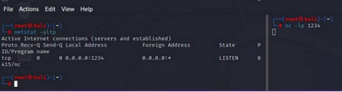
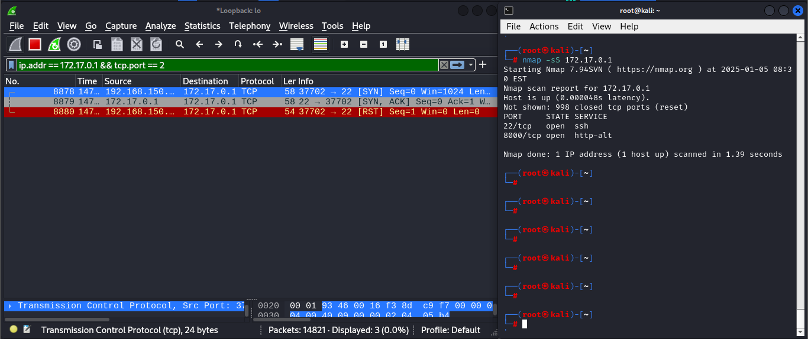
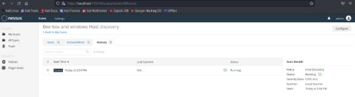

# SCANNNING

## <mark style="color:green;">SCANNNING</mark>

> Scanning is checking.. Its has two types
>
> Passive Scanning: Want to know about tesla asking the information from someone else.
>
> Active Scanning: Want to know about tesla direct asking from tesla.

## <mark style="color:green;">Active Scanning</mark>

> Active Scanning is a real Timeing checking the Services...&#x20;
>
> So the Target may be aware that they are being scan.


| Pros                                                                                                             | Cons                                                                                                                                                        |
| ---------------------------------------------------------------------------------------------------------------- | ----------------------------------------------------------------------------------------------------------------------------------------------------------- |
| It can detect more vulnerabilites then Passive Scanning. As its activlity try to exploit any weakness it finds.  | <p>Its can be timing and resources  consuming<br>its can also distrup the NETWORK  or SYSTEM<br>and the Target mostly get Aware they are being scanned.</p> |

<details>

<summary>Time To Live Probs</summary>

The TTL is determined by the remote host where the ICMP Protocol, PING Service the **ECHO-REPLY**  which has some TTL value defined which are&#x20;

Windows have 128 TTL Value.

Linux has 64 TTL Value.

Networking Devices has 255 TTL Value.

Any other TTL is wehn  the **Above any threee OS** minus **NEXT HOPS**

**Example the TTL Is 63 so its probably Linux because Linux has 64 has the - 1 maybe an VPN From sources to Destination.**

</details>


## <mark style="color:purple;">Network Scanning</mark>

> Scanning is an Active Information Gathering where its scan the network and the application  for finding the running services.

### <mark style="color:blue;">Net (Cat & Discover)</mark>

> Netcat is a software which generate and received network packets.

```bash
netstat -altp #to view live packets
nc -lvp 1234 # nc >> netcat L listing v verbose p port to 1234
```

<figure><figcaption><p>Listing and Using Random Ports which is specifield</p></figcaption></figure>

```bash
Listner
nc [KALI IP] 127.0.0.1 [Random Port] 1234
nc 127.0.0.1 1234

Client
nc -lvp 1234
```

<figure><figcaption><p>Getting replay From The Server And Client Connection</p></figcaption></figure>


### <mark style="color:purple;">Network Scan Using NETDISCOVER</mark>

> Netdiscover use ARP Protocol To identify the Networks/ Networks Machines.

```
netdiscover -r 192.168.0.0/24
```

<figure><figcaption><p>Netdiscover Results</p></figcaption></figure>

### <mark style="color:green;">NMAP (Network Mapper)</mark>

On **September 1, 1997 the nmap got released.**

> Nmap (Network Mapper ) is a free and open Source Tool used to discover the hosts and services.

<figure><figcaption><p>Nmap</p></figcaption></figure>

#### <mark style="color:blue;">Pre-Requisties</mark>&#x20;

> The baisc knowlegde of TCP/IP (Networking). Command Line Interface of Windows or Linux.&#x20;

Installing NMAP

* Windows Downlaoding Nmap : [https://nmap.org/download.html.](https://nmap.org/download.html.)
* Linux : `sudo apt install nmap`
* MAC Os: `brew install nmap`

#### Nmap is Already Installed

```
nmap --version
```

**Nmap Port State**

**open** (port is actively accepting connections),&#x20;

**closed** (port responds but no application is listening),&#x20;

**filtered** (packet filtering prevents probe responses),&#x20;

**unfiltered** (port is accessible but status unknown),&#x20;

**open|filtered** (status unknown, could be open or filtered),&#x20;

**closed|filtered** (status unknown, could be closed or filtered).


```
nmap -sT 127.0.0.1
```

Wireshark Filter Command

```
ip.addr == 172.17.0.1 && tcp.port == 22
```


### <mark style="color:purple;">TCP Connect Scan</mark>

> In My VM i have two IP the Docker IP which i used as a target and my ethernet IP which i used as MY KALI MACHINE.

<figure><figcaption><p>This Above image is where -sT Scan start,</p></figcaption></figure>

> -sT scan first Starts scanning Randomly to any Ports. where the close Port results with respons of RST FLAG From Target.

Where as when the ports its open its get the SYN+ACK packet then the NMAP Immdelfy send the RST packet and that how the NMAP identify the open ports.

<figure><figcaption><p>in the above image where the open ports has TCP 3 Way Hankshake.</p></figcaption></figure>


### <mark style="color:purple;">TCP Stealth Scan</mark>

> After sending the SYK And receviing the SYN+ACK its send the RST reset and doesnt not send the ACK packet.

<figure><figcaption><p>After getting the  SYN + ACK from ther Server its doesn't send the ACK packet its directly send the RST Packet.</p></figcaption></figure>


### <mark style="color:purple;">UDP Scan</mark>

> UDP scanning is different because of its behavours of directly communication without ACK Packets.
>
> Nmap detect the ports with the specialy carfted packets and results based on the below Tables.


<table><thead><tr><th width="383">Response</th><th>Assigned State</th></tr></thead><tbody><tr><td>Any UDP response form the Targets ports</td><td>Open</td></tr><tr><td>No Response received</td><td>Open | Filtered</td></tr><tr><td>ICMP ports Unreachable error like Type 3 or Code 3</td><td>Closed</td></tr><tr><td>Other ICMP errrors</td><td>FIltered</td></tr></tbody></table>


```
nmap -sU #target-IP
```

<figure><figcaption><p>Because of UDP response nmap knows that the UDP ports is open is its close the connection.</p></figcaption></figure>


<figure><figcaption><p>In REALL Scenario Wiresharks.</p></figcaption></figure>

### <mark style="color:purple;">Quick Table</mark>

| sS:           | **TCP SYN (Stealth) Scan** (Send SYN Packet)                                                                                            |
| ------------- | --------------------------------------------------------------------------------------------------------------------------------------- |
| sT:           | TCP connect scan (3 way handshake)                                                                                                      |
| sU:           | UDP scan (Send UDP Packet)                                                                                                              |
| sN            | Null TCP (no TCP Header)                                                                                                                |
| sF            | Fin Scan (Send FIN Packet)                                                                                                              |
| sX            | Xmas Scan (Send TCP Flags Like RST,PSH,FIN)                                                                                             |
| sA            | **TCP ACK Scan** (To determine the Firewall is statefull or Stateless)                                                                  |
| sW            | TCP Windows Scan (Same TCP ACK Scan Get information about windows)                                                                      |
| sZ            | SCTP Echo Scan (Use the SCTP Protocol )                                                                                                 |
| sO            | Protocal Scan (Determine which Protocal is allow to end target)                                                                         |
| -b            | BounceBack FTP Scan (Use NSE Script FTP Anonymous and Null Sessions)                                                                    |
| p:            | Specify port range                                                                                                                      |
| O:            | OS detection                                                                                                                            |
| A:            | Aggressive scan                                                                                                                         |
| sV:           | Service version detection                                                                                                               |
| sC:           | Script scanning using the default NSE scripts                                                                                           |
| Pn:           | Treat all hosts as online (skip host discovery)                                                                                         |
| n:            | Do not resolve hostnames                                                                                                                |
| f:            | Fragment packets                                                                                                                        |
| T0:           | Paranoid timing (slowest)                                                                                                               |
| T5:           | Insane timing (fastest)                                                                                                                 |
| v:            | Verbose output                                                                                                                          |
| oA:           | Output in all formats (standard, XML, and grepable)                                                                                     |
| -sW           | **TCP Window Scan (-sW)**                                                                                                               |
| -sM           | **TCP Maimon Scan (-sM)**                                                                                                               |
| -sl           | T**CP Idle Scan (-sI)**                                                                                                                 |
|  **-sO**      | **IP Protocol Scan** which IP protocols are supported by the target, not a port scan but uses similar methods.                          |
| **-b**        |  T**CP FTP Bounce Scan** scan that uses FTP servers to perform port scans by proxy, works against restrictive firewalls when unpatched. |
| <h4>-sn</h4>  | Disable Port Scan                                                                                                                       |
| <h4> -sL</h4> | List Scan                                                                                                                               |
| -b            | <p>FTP Bounce Scan </p><p>Its also called Proxy FTP where this connect to FTP server then ask that files to be send to third server</p> |

### <mark style="color:purple;">Quick TCP SCAN</mark>

```
nmap -sC -sV -vv -oA quick (Target-IP address)
```

### <mark style="color:purple;">Quick UDP Scan</mark>

```
nmap -sU -sV -vv -oA quick udp (Target_IP_address)
```

### <mark style="color:purple;">Resaoning NMAP</mark>

```
nmap -resaon #target
```


### <mark style="color:purple;">Choosing Ports</mark>

> Ones the hosts is discovered Then finds the open ports in those host.

```
nmap -p (port Range) <host>
```


<figure><figcaption></figcaption></figure>

### <mark style="color:purple;">Full TCP Scan</mark>&#x20;

```
nmap -sC -sV -p- -vv -oA Full (Target_IP_ADDRESS)
```

### <mark style="color:purple;">What Your OS  (Banner Grabbing)</mark>

* Banner Grabbing Collecting information using the device banner

```
nmap -sV -v -p- (Target_IP_Address)
```

> — OS Scan - guess provides a faster more aggressive scan which is usefull when NMAP retrives close to 100% OS Detection. Howver agressive scanning may results in missing some ports.

> — OS Scan -limit is an option used to limit what target to scan. This option is useful when you have a larger range of IPs to scan.

```
nmap -O -sV (Target_IP_Address)
```

> -p- Scan all the availabe ports by default nmap doesn't scan ports from 1-1000 instead its target the most comonly used ports with the service.

### <mark style="color:purple;">Port Knock</mark>

> This allows the commands to quicky check the status of the specified ports on the target host and skip the ping process

```
nmap -Pn --host-timeout 201ms --max-retires 0 -p 7000,8000,9000 (Target_IP_Address)
```


<figure><figcaption><p>Port Knock</p></figcaption></figure>


### <mark style="color:purple;">Version Detection</mark>

> Nmap has 1024 known service in the database which its used and scan those SCAN.

```
nmap -sV (target_IP)
```


<figure><figcaption></figcaption></figure>

<pre><code><strong># nmap -A -T4 -F www.microsoft.com
</strong></code></pre>


### <mark style="color:purple;">Scan For Vulnerabilties</mark>

* The Nmap Scriting Engine (NSE) is one of the powerfull flexible feature. its scan network to identify the vulnerably system before the bad guys do. the NSE is activated with the -sC opetion or --script
* The core of NMAP scripting engine is Lua interpreter, Lua is lightweight language.
* Its allows to run custom scripts which is stored in /usr/share/nmap/scripts

> LOOKING for /usr/nmap/script/ftp.anon.nsa


```lua
author = {"Eddie Bell", "Rob Nicholls", "Ange Gutek", "David Fifield"} 
─(kali㉿kali)-[/home/hasanrehni] 
└─$ sudo cp /usr/share/nmap/scripts/ftp-anon.nse ./ftp-anon.lua 
[sudo] password for kali: 
┌──(kali㉿kali)-[/home/hasanrehni] 
└─$ code ./ftp-anon.lua     
┏━(Message from Kali developers) 
┃ code is not the binary you may be expecting. 
┃ You are looking for \"code-oss\" 
┃ Starting code-oss for you... 
┗━ 
libva error: vaGetDriverNameByIndex() failed with unknown libva error, driver_name = (null) 
[5348:0610/140452.154223:ERROR:gpu_memory_buffer_support_x11.cc(44)] dri3 extension not supported.
[main 2023-06-10T18:04:52.274Z] update#ctor - updates are disabled as there is no update URL
[5387:0610/140452.312402:ERROR:command_buffer_proxy_impl.cc(126)] ContextResult::kTransientFailure: Failed to send GpuControl.CreateCommandBuffer. 
[main 2023-06-10T18:04:53.116Z] Starting extension host with pid 5474 (fork() took 5 ms). 
```



> When opens the scripts there are some varaible defined which is pre requisite of scripts like FTP Ports ETC. which is below.&#x20;

```lua
local ftp = require "ftp" 
local match = require "match" 
local nmap = require "nmap" 
local shortport = require "shortport" 
local stdnse = require "stdnse" 
local string = require "string" 
local table = require "table" 
```

> As below there is function.

```lua
portrule = shortport.port_or_service({21,990}, {"ftp","ftps"}) 
```

> Which is there is pre requisite, its says that this is open should be there which 21 for FTP and 900 for Secure FTP.
>
> To do this function is required login which is anonymous Login HERE

```lua
local status, code, message = ftp.auth(socket, buffer, "anonymous", "IEUser@") 
  if not status then 
    if not code then 
      stdnse.debug1("got socket error %q.", message) 
    elseif code == 421 or code == 530 then 
      -- Don't log known error codes. 
      -- 421: Service not available, closing control connection. 
      -- 530: Not logged in. 
    else 
      stdnse.debug1("got code %d %q.", code, message) 
      return ("got code %d %q."):format(code, message) 
    end 
    return nil 
  end 

  local result = {} 

  result[#result + 1] = "Anonymous FTP login allowed (FTP code " .. code .. ")" 
```

#### Script Action on Wireshark.

<figure><figcaption><p>NMAP FTP SCRIPT ON ACTION</p></figcaption></figure>

* As see LS open ASCII Mode Data Connection for Files LIST..&#x20;
* After this the LIST will Let.

> $LIST as this function is in variable to send the commands LIST to FTP Server.
>
> What is LIST its name speech.
>
> It get the LIST details of FTP server.

```lua
local function list(socket, buffer, target, max_lines) 
  local list_socket, err = ftp.pasv(socket, buffer) 
  if not list_socket then 
    return nil, err 
  end 
```

> LIST Manully.

```lua
┌──(kali㉿kali)-[~] 
└─$ ftp 192.168.100.130 
Connected to 192.168.100.130. 
220 ProFTPD 1.3.1 Server (bee-box) [192.168.100.130] 
Name (192.168.100.130:kali): anonymous 
331 Anonymous login ok, send your complete email address as your password 
Password:  
230 Anonymous access granted, restrictions apply 
Remote system type is UNIX. 
Using binary mode to transfer files. 
ftp> LIST 
?Invalid command. 
ftp> ls 
229 Entering Extended Passive Mode (|||3787|) 
150 Opening ASCII mode data connection for file list 
-rw-rw-r--   1 root     www-data   543803 Nov  2  2014 Iron_Man.pdf 
-rw-rw-r--   1 root     www-data   462949 Nov  2  2014 Terminator_Salvation.pdf 
-rw-rw-r--   1 root     www-data   544600 Nov  2  2014 The_Amazing_Spider-Man.pdf 
-rw-rw-r--   1 root     www-data   526187 Nov  2  2014 The_Cabin_in_the_Woods.pdf 
-rw-rw-r--   1 root     www-data   756522 Nov  2  2014 The_Dark_Knight_Rises.pdf 
-rw-rw-r--   1 root     www-data   618117 Nov  2  2014 The_Incredible_Hulk.pdf 
-rw-rw-r--   1 root     www-data  5010042 Nov  2  2014 bWAPP_intro.pdf 
226 Transfer complete 
ftp>  
```


LIST ON WIRESHARK.

<figure><figcaption><p>LIST ON WIRESHARK</p></figcaption></figure>

> This is the output get because of LIST

```lua
ftp> ls 
229 Entering Extended Passive Mode (|||3787|) 
150 Opening ASCII mode data connection for file list 
-rw-rw-r--   1 root     www-data   543803 Nov  2  2014 Iron_Man.pdf 
-rw-rw-r--   1 root     www-data   462949 Nov  2  2014 Terminator_Salvation.pdf 
-rw-rw-r--   1 root     www-data   544600 Nov  2  2014 The_Amazing_Spider-Man.pdf 
-rw-rw-r--   1 root     www-data   526187 Nov  2  2014 The_Cabin_in_the_Woods.pdf 
-rw-rw-r--   1 root     www-data   756522 Nov  2  2014 The_Dark_Knight_Rises.pdf 
-rw-rw-r--   1 root     www-data   618117 Nov  2  2014 The_Incredible_Hulk.pdf 
-rw-rw-r--   1 root     www-data  5010042 Nov  2  2014 bWAPP_intro.pdf 
226 Transfer complete 
ftp>  
```

### <mark style="color:purple;">FTP SCAN</mark>

> -S TCP
>
> -v For Version.
>
> -T For time Template which by default is 3.

```
nmap 192.168.100.130 -p 21 -sVT --script=ftp-anon.nse 
```

> First NMAP use the ARP Address to resolve the ip-addr.
>
> Then its send 3 WAY HANDSHAKE and again Send 3 WAY HANDSHAKE.

<figure><figcaption><p>FTP SCAN Wireshark</p></figcaption></figure>

> As you can see the NMAP uses the LOGIN Credentials.

<figure><figcaption><p>Wireshark LOGIN Credentails.</p></figcaption></figure>


### <mark style="color:purple;">FTP SCAN USING ALL SCRIPT</mark>


```bash
nmap -p 21 -sVT --script-ftp*

Starting Nmap 7.93 ( https://nmap.org ) at 2023-06-10 15:09 EDT 
NSE: [ftp-bounce] PORT response: 500 Illegal PORT command 
Stats: 0:06:18 elapsed; 0 hosts completed (1 up), 1 undergoing Script Scan 
NSE Timing: About 70.42% done; ETC: 15:18 (0:02:37 remaining) 
NSE: [ftp-brute] usernames: Time limit 10m00s exceeded. 
NSE: [ftp-brute] usernames: Time limit 10m00s exceeded. 
NSE: [ftp-brute] passwords: Time limit 10m00s exceeded. 
Nmap scan report for 192.168.100.130 
Host is up (0.00066s latency). 

PORT   STATE SERVICE VERSION 

21/tcp open  ftp     ProFTPD 1.3.1 
| ftp-anon: Anonymous FTP login allowed (FTP code 230) 
| -rw-rw-r--   1 root     www-data   543803 Nov  2  2014 Iron_Man.pdf 
| -rw-rw-r--   1 root     www-data   462949 Nov  2  2014 Terminator_Salvation.pdf 
| -rw-rw-r--   1 root     www-data   544600 Nov  2  2014 The_Amazing_Spider-Man.pdf 
| -rw-rw-r--   1 root     www-data   526187 Nov  2  2014 The_Cabin_in_the_Woods.pdf 
| -rw-rw-r--   1 root     www-data   756522 Nov  2  2014 The_Dark_Knight_Rises.pdf 
| -rw-rw-r--   1 root     www-data   618117 Nov  2  2014 The_Incredible_Hulk.pdf 
|_-rw-rw-r--   1 root     www-data  5010042 Nov  2  2014 bWAPP_intro.pdf 
| ftp-brute:  
|   Accounts: No valid accounts found 
|_  Statistics: Performed 46913 guesses in 608 seconds, average tps: 71.7 
MAC Address: 00:0C:29:9C:C7:94 (VMware) 
Service Info: OS: Unix 
Service detection performed. Please report any incorrect results at https://nmap.org/submit/ . 

Nmap done: 1 IP address (1 host up) scanned in 613.80 seconds 
```



### <mark style="color:purple;">NMAP TRACEROUTE</mark>

> Which check the host are there in between.

```bash
nmap  --traceroute google.com

Starting Nmap 7.93 ( https://nmap.org ) at 2023-06-10 15:28 EDT 
Nmap scan report for robensive.in (34.102.136.180) 
Host is up (0.015s latency). 
rDNS record for 34.102.136.180: 180.136.102.34.bc.googleusercontent.com 
Not shown: 998 filtered tcp ports (no-response) 
PORT    STATE SERVICE 
80/tcp  open  http 
443/tcp open  https 

TRACEROUTE (using port 80/tcp) 
HOP RTT     ADDRESS 
1   0.03 ms 192.168.100.2 
2   0.04 ms 180.136.102.34.bc.googleusercontent.com (34.102.136.180)

Nmap done: 1 IP address (1 host up) scanned in 60.18 seconds 
```

### <mark style="color:purple;">Aggressive Scan</mark>

> As the name says the SCAN Aggressively Which is -A.


```bash
nmap -p 21 -A 192.168.100.130 
Starting Nmap 7.93 ( https://nmap.org ) at 2023-06-10 15:37 EDT 
Nmap scan report for 192.168.100.130 
Host is up (0.00020s latency). 

PORT   STATE SERVICE VERSION 
21/tcp open  ftp     ProFTPD 1.3.1 
| ftp-anon: Anonymous FTP login allowed (FTP code 230) 
| -rw-rw-r--   1 root     www-data   543803 Nov  2  2014 Iron_Man.pdf 
| -rw-rw-r--   1 root     www-data   462949 Nov  2  2014 Terminator_Salvation.pdf 
| -rw-rw-r--   1 root     www-data   544600 Nov  2  2014 The_Amazing_Spider-Man.pdf 
| -rw-rw-r--   1 root     www-data   526187 Nov  2  2014 The_Cabin_in_the_Woods.pdf 
| -rw-rw-r--   1 root     www-data   756522 Nov  2  2014 The_Dark_Knight_Rises.pdf 
| -rw-rw-r--   1 root     www-data   618117 Nov  2  2014 The_Incredible_Hulk.pdf 
|_-rw-rw-r--   1 root     www-data  5010042 Nov  2  2014 bWAPP_intro.pdf 
MAC Address: 00:0C:29:9C:C7:94 (VMware) 
Warning: OSScan results may be unreliable because we could not find at least 1 open and 1 closed port 
Device type: general purpose 
Running: Linux 2.6.X 
OS CPE: cpe:/o:linux:linux_kernel:2.6 
OS details: Linux 2.6.13 - 2.6.32 
Network Distance: 1 hop
Service Info: OS: Unix 

 

TRACEROUTE 
HOP RTT     ADDRESS 
1   0.20 ms 192.168.100.130 
OS and Service detection performed. Please report any incorrect results at https://nmap.org/submit/ . 

Nmap done: 1 IP address (1 host up) scanned in 30.34 seconds 
```



### <mark style="color:purple;">Templates Timing</mark>

* **Its starts from -T0 to T5.**
* **T0 is easy slow scan which is harder to detects as the T number increase the Scan and chances of getting detect will increase.**
* **T2** sends a TCP null (no flags set) packet with the IP DF bit set and a window field of 128 to an open port.
* **T3** sends a TCP packet with the SYN, FIN, URG, and PSH flags set and a window field of 256 to an open port. The IP DF bit is not set.
* **T4** sends a TCP ACK packet with IP DF and a window field of 1024 to an open port.
* **T5** sends a TCP SYN packet without IP DF and a window field of 31337 to a closed port.
* **T6** sends a TCP ACK packet with IP DF and a window field of 32768 to a closed port.
* **T7** sends a TCP packet with the FIN, PSH, and URG flags set and a window field of 65535 to a closed port. The IP DF bit is not set.

#### &#x20;Timing templates and their effects

| T0:  | paranoid timing    |
| ---- | ------------------ |
| T1:  | sneaky timing      |
| T2:  | polite timing      |
| T3:  | normal timing      |
| T4:  | aggressive timing  |
| T5:  | insane timing      |



```bash
nmap -A -T5 (Target_IP)
-T5 Nmap done: 1 IP address (1 host up) scanned in 187.43 seconds   
 ---------------------------------------------------------------------- 
┌──(root㉿kali)-[/home/hasanrehni]  
└─# nmap -A -T5 192.168.100.130                            
Starting Nmap 7.93 (https://nmap.org ) at 2023-06-10 16:02 EDT  
Stats: 0:01:15 elapsed; 0 hosts completed (1 up), 1 undergoing Service Scan  
Service scan Timing: About 94.12% done; ETC: 16:04 (0:00:05 remaining)  
Nmap scan report for 192.168.100.130  
Host is up (0.00043s latency).  
Not shown: 983 closed tcp ports (reset)  
PORT     STATE SERVICE     VERSION  
21/tcp   open  ftp         ProFTPD 1.3.1  
| ftp-anon: Anonymous FTP login allowed (FTP code 230)  
| -rw-rw-r--   1 root     www-data   543803 Nov  2  2014 Iron_Man.pdf  
| -rw-rw-r--   1 root     www-data   462949 Nov  2  2014 Terminator_Salvation.pdf  
| -rw-rw-r--   1 root     www-data   544600 Nov  2  2014 The_Amazing_Spider-Man.pdf  
| -rw-rw-r--   1 root     www-data   526187 Nov  2  2014 The_Cabin_in_the_Woods.pdf  
| -rw-rw-r--   1 root     www-data   756522 Nov  2  2014 The_Dark_Knight_Rises.pdf  
| -rw-rw-r--   1 root     www-data   618117 Nov  2  2014 The_Incredible_Hulk.pdf  
|_-rw-rw-r--   1 root     www-data  5010042 Nov  2  2014 bWAPP_intro.pdf 
22/tcp   open  ssh         OpenSSH 4.7p1 Debian 8ubuntu1 (protocol 2.0)  

| ssh-hostkey:   
|   1024 45a466ec3aba97f83e1aba1c246822e8 (DSA)  
|_  2048 63e7c5d18d8a9402366ad7d275e98bce (RSA)  

25/tcp   open  smtp        Postfix smtpd  
| sslv2:   
|   SSLv2 supported  
|   ciphers:   
|     SSL2_RC2_128_CBC_EXPORT40_WITH_MD5  
|     SSL2_DES_192_EDE3_CBC_WITH_MD5  
|     SSL2_RC4_128_WITH_MD5  
|     SSL2_RC4_128_EXPORT40_WITH_MD5  
|     SSL2_DES_64_CBC_WITH_MD5  
|_    SSL2_RC2_128_CBC_WITH_MD5  

|_smtp-commands: bee-box, PIPELINING, SIZE 10240000, VRFY, ETRN, STARTTLS, ENHANCEDSTATUSCODES, 8BITMIME, DSN  

|_ssl-date: 2023-06-10T20:05:47+00:00; +3s from scanner time.  

| ssl-cert: Subject: commonName=ubuntu/organizationName=OCOSA/stateOrProvinceName=There is no such thing outside US/countryName=XX  

| Not valid before: 2013-03-28T19:14:17  

|_Not valid after:  2013-04-27T19:14:17  

80/tcp   open  http        Apache httpd 2.2.8 ((Ubuntu) DAV/2 mod_fastcgi/2.4.6 PHP/5.2.4-2ubuntu5 with Suhosin-Patch mod_ssl/2.2.8 OpenSSL/0.9.8g)  

|_http-title: Site doesn't have a title (text/html).  

|_http-server-header: Apache/2.2.8 (Ubuntu) DAV/2 mod_fastcgi/2.4.6 PHP/5.2.4-2ubuntu5 with Suhosin-Patch mod_ssl/2.2.8 OpenSSL/0.9.8g  

| http-methods:   

|_  Potentially risky methods: TRACE  

139/tcp  open  netbios-ssn Samba smbd 3.X - 4.X (workgroup: ITSECGAMES)  

443/tcp  open  ssl/http    Apache httpd 2.2.8 ((Ubuntu) DAV/2 mod_fastcgi/2.4.6 PHP/5.2.4-2ubuntu5 with Suhosin-Patch mod_ssl/2.2.8 OpenSSL/0.9.8g)  

| ssl-cert: Subject: commonName=bee-box.bwapp.local/organizationName=MME/stateOrProvinceName=Flanders/countryName=BE  

| Not valid before: 2013-04-14T18:11:32  

|_Not valid after:  2018-04-13T18:11:32  

|_http-server-header: Apache/2.2.8 (Ubuntu) DAV/2 mod_fastcgi/2.4.6 PHP/5.2.4-2ubuntu5 with Suhosin-Patch mod_ssl/2.2.8 OpenSSL/0.9.8g  

| sslv2:   

|   SSLv2 supported  

|   ciphers:   

|     SSL2_RC2_128_CBC_EXPORT40_WITH_MD5  

|     SSL2_DES_192_EDE3_CBC_WITH_MD5  

|     SSL2_RC4_128_WITH_MD5  

|     SSL2_RC4_128_EXPORT40_WITH_MD5  

|     SSL2_DES_64_CBC_WITH_MD5  

|_    SSL2_RC2_128_CBC_WITH_MD5  

| http-methods:   

|_  Potentially risky methods: TRACE  

|_http-title: Site doesn't have a title (text/html).  

|_ssl-date: 2023-06-10T20:05:41+00:00; +3s from scanner time.  

445/tcp  open  netbios-ssn Samba smbd 3.0.28a (workgroup: ITSECGAMES)  

512/tcp  open  exec        netkit-rsh rexecd  

513/tcp  open  login?  

514/tcp  open  shell?  

666/tcp  open  doom?  

| fingerprint-strings:   

|   GenericLines, beast2:   

|     *** bWAPP Movie Service ***  

|_    Matching movies: 0  

3306/tcp open  mysql       MySQL 5.0.96-0ubuntu3  

| mysql-info:   

|   Protocol: 10  

|   Version: 5.0.96-0ubuntu3  

|   Thread ID: 39  

|   Capabilities flags: 41516  

|   Some Capabilities: Speaks41ProtocolNew, ConnectWithDatabase, SupportsTransactions, LongColumnFlag, SupportsCompression, Support41Auth  

|   Status: Autocommit  

|_  Salt: D:44JVQtunI`*K}Se#y\  

5901/tcp open  vnc         VNC (protocol 3.8)  
| vnc-info:   
|   Protocol version: 3.8  
|   Security types:   
|_    VNC Authentication (2)  
6001/tcp open  X11         (access denied)  
8080/tcp open  http        nginx 1.4.0  
|_http-open-proxy: Proxy might be redirecting requests  
|_http-server-header: nginx/1.4.0  
|_http-title: Site doesn't have a title (text/html).  
8443/tcp open  ssl/http    nginx 1.4.0  
| tls-nextprotoneg:   
|_  http/1.1  
|_http-server-header: nginx/1.4.0  
| ssl-cert: Subject: commonName=bee-box.bwapp.local/organizationName=MME/stateOrProvinceName=Flanders/countryName=BE  
| Not valid before: 2013-04-14T18:11:32  
|_Not valid after:  2018-04-13T18:11:32  
|_http-title: Site doesn't have a title (text/html).  
|_ssl-date: 2023-06-10T20:05:41+00:00; +3s from scanner time.  
9080/tcp open  http        lighttpd 1.4.19  
|_http-title: Site doesn't have a title (text/html).  
|_http-server-header: lighttpd/1.4.19  
1 service unrecognized despite returning data. If you know the service/version, please submit the following fingerprint at https://nmap.org/cgi-bin/submit.cgi?new-service :  
SF-Port666-TCP:V=7.93%I=7%D=6/10%Time=6484D6F5%P=x86_64-pc-linux-gnu%r(Gen  
MAC Address: 00:0C:29:9C:C7:94 (VMware)  
Device type: general purpose  
Running: Linux 2.6.X  
OS CPE: cpe:/o:linux:linux_kernel:2.6  
OS details: Linux 2.6.13 - 2.6.32  
Network Distance: 1 hop  
Service Info: Host:  bee-box; OSs: Unix, Linux; CPE: cpe:/o:linux:linux_kernel  

Host script results:  
|_nbstat: NetBIOS name: BEE-BOX, NetBIOS user: <unknown>, NetBIOS MAC: 000000000000 (Xerox)  
| smb-security-mode:   
|   account_used: guest  
|   authentication_level: user  
|   challenge_response: supported  
|_  message_signing: disabled (dangerous, but default)  
| smb-os-discovery:   
|   OS: Unix (Samba 3.0.28a)  
|   Computer name: bee-box  
|   NetBIOS computer name:   
|   Domain name:   
|   FQDN: bee-box  
|_  System time: 2023-06-10T22:05:30+02:00  
|_smb2-time: Protocol negotiation failed (SMB2)  
|_clock-skew: mean: -23m56s, deviation: 53m39s, median: 2s  

TRACEROUTE  
HOP RTT     ADDRESS  
1   0.43 ms 192.168.100.130  

OS and Service detection performed. Please report any incorrect results at https://nmap.org/submit/ .  

 

Nmap done: 1 IP address (1 host up) scanned in 187.43 seconds  
```



### <mark style="color:purple;">Save Results</mark>

> &#x20;Its generate the Output of Results in varoius file formet.

> -O for the Output.
>
> -oN to specific output in NMAP format.


```bash
┌──(root㉿kali)-[/home/hasanrehni] 

└─# nmap -p 21 -sV -oN nmapformat.nmap 192.168.100.130 

Starting Nmap 7.93 ( https://nmap.org ) at 2023-06-10 15:44 EDT 

Nmap scan report for 192.168.100.130 

Host is up (0.00025s latency). 

 

PORT   STATE SERVICE VERSION 

21/tcp open  ftp     ProFTPD 1.3.1 

MAC Address: 00:0C:29:9C:C7:94 (VMware) 

Service Info: OS: Unix 

 

Service detection performed. Please report any incorrect results at https://nmap.org/submit/ . 

Nmap done: 1 IP address (1 host up) scanned in 5.48 seconds 

                                                                                                                                                                                                                   

┌──(root㉿kali)-[/home/hasanrehni] 

└─# cat nmapformat.nmap 

# Nmap 7.93 scan initiated Sat Jun 10 15:44:00 2023 as: nmap -p 21 -sV -oN nmapformat.nmap 192.168.100.130 

Nmap scan report for 192.168.100.130 

Host is up (0.00025s latency). 

 

PORT   STATE SERVICE VERSION 

21/tcp open  ftp     ProFTPD 1.3.1 

MAC Address: 00:0C:29:9C:C7:94 (VMware) 

Service Info: OS: Unix 

 

Service detection performed. Please report any incorrect results at https://nmap.org/submit/ . 

# Nmap done at Sat Jun 10 15:44:05 2023 -- 1 IP address (1 host up) scanned in 5.48 seconds 
```


> -pX use for combine with other tools, in the Execl Format.


```bash
┌──(root㉿kali)-[/home/hasanrehni] 

└─# nmap -p 21 -sV -oX nmapxml.xml 192.168.100.130 

Starting Nmap 7.93 ( https://nmap.org ) at 2023-06-10 15:46 EDT 

Nmap scan report for 192.168.100.130 

Host is up (0.00066s latency). 

 

PORT   STATE SERVICE VERSION 

21/tcp open  ftp     ProFTPD 1.3.1 

MAC Address: 00:0C:29:9C:C7:94 (VMware) 

Service Info: OS: Unix 

 

Service detection performed. Please report any incorrect results at https://nmap.org/submit/ . 

Nmap done: 1 IP address (1 host up) scanned in 5.58 seconds 

                                                                                                                                                                                                                   

┌──(root㉿kali)-[/home/hasanrehni] 

└─# cat nmapxml.xml      

<?xml version="1.0" encoding="UTF-8"?> 

<!DOCTYPE nmaprun> 

<?xml-stylesheet href="file:///usr/bin/../share/nmap/nmap.xsl" type="text/xsl"?> 

<!-- Nmap 7.93 scan initiated Sat Jun 10 15:46:17 2023 as: nmap -p 21 -sV -oX nmapxml.xml 192.168.100.130 --> 

<nmaprun scanner="nmap" args="nmap -p 21 -sV -oX nmapxml.xml 192.168.100.130" start="1686426377" startstr="Sat Jun 10 15:46:17 2023" version="7.93" xmloutputversion="1.05"> 

<scaninfo type="syn" protocol="tcp" numservices="1" services="21"/> 

<verbose level="0"/> 

<debugging level="0"/> 

<hosthint><status state="up" reason="arp-response" reason_ttl="0"/> 

<address addr="192.168.100.130" addrtype="ipv4"/> 

<address addr="00:0C:29:9C:C7:94" addrtype="mac" vendor="VMware"/> 

<hostnames> 

</hostnames> 

</hosthint> 

<host starttime="1686426377" endtime="1686426382"><status state="up" reason="arp-response" reason_ttl="0"/> 

<address addr="192.168.100.130" addrtype="ipv4"/> 

<address addr="00:0C:29:9C:C7:94" addrtype="mac" vendor="VMware"/> 

<hostnames> 

</hostnames> 

<ports><port protocol="tcp" portid="21"><state state="open" reason="syn-ack" reason_ttl="64"/><service name="ftp" product="ProFTPD" version="1.3.1" ostype="Unix" method="probed" conf="10"><cpe>cpe:/a:proftpd:proftpd:1.3.1</cpe></service></port> 

</ports> 

<times srtt="664" rttvar="3804" to="100000"/> 

</host> 

<runstats><finished time="1686426382" timestr="Sat Jun 10 15:46:22 2023" summary="Nmap done at Sat Jun 10 15:46:22 2023; 1 IP address (1 host up) scanned in 5.58 seconds" elapsed="5.58" exit="success"/><hosts up="1" down="0" total="1"/> 

</runstats> 

</nmaprun> 
```



> -Os if for the script kiddles which is replace randoms Alphabtes which randomes signs.


```bash
┌──(root㉿kali)-[/home/hasanrehni] 

└─# nmap -p 21 -sV -oX nmapkiddie.kiddie 192.168.100.130 

Starting Nmap 7.93 ( https://nmap.org ) at 2023-06-10 15:48 EDT 

Nmap scan report for 192.168.100.130 

Host is up (0.00028s latency). 

 

PORT   STATE SERVICE VERSION 

21/tcp open  ftp     ProFTPD 1.3.1 

MAC Address: 00:0C:29:9C:C7:94 (VMware) 

Service Info: OS: Unix 

 

Service detection performed. Please report any incorrect results at https://nmap.org/submit/ . 

Nmap done: 1 IP address (1 host up) scanned in 8.13 seconds 

                                                                                                                                                                                                                   

┌──(root㉿kali)-[/home/hasanrehni] 

└─# cat nmapkiddie.kiddie  

<?xml version="1.0" encoding="UTF-8"?> 

<!DOCTYPE nmaprun> 

<?xml-stylesheet href="file:///usr/bin/../share/nmap/nmap.xsl" type="text/xsl"?> 

<!-- Nmap 7.93 scan initiated Sat Jun 10 15:48:21 2023 as: nmap -p 21 -sV -oX nmapkiddie.kiddie 192.168.100.130 --> 

<nmaprun scanner="nmap" args="nmap -p 21 -sV -oX nmapkiddie.kiddie 192.168.100.130" start="1686426501" startstr="Sat Jun 10 15:48:21 2023" version="7.93" xmloutputversion="1.05"> 

<scaninfo type="syn" protocol="tcp" numservices="1" services="21"/> 

<verbose level="0"/> 

<debugging level="0"/> 

<hosthint><status state="up" reason="arp-response" reason_ttl="0"/> 

<address addr="192.168.100.130" addrtype="ipv4"/> 

<address addr="00:0C:29:9C:C7:94" addrtype="mac" vendor="VMware"/> 

<hostnames> 

</hostnames> 

</hosthint> 

<host starttime="1686426502" endtime="1686426510"><status state="up" reason="arp-response" reason_ttl="0"/> 

<address addr="192.168.100.130" addrtype="ipv4"/> 

<address addr="00:0C:29:9C:C7:94" addrtype="mac" vendor="VMware"/> 

<hostnames> 

</hostnames> 

<ports><port protocol="tcp" portid="21"><state state="open" reason="syn-ack" reason_ttl="64"/><service name="ftp" product="ProFTPD" version="1.3.1" ostype="Unix" method="probed" conf="10"><cpe>cpe:/a:proftpd:proftpd:1.3.1</cpe></service></port> 

</ports> 

<times srtt="276" rttvar="3766" to="100000"/> 

</host> 

<runstats><finished time="1686426510" timestr="Sat Jun 10 15:48:30 2023" summary="Nmap done at Sat Jun 10 15:48:30 2023; 1 IP address (1 host up) scanned in 8.13 seconds" elapsed="8.13" exit="success"/><hosts up="1" down="0" total="1"/> 

</runstats> 

</nmaprun>
```



> -pG the Grapabale its provide the simplyfied Output which can be easy.


```bash
┌──(root㉿kali)-[/home/hasanrehni] 

└─# nmap -p 21 -sV -oG nmapgrapable.gnamp 192.168.100.130 

Starting Nmap 7.93 ( https://nmap.org ) at 2023-06-10 15:50 EDT 

Nmap scan report for 192.168.100.130 

Host is up (0.00016s latency). 

 

PORT   STATE SERVICE VERSION 

21/tcp open  ftp     ProFTPD 1.3.1 

MAC Address: 00:0C:29:9C:C7:94 (VMware) 

Service Info: OS: Unix 

 

Service detection performed. Please report any incorrect results at https://nmap.org/submit/ . 

Nmap done: 1 IP address (1 host up) scanned in 5.47 seconds 

                                                                                                                                                                                                                   

┌──(root㉿kali)-[/home/hasanrehni] 

└─# cat nmapgrapable.gnamp  

# Nmap 7.93 scan initiated Sat Jun 10 15:50:49 2023 as: nmap -p 21 -sV -oG nmapgrapable.gnamp 192.168.100.130 

Host: 192.168.100.130 ()        Status: Up 

Host: 192.168.100.130 ()        Ports: 21/open/tcp//ftp//ProFTPD 1.3.1/ 

# Nmap done at Sat Jun 10 15:50:55 2023 -- 1 IP address (1 host up) scanned in 5.47 seconds 

                                                                                                                                                                                                                   

┌──(root㉿kali)-[/home/hasanrehni] 

└─# cat nmapgrapable.gnamp | grep 192.168.100.130 

# Nmap 7.93 scan initiated Sat Jun 10 15:50:49 2023 as: nmap -p 21 -sV -oG nmapgrapable.gnamp 192.168.100.130 

Host: 192.168.100.130 ()        Status: Up 

Host: 192.168.100.130 ()        Ports: 21/open/tcp//ftp//ProFTPD 1.3.1/ 
```



## <mark style="color:purple;">Automated Scanning (Vulernability Assessments)</mark>


What is Nessus ?

> Nessus is an Automation tools which provides the enumeration and scanning in Graphical Mode.

How does Nessus work ?

> **In the backend, Its uses the open sources traditional Service like NMAP, Netdiscover ETC. but provides the output in simple Graphical format. In addition to the Nessus Vulnerability Scan We also Utilizaed a Network Port Scan. Wth the results of this SCAN, We CAN see the internal FOOTPRINT of OPEN PORTS and SERVICES.**


**Is Nessus a paid Software ?**

> YES


**Installation**

> Copy  and paste this below Scripts and saves in BASH with the name nessus.sh


```bash
#!/bin/bash 
if [[ $(id -u) -ne 0 ]] ; then echo "Please run as root" ; exit 1 ; fi 
echo //============================================================== 
echo   Nessus 10.5.1 DOWNLOAD, INSTALL, and CRACK   -Zen 20230123 
echo   special thanks to John Doe for showing this works on Debian  
echo //============================================================== 
echo " o making sure we have prerequisites.." 
sudo apt-get update &>/dev/null 
sudo apt-get install curl dpkg expect -y &>/dev/null 

echo " o stopping old nessusd in case there is one!" 

/bin/systemctl stop nessusd.service &>/dev/null 

echo " o downloading Nessus.." 

curl -A Mozilla --request GET \ 

  --url 'https://www.tenable.com/downloads/api/v2/pages/nessus/files/Nessus-10.5.2-debian10_amd64.deb' \ 

  --output 'Nessus-10.5.2-debian10_amd64.deb' &>/dev/null 

{ if [ ! -f Nessus-10.5.2-debian10_amd64.deb ]; then 

  echo " o nessus download failed :/ exiting. get copy of it from t.me/pwn3rzs" 

  exit 0 

fi } 

echo " o installing Nessus.." 

chmod +x Nessus-10.5.2-debian10_amd64.deb &>/dev/null 

dpkg -i Nessus-10.5.2-debian10_amd64.deb &>/dev/null 

# look I tried to just make changes and run but it doesnt work. if you can optimize 

# what im doing here, let me know.  but this was it for me, it had to be run once :/ 

echo " o starting service once FIRST TIME INITIALIZATION (we have to do this)" 

/bin/systemctl start nessusd.service &>/dev/null 

echo " o let's allow Nessus time to initalize - we'll give it like 20 seconds..." 

sleep 20 

echo " o stopping the nessus service.." 

/bin/systemctl stop nessusd.service &>/dev/null 

echo " o changing nessus settings to Zen preferences (freedom fighter mode)" 

echo "   listen port: 11127" 

/opt/nessus/sbin/nessuscli fix --set xmlrpc_listen_port=11127 &>/dev/null 

echo "   theme:       dark" 

/opt/nessus/sbin/nessuscli fix --set ui_theme=dark &>/dev/null 

echo "   safe checks: off" 

/opt/nessus/sbin/nessuscli fix --set safe_checks=false &>/dev/null 

echo "   logs:        performance" 

/opt/nessus/sbin/nessuscli fix --set backend_log_level=performance &>/dev/null 

echo "   updates:     off" 

/opt/nessus/sbin/nessuscli fix --set auto_update=false &>/dev/null 

/opt/nessus/sbin/nessuscli fix --set auto_update_ui=false &>/dev/null 

/opt/nessus/sbin/nessuscli fix --set disable_core_updates=true &>/dev/null 

echo "   telemetry:   off" 

/opt/nessus/sbin/nessuscli fix --set report_crashes=false &>/dev/null 

/opt/nessus/sbin/nessuscli fix --set send_telemetry=false &>/dev/null 

echo " o adding a user you can change this later (u:admin,p:admin)" 

cat > expect.tmp<<'EOF' 

spawn /opt/nessus/sbin/nessuscli adduser admin 

expect "Login password:" 

send "admin\r" 

expect "Login password (again):" 

send "admin\r" 

expect "*(can upload plugins, etc.)? (y/n)*" 

send "y\r" 

expect "*(the user can have an empty rules set)" 

send "\r" 

expect "Is that ok*" 

send "y\r" 

expect eof 

EOF 

expect -f expect.tmp &>/dev/null 

rm -rf expect.tmp &>/dev/null 

echo " o downloading new plugins.." 

curl -A Mozilla -o all-2.0.tar.gz \ 

  --url 'https://plugins.nessus.org/v2/nessus.php?f=all-2.0.tar.gz&u=4e2abfd83a40e2012ebf6537ade2f207&p=29a34e24fc12d3f5fdfbb1ae948972c6' &>/dev/null 

{ if [ ! -f all-2.0.tar.gz ]; then 

  echo " o plugins all-2.0.tar.gz download failed :/ exiting. get copy of it from t.me/pwn3rzs" 

  exit 0 

fi } 

echo " o installing plugins.." 

chmod +x all-2.0.tar.gz &>/dev/null 

/opt/nessus/sbin/nessuscli update all-2.0.tar.gz &>/dev/null 

echo " o fetching version number.." 

# i have seen this not be correct for the download.  hrm. but, it works for me. 

vernum=$(curl https://plugins.nessus.org/v2/plugins.php 2> /dev/null) 

echo " o building plugin feed..." 

cat > /opt/nessus/var/nessus/plugin_feed_info.inc <<EOF 

PLUGIN_SET = "${vernum}"; 

PLUGIN_FEED = "ProfessionalFeed (Direct)"; 

PLUGIN_FEED_TRANSPORT = "Tenable Network Security Lightning"; 

EOF 

echo " o protecting files.." 

chattr -i /opt/nessus/lib/nessus/plugins/plugin_feed_info.inc &>/dev/null 

cp /opt/nessus/var/nessus/plugin_feed_info.inc /opt/nessus/lib/nessus/plugins/plugin_feed_info.inc &>/dev/null 

echo " o let's set everything immutable..." 

chattr +i /opt/nessus/var/nessus/plugin_feed_info.inc &>/dev/null 

chattr +i -R /opt/nessus/lib/nessus/plugins &>/dev/null 

echo " o but unsetting key files.." 

chattr -i /opt/nessus/lib/nessus/plugins/plugin_feed_info.inc &>/dev/null 

chattr -i /opt/nessus/lib/nessus/plugins  &>/dev/null 

echo " o starting service.." 

rm -r all-2.0.tar.gz &>/dev/null 

/bin/systemctl start nessusd.service &>/dev/null 

echo " o Let's sleep for another 20 seconds to let the server have time to start!" 

sleep 20 

echo " o Monitoring Nessus progress. Following line updates every 10 seconds until 100%" 

zen=0 

while [ $zen -ne 100 ] 

do 

 statline=`curl -sL -k https://localhost:11127/server/status|awk -F"," -v k="engine_status" '{ gsub(/{|}/,""); for(i=1;i<=NF;i++) { if ( $i ~ k ){printf $i} } }'` 

 if [[ $statline != *"engine_status"* ]]; then echo -ne "\n Problem: Nessus server unreachable? Trying again..\n"; fi 

 echo -ne "\r $statline" 

 if [[ $statline == *"100"* ]]; then zen=100; else sleep 10; fi 

done 

echo -ne '\n  o Done!\n' 

echo 

echo "        Access your Nessus:  https://localhost:11127/ (or your VPS IP)" 

echo "                             username: admin" 

echo "                             password: admin" 

echo "                             you can change this any time" 

echo 

read -p "Press enter to continue" 
```



### <mark style="color:purple;">Running The SCRIPTS</mark>


```bash
 ┌──(root㉿kali)-[/home/hasanrehni/CyberSecurity360] 

└─# bash nessus.sh  

//============================================================== 

Nessus 10.5.1 DOWNLOAD, INSTALL, and CRACK -Zen 20230123 

special thanks to John Doe for showing this works on Debian 

//============================================================== 

 o making sure we have prerequisites.. 

 o stopping old nessusd in case there is one! 

 o downloading Nessus.. 

 o installing Nessus.. 

 o starting service once FIRST TIME INITIALIZATION (we have to do this) 

 o let's allow Nessus time to initalize - we'll give it like 20 seconds... 

 o stopping the nessus service.. 

 o changing nessus settings to Zen preferences (freedom fighter mode) 

   listen port: 11127 

   theme:       dark 

   safe checks: off 

   logs:        performance 

   updates:     off 

   telemetry:   off 

 o adding a user you can change this later (u:admin,p:admin) 

 o downloading new plugins.. 

 o installing plugins.. 

 o fetching version number.. 

 o building plugin feed... 

 o protecting files.. 

 o let's set everything immutable... 

 o but unsetting key files.. 

 o starting service.. 

 o Let's sleep for another 20 seconds to let the server have time to start! 

 o Monitoring Nessus progress. Following line updates every 10 seconds until 100% 

 "engine_status":"progress":35 

 "engine_status":"progress":100 

  o Done! 

 

        Access your Nessus:  https://localhost:11127/ (or your VPS IP) 

                             username: admin 

                             password: admin 

                             you can change this any time 

 

Press enter to continue                                                                                                                                                                                                                    

┌──(root㉿kali)-[/home/hasanrehni/CyberSecurity360] 
```



The Default Credentails is admin and the password is admin


<figure><figcaption><p>Dashboard</p></figcaption></figure>

The button which is used to launch the Scan is **NEW SCAN.**

> Policies

<figure><figcaption><p>Policies of Nessus</p></figcaption></figure>

Which menu can we use to modify PLUGIN SETTTING and create a CUSTOM RULES.

> Plugin Rules.

```
Navigate to PLUGIN RULE >> NEW RULE and Create the RULE as per Required.
```

<figure><figcaption><p>Nessus New Rules.</p></figcaption></figure>


Which Scan in the **SCAN TEMPLATES** Section by clicking on **NEW SCAN** Enables us to easily identigy  the active hosts

> Host Discovery

* Discovery host and check open ports , One of the most useful Scan types.

<figure><figcaption><p>Host Discovery</p></figcaption></figure>


```
Navigate on NEWSCAN >> Click on Host Discovery >> On THE BASIC TAB fill the information as per required.
```


<figure><figcaption><p>HOST Discovery</p></figcaption></figure>


> Launch The Scan

<figure><figcaption><p>Lanuching the Scan</p></figcaption></figure>

> Scanning on Process

<figure><figcaption><p>Scanning On Process</p></figcaption></figure>

> Results of Hosts

<figure><figcaption><p>Hosts Results</p></figcaption></figure>

> Vulnerably Results Host

<figure><figcaption><p>Vulnerably Host Results</p></figcaption></figure>


Advance Network Scan

> Its scan Manually according to tester specified.

```
Navigate on NEWSCAN >> Click on Advance Network Scan >> On the PLUGIN TAB manually Enables and disable the PLUGIN as per required.
```


<figure><figcaption><p>Advance NEW RULES</p></figcaption></figure>

> Launch The Scan

<figure><figcaption><p>Launch the Scan</p></figcaption></figure>

> Advance Scanning the Results

<figure><figcaption><p>Advance host Rsults</p></figcaption></figure>

