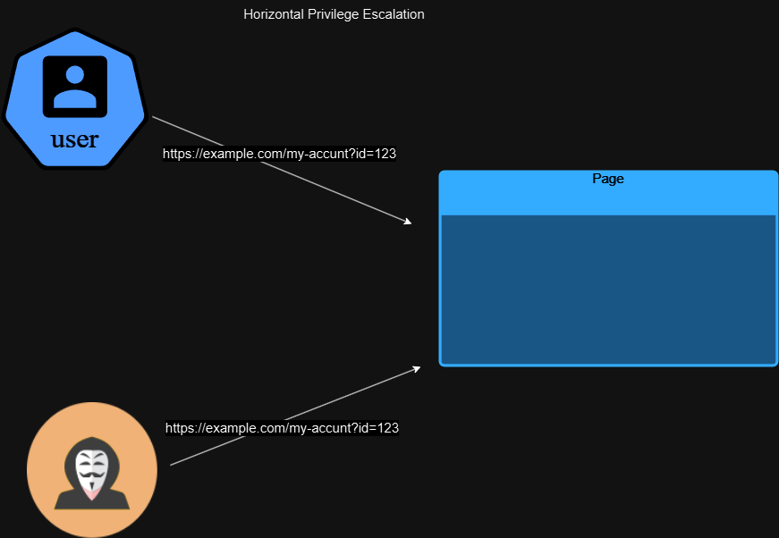
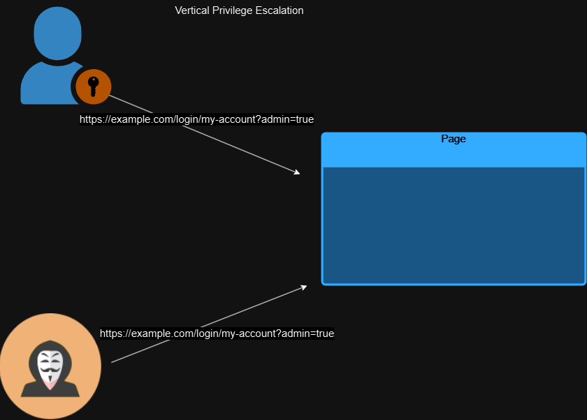
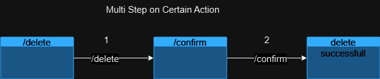

# BROKEN ACCESS CONTROL

## <mark style="color:purple;">Access Control</mark>

> * Check the authenticated user is allowed to carry out the action that they are attempting.
> * Before performing user actions, the server is validating the user privileges/permissions.

### <mark style="color:purple;">Terminologies</mark>

<mark style="color:blue;">**Authentication:**</mark>

> &#x20;**Verify the username and password are valid. (WHO ARE YOU).**

<mark style="color:blue;">**Authorization:**</mark>

> **Verify the user has permission to performer certain actions.**

<mark style="color:blue;">**Accounting:**</mark>

> **Logs data of authenticated and authorized user activity.**

<mark style="color:blue;">**Session Management:**</mark>&#x20;

> **A randomly generated string used as a user credentials every time certain action is performed.**
>
> * **A User can’t put credentials every time certain action is performed therefore the server create SESSIONID in UserID Database, which generate a random string used as a user credentials.**

### <mark style="color:blue;">Types of Access Control</mark>

<mark style="color:blue;">**Horizontal Access Control:**</mark>&#x20;

> Prevent the user from gaining access to another user with same level of privileged/permission user.

<mark style="color:blue;">**Vertical Access Control:**</mark>

> &#x20;Prevent the user from gaining access to another user with higher privileged/permission user.

<mark style="color:blue;">**Context Dependent Access Control (Multi Steps):**</mark>&#x20;

> Prevent the user at each step of confirmation actions.

## <mark style="color:purple;">Broken Access Control(IDOR)</mark>

> * &#x20;An attacker tricks the web application authenticated user to act outside of it intended permissions.
> * Automated using BURP Extension **Autorize**.

### <mark style="color:blue;">Types</mark>

#### <mark style="color:blue;">Horizontal Privileges Escalation</mark>

> An Attacker gain access to another user with the same level of privileged/permissions

<figure><figcaption><p><strong>Horizontal Privilege Escalation</strong></p></figcaption></figure>

<mark style="color:blue;">**Vertical Privileges Escalation**</mark>

> An Attacker gain access to another user with the higher level of privileged/permissions.

<figure><figcaption><p><strong>Vertical Privilege Escalation.</strong></p></figcaption></figure>

<mark style="color:blue;">**Multi Steps Process:**</mark>

> An Attacker gain access from the ignored step of access controls.

<figure><figcaption><p><strong>Multi Steps Process</strong></p></figcaption></figure>


<mark style="color:blue;">**Horizontal to Vertical Escalation:**</mark>

> &#x20;An attacker gain access from the user with same privilege then trick that user to gain access of high privileged user.

### <mark style="color:purple;">BlackBox Testing</mark>

1. Check for administrator panel.
2. Inspect the source code of the script for an admin panel.
3. Login as "wiener," capture the request; if "admin=false" is in the cookie, change it to "admin=true" and delete the user.
4. Login as "wiener," capture the request and response; if "role" is present in the response, add a new parameter `"roleid": 1` to gain admin access.
5. Modify `/my-account?id=` to access another user's account.
6. Find an unpredictable ID in the blog code, then change `/my-account?id=` to access another user's account.
7. Attempt to change `/my-account?id=` to access another user; if redirected to login but can observe in Burp Suite packet capture.
8. After logging in as "wiener," check if the password parameter is visible in the code; modify `/my-account?id=` to access another admin where the password value is exposed in the response.
9. Exploit Insecure Direct Object Reference (IDOR) by downloading a live chat transcript and changing the ID number.
10. Use `X-Original-Url: /nothing`; if not found, try `/admin`.
11. Identify a user upgrade option in the admin panel, capture the packet, and then change the cookie value to "wiener" with parameters `username=wiener&action=upgrade` to gain admin rights. If unsuccessful, change the request to GET.
12. Exploit multi-step processes; in `/admin-role`, try `username=wiener&action=upgrade`. If secured, check another step like `/admin-role` with `action=upgrade&confirm=true&username=wiener`; change the cookie value to "wiener" to gain admin rights.

### <mark style="color:blue;">**Defenses**</mark>

> * Prevent Using Defense in Dept (**Least Privileges**)
> * Parameters Based Control: Store the Access Control privileges or roles in **hidden field or Cookie or Query Parameters.**
>   * &#x20;[https://example/login?admin=true](https://example/login?admin=true)
>   * [https://example/login?role=1](https://example/login?role=1)
>   * [https://example/login?username=wiener\&role=user\&password=peter](https://example/login?username=wiener\&role=user\&password=peter)


### IDOR PARAMETERS

```
rder
ne
doc
key
email
group
profile
edit
REST numeric paths
```

