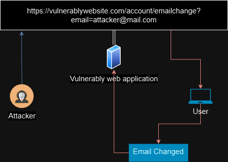

# CSRF CROSS  SITE REQUEST FORGERY

## CSRF (Cross Site Request Forgery)

> CSRF mean one domain is making/forgering request to another in order to modify some value.
>
> An attacker uses the default function of browser and the authenticated user to compromise the cookie.
>
> CSRF allows an attacker to cause something to authenticated user that perform actions that they do not intend to perform.
>
> an attacker send malicious request to authenticated user and use user browser function of cookies to steal cookie to compromise the system.

<figure><figcaption>
CSRF
</figcaption></figure>

### Conditions

> To delivery/exploit CSRF there are three conditions should be met.
>
> 1. Relevant actions:  An action feature in the web application that attacker can do something about it.  Like the email change function(An Email Change functionality).
> 2. Cookie Based Session Handling: the web application solo relies on Cookie based session, there should not be any other defense mechanism for tracking sessions and user validation (Web application used cookie sessions).
> 3. No unpredictable parameters: the action feature doesn't not contain any unpredictable parameters which attacker can guess. (any unpredictable parameters which cannot guess by attacker).

### Impact of CSRF

> * Break the CIA.
> * RCE using vulnerability chaining.

### Difference between XSS and CSRF

> XSS: Allows the attacker to execute malicious code within the victim browser.
>
> CSRF: Allows the attacker to do something to user that perform something unintended.

### BlackBox

> * Map the application
>   * Review the function of the application.
> * Identify the function that matches the condition for CSRF.
>   * A relevant action.
>   * Cookie session handling.
>   * unpredictable parameters.
> * Create the POC to exploit.
>   * GET request (mostly used).
>     * `,` `<src>` `source> tags`&#x20;
>   * POST request : Using `iframe` tags.
> * Remove the CSRF Token and see the Application accept it.
> * Change the HTTP request; Form `POST` to `GET` Method.
> * Change the CSRF Token value.
>   * See if CSRF token is tired to current user session. (exchange the CSRF token value form another user.)
> * Testing CSRF token and CSRF Key/Cookie
>   * &#x20;Check if CSRF token is tied to the CSRF Cookie.
>     * Submit an invalid CSRF Token.
>     * Submit an Valid CSRF Token Form another user.
>   * Submit an valid CSRF token and Cookie (CSRF Key) form another user.
> * Remove the referre header and add the meta tag to check for no referrer tags.
>   * `<meta name="referrer" content="no-referrer">`

### Defense Against CSRF

> * CSRF Token: the CSRF token is the random generate value by server. which is shared with the client when the client attempts valuable actions.
>   * unpredictable sting similar with session token.
>   * Blind with the session cookie so that the attacker can't use its own cookie.
>   * Validate the user before the relevant action.
> * Same site cookie: it's a feature which check the cookie are there when the request comes from another domain.
>   * None: None will allow another website. and not check for cookie
>   * LAX: it will allow other domain request when the request come from top level navigation (manually clicked),&#x20;
>     * it checks the cookie if not then included the cookie and check the GET request
>     * Strict: the request is permitted when its match the current domain.
> * Referrer Based Validation: it verifies the request domain and only allow the own domain request. and check for cookie if not then include the cookie.

### Breaking The Defense

> * The referrer header can be spoof. and the header doesn't validate.
> * CSRF token and CSRF key cookie doesn't user validate

> * Test the CSRF Token.
> * Remove the CSRF token and view the application accept the request.
> * Change the request method from GET to POST.
> * check if the CSRF token is blind with user.
> * Check the CSRF token is blind with CSRF cookie
>   * Submit an invalid CSRF token and check it validate the CRSF token at the backend.
>   * Submit an valid CSRF token from another user.


CSRF token is valid still the user is active in the web application.


## MindMap


CSRF Cross Site Request Forgery MindMap

